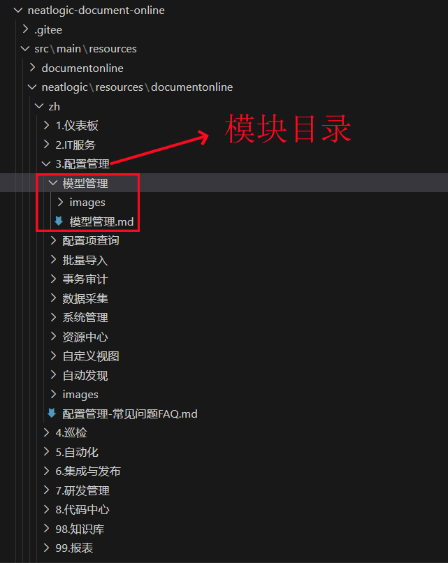
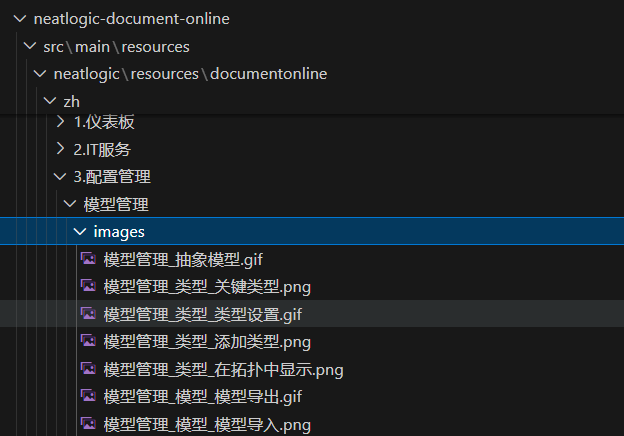

# 在线帮助文档
下面以“模型管理”为例，讲解维护文档的基本规则。

## 维护路径
所有文档所在路径： 
..\neatlogic-document-online\src\main\resources\neatlogic\resources\documentonline\zh

一个模块对应一个文件目录，如配置管理模块的文档都在“3.配置管理”的目录下。

## 文档和附件
每个模块下面会有文档的分类目录，比如目录“模块管理”，目录下包含了帮助文档和引用图片目录，说明如下。

- 帮助文档是markdown类型文件
- 同级别的目录和帮助文档命名时，可以用“数字+.”作为前缀，控制排序，
- 文档和图片目录同级
- 图片命名规范，“帮助文档名称_后缀”，示例如下
  
