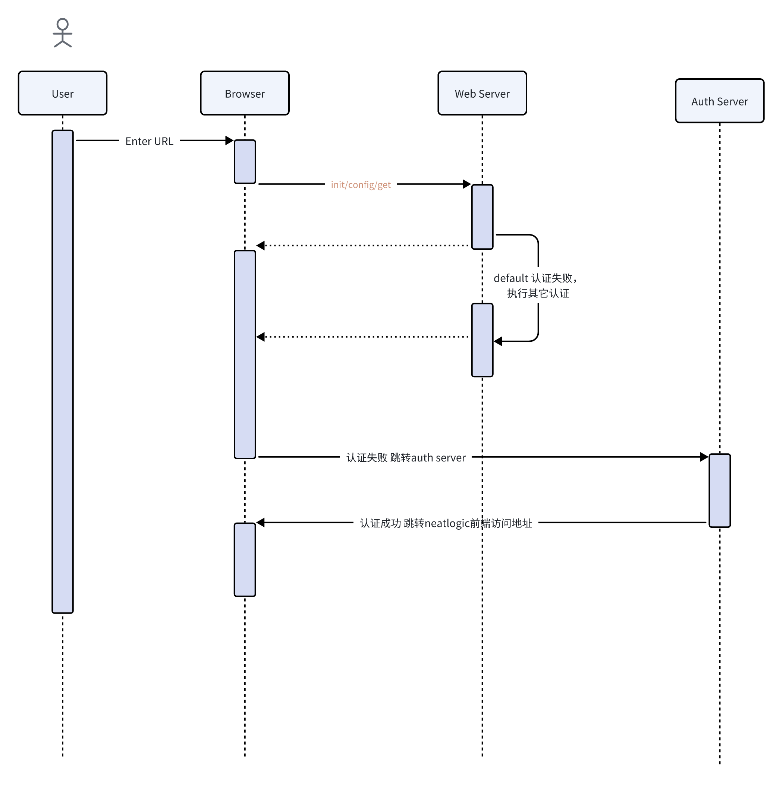

# CAS 认证
如需配置 CAS 认证，可按以下步骤操作。

操作步骤：修改服务端 `config.properties` 中的 CAS 配置，重启服务。
```
#接口单点认证
login.auth.type=cas

#sso的key。如cas跳转过来的url,http://192.168.0.10:8090/demo?ticket=xxxxxxxx，则key是ticket
sso.ticket.key=ticket

#cas url
direct.url=http://cas.techsure.cn:8080/cas

#neatlogic前端 url
home.url=http://192.168.0.10:8090/
```

