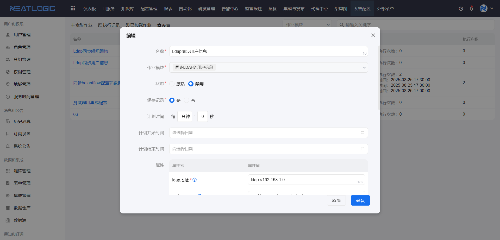
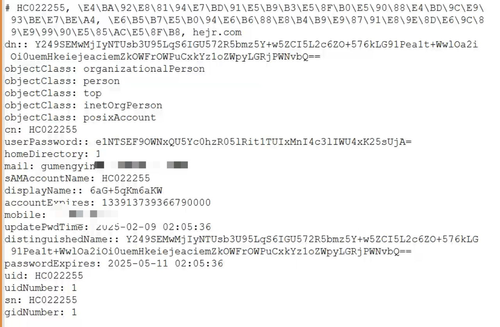

## 说明
在客户现场配置ldap的时候，无法确定客户给的信息是否准确或配置后遇到问题，如何核对，此时就需要借助ldap客户端验证

如果当前机器可以直接访问ldap服务器，可以用ldapborowes工具，测试验证

下载工具：[ldapbroweser.zip](../1.登录认证/ldapbrowser.zip)

（补充说明：ldapbroweser工具需要jdk环境）

如果当前机器不能直接访问ldap服务器，应用机器可以访问，此时可以考虑安装ldap客户端
```
yum install openldap-clients
```
## 系统内定时作业配置



## ldapsearch测试

-D 用户

-w 密码 

-b base dn 

## 查找组织架构
ldapsearch -x -H ldap://10.166.204.209:389 -D "uid=admin_read,ou=read,ou=empty,dc=hejr,dc=com"  -w 'Qy&OWn38Pjf1u%ag' -b  "dc=hejr,dc=com"  "(objectClass=organizationalUnit)"

## 查找用户
ldapsearch -x -H ldap://10.166.204.209:389 -D "uid=admin_read,ou=read,ou=empty,dc=hejr,dc=com"  -w 'Qy&OWn38Pjf1u%ag' -b  "dc=hejr,dc=com"  "(objectClass=posixAccount)"

返回结构


### 其它说明
ldap协议无法以隧道方式转发