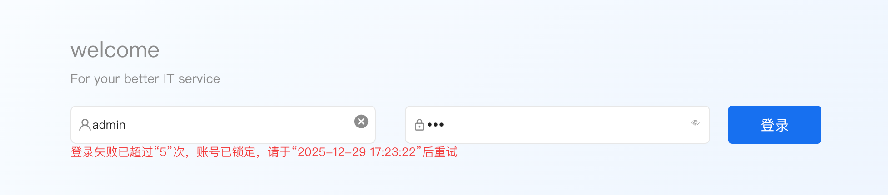

# 登录失败锁定用户
```
开启后将启用用户锁定机制：当用户登录失败次数超过设定阈值时，系统将自动锁定该用户，锁定期间用户无法登录；达到锁定时长后，系统将自动解锁，用户可重新登录。
```


## 配置参数
打开 系统配置-系统参数 修改参数配置并保存后立马生效
  <table style="width:100%">
   <thead>
      <tr>
         <td>key</td>
         <td>默认值</td>
         <td>描述</td>
      </tr>
   </thead>
   <tbody>
      <tr>
         <td>login.need.lock</td>
         <td>0</td>
         <td>登录是否需要检查是否锁定用户。默认为0，不需要检查</td>
      </tr>
      <tr>
         <td>login.locked.failed.count</td>
         <td>5</td>
         <td>登录失败次数限制(次)。超过次数则锁定用户，无法登录，等自动解锁</td>
      </tr>
      <tr>
         <td>login.locked.times.limit</td>
         <td>10</td>
         <td>登录锁定时长(分钟)。锁定用户后，超过这个时间后才允许登录</td>
      </tr>
   </tbody>
   </table>
