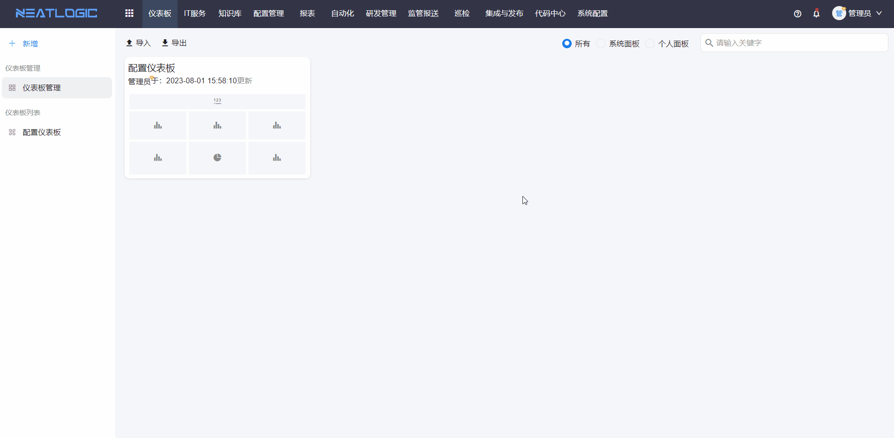
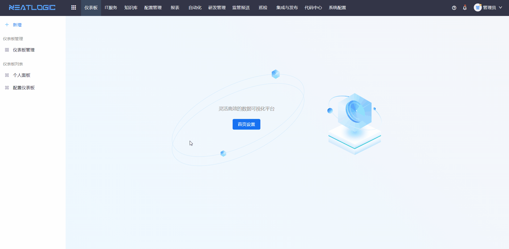

# 仪表板
仪表板模块，全可视化配置，无需编码，支持自定义组件和自定义数据。

## 权限说明
相关的系统权限有面板查看权限和面板管理权限，同时缺少这两个权限，无法查看仪表板模块。

面板管理权限：可以添加、编辑、删除系统和个人面板 
面板查看权限：可以添加、编辑、删除个人模板，查看被授权的系统面板

## 仪表板管理
仪表板管理页面展示所有的系统面板和当前用户的个人面板。需授权面板管理权限才能访问。

### 添加仪表板
打开仪表板模块，点击左上角的快捷添加入口，跳转到仪表板编辑页面，根据需求拖动组件到仪表板画布中，完成仪表板配置并保存。仪表板组件的数据源可来源于[数据仓库](../100.系统配置/3.数据和集成/数据仓库.md)

布局：设置组件标题、组件内文案与组件边界的边距、组件的透明度等
数据：设置组件引用的数据源、字段映射和过滤条件，支持设置默认排序规则
配置：设置组件内文案或图形的显示样式

### 复制仪表板
点击目标仪表板的复制按钮，跳转到编辑页面，保存仪表板即可

### 导入导出
仪表板支持导入导出功能，导出的是当前所有的仪表板。

## 仪表板列表
仪表板列表显示的是当前登录人有权限的系统面板和个人面板，点击仪表板标题跳转到面板的查看页面。
