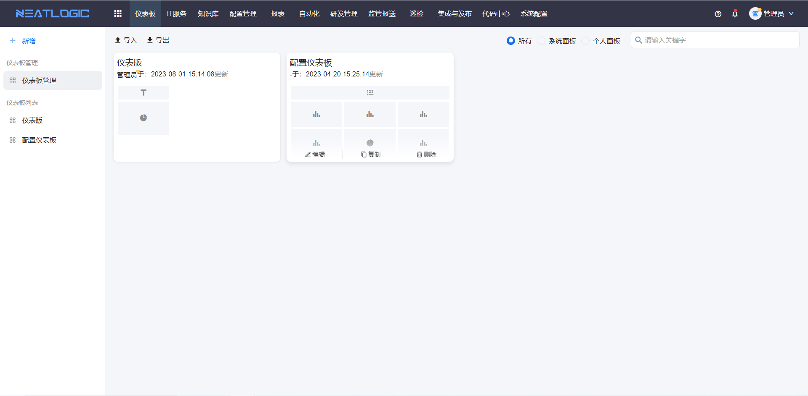
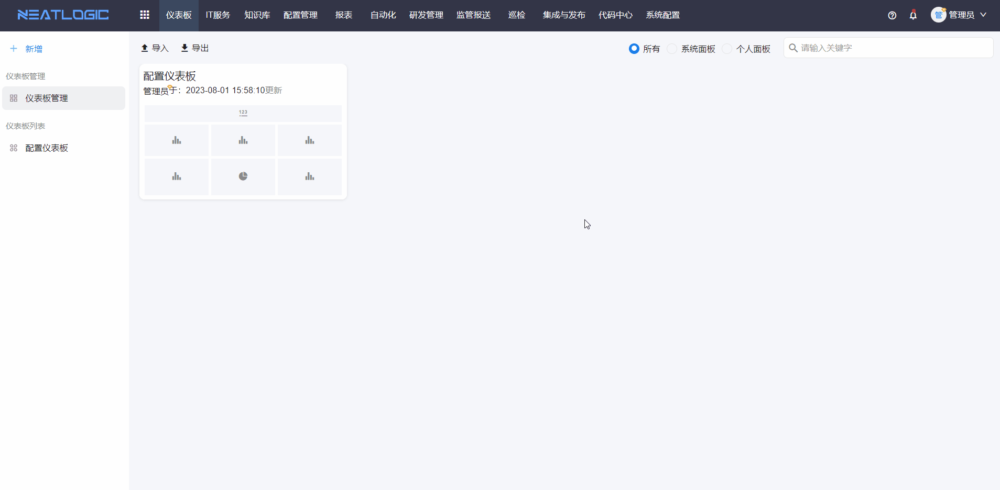
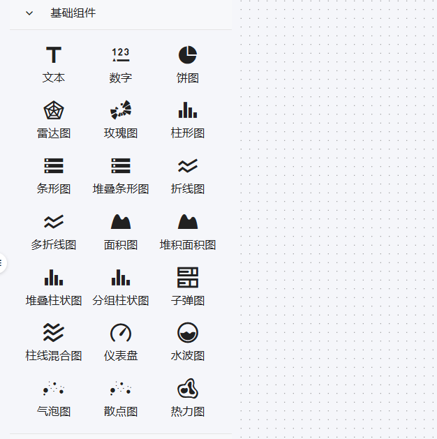
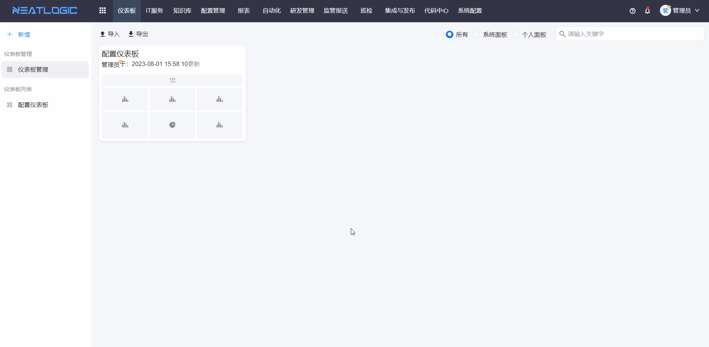
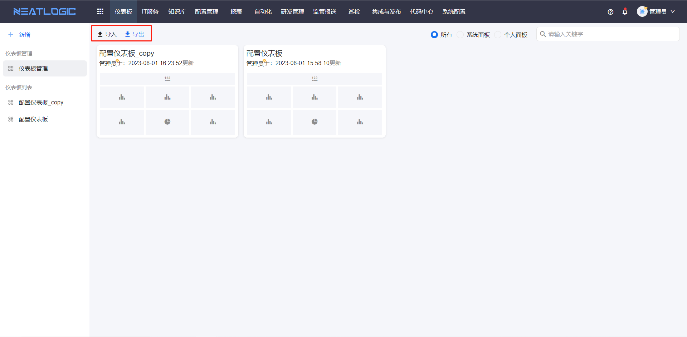

# 仪表板

仪表板模块提供全可视化的配置体验，无需编写代码即可快速构建数据面板。支持自定义组件与自定义数据源，满足多样化的展示需求。

## 权限说明

仪表板模块的访问和使用依赖于以下两类系统权限：

- 面板管理权限：可以添加、编辑、删除系统面板和个人面板 
- 面板查看权限：可以添加、编辑、删除个人面板，并可查看被授权的系统面板。用户仅能查看自己创建的个人面板。

> 若用户同时缺少**面板管理权限**和**面板查看权限**，则无法访问仪表板模块。

## 仪表板管理
仪表板管理页面集中展示所有**系统面板**和**当前用户的个人面板**。需授权**面板管理权限**才能访问。

### 添加仪表板
1. 进入仪表板模块，点击左上角的快捷添加入口，系统将自动跳转至仪表板编辑页面。
2. 在编辑页面中，根据需求将所需组件拖拽至仪表板画布。
3. 配置完成后保存仪表板。

> 仪表板组件的数据源均来自[数据仓库](../100.系统配置/3.数据和集成/数据仓库.md)

#### 仪表版组件

仪表板组件包括基础图表类组件（如文本、数字、图表等），并支持通过脚本自定义组件，扩展能力更强。

每个组件支持以下三类配置：

- **布局**：设置组件标题、内容边距、背景透明度等样式属性。
- **数据**：配置组件的数据源、字段映射、过滤条件及默认排序规则。
- **配置**：自定义组件内文案样式或图表的显示效果。

### 复制仪表板

在仪表板管理页面，点击目标仪表板的**复制**按钮，系统将跳转至编辑页面。确认无误后保存，即可快速生成一个新的仪表板。

### 导入导出

仪表板支持整体导入导出功能，导出的内容将包含当前所有仪表板。

## 仪表板列表

仪表板列表展示当前登录用户有权限访问的所有仪表板，包括系统面板和个人面板。点击任一仪表板的标题，即可进入对应的查看页面。

