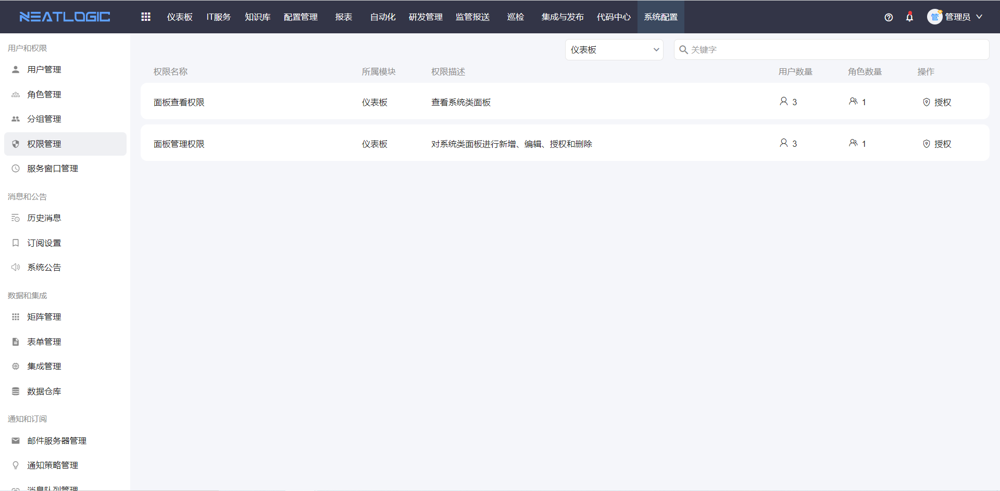
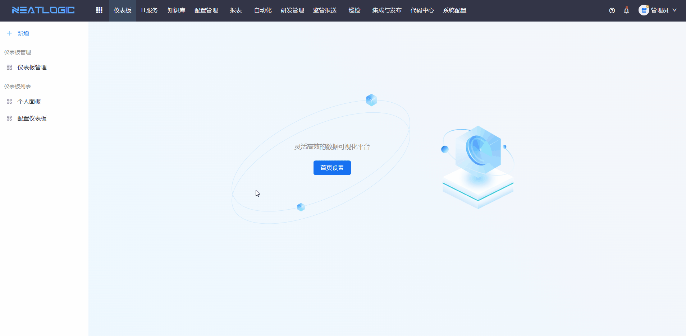

# 仪表板列表

仪表板列表用于查看当前登录用户有权限访问的仪表板，包括被授权的系统面板和用户自己创建的个人面板。

用户进入列表后，可以点击任一仪表板标题进入查看页面，用于快速查看业务数据、监控指标或其他可视化内容。

## 权限

**操作权限**
- 配置：系统配置-[用户管理](../100.系统配置/1.用户和权限/用户管理.md)-授权-面板查看权限
- 包含操作：查看被授权的系统面板，新增、编辑、删除个人面板，查看自己创建的个人面板
- 配置人员：系统超级管理员

**操作权限**
- 配置：系统配置-[用户管理](../100.系统配置/1.用户和权限/用户管理.md)-授权-面板管理权限
- 包含操作：新增、编辑、删除系统面板和个人面板
- 配置人员：系统超级管理员

> 若用户同时缺少**面板管理权限**和**面板查看权限**，则无法访问仪表板模块。

## 查看仪表板

仪表板列表展示当前用户可访问的所有仪表板。系统面板需要经过授权后才会显示，个人面板只显示当前用户自己创建的内容。

点击仪表板标题后，即可进入对应的查看页面。

