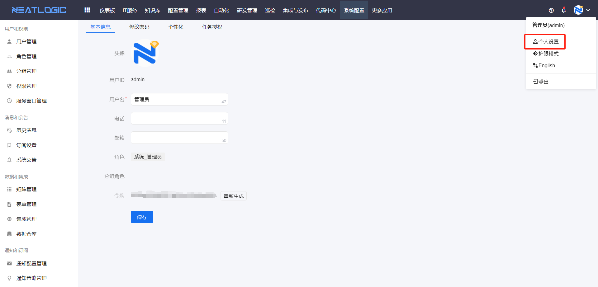
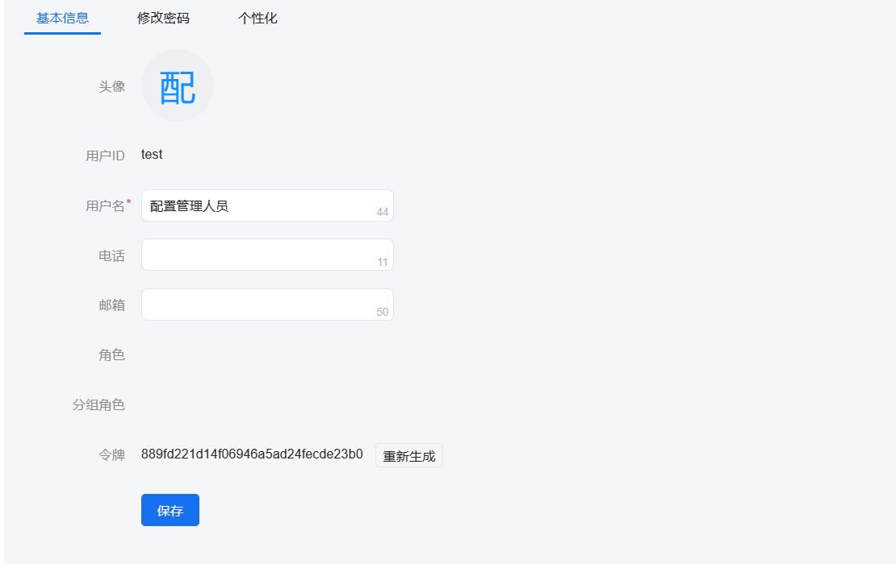
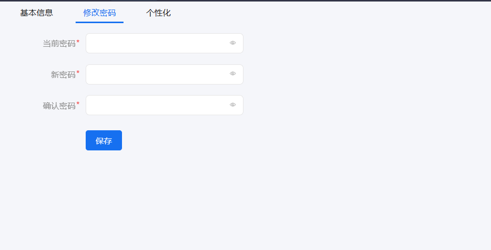
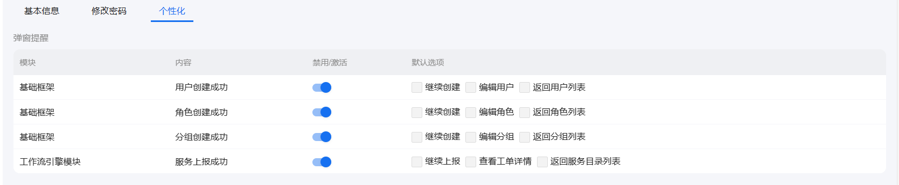
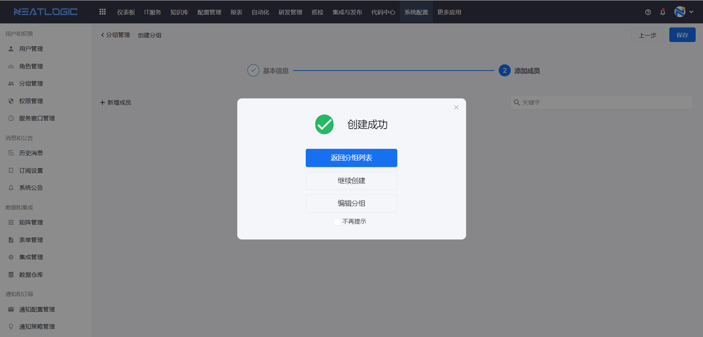
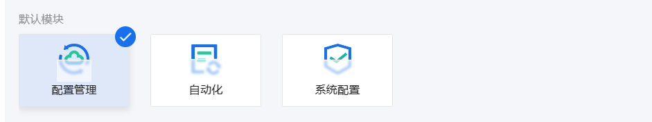
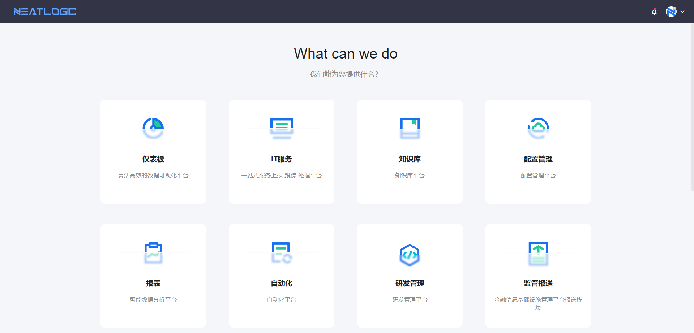
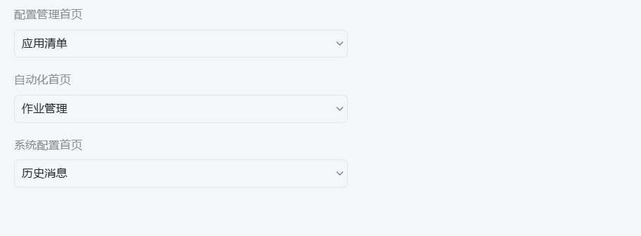
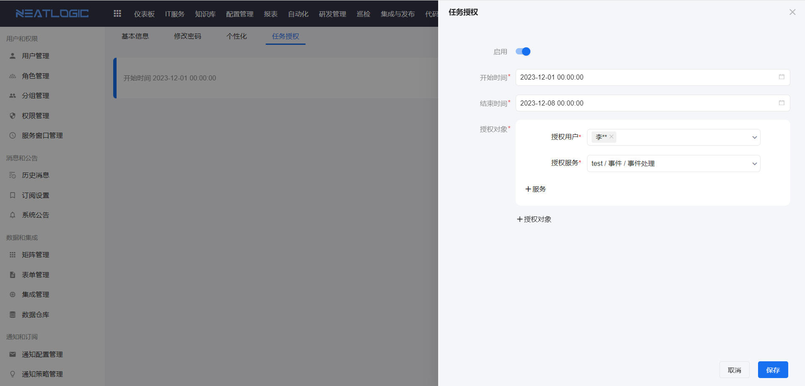

# 个人设置
个人设置是一个快速编辑个人基本信息和个性化配置的页面，一共有四个页签，分别是基本信息、修改密码、个性化和任务授权。
入口：点击用户头像-个人设置

## 基本信息
基本信息下可修改当前用户的用户名、电话和邮箱数据，还支持重新生成用户令牌。

## 修改密码

## 个性化
个性化中可以设置弹窗提醒、默认模块及模块默认首页。

1. 弹窗提醒
   
   有四个操作支持弹窗提醒功能，分别是创建用户成功、创建角色成功、创建分组成功、工单上报成功。弹窗提醒有两个状态，禁用和启用，默认选项单选。 
    启用状态下，每次操作成功都会出现弹窗，没有默认选项。 
   
   禁用状态下，自动选择返回列表，可以修改默认选项，这样每次操作成功时，不会出现弹窗，并且自动执行默认选项的操作。

2. 默认模块
   
   当引用全局配置时，引用[默认首页](../5.基础服务/默认首页.md)管理中生效的配置。
   
   默认模块是指登陆系统时默认跳转的模块，默认模块单选。 
   如果未选择默认模块，登录成功后，会跳转到欢迎页面。
    
   如果设置了默认模块，登录成功后，自动跳转到默认模块的默认首页。
   **备注** ：用户可选模块只显示有访问权限的模块，与上方模块菜单保持一致。

3. 默认首页
   
   默认首页是指打开模块时默认跳转的页面，每个模块都可以设置默认首页，默认首页单选。

   **备注** ：用户可设置默认首页的模块只包括有访问权限的模块，与上方模块菜单一致。

## 任务授权
任务授权是指把当前用户的待处理工单授权给指定用户代替其处理，这个功能可以解决用户临时无法处理工单的场景。

处理人任务授权是只应用于工单中，所以用户必须有IT服务基础权限才能配置任务授权。

任务授权的配置：激活状态、起止时间、授权用户、授权服务

**备注** ：授权的维度是在工单所属的服务层面，不能具体到工单。