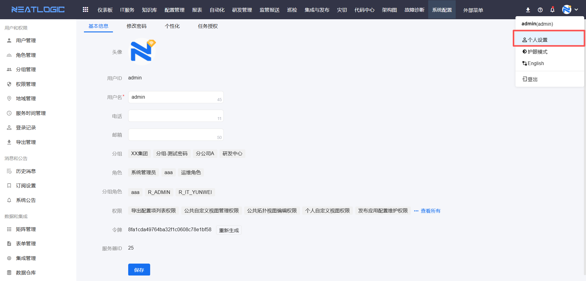
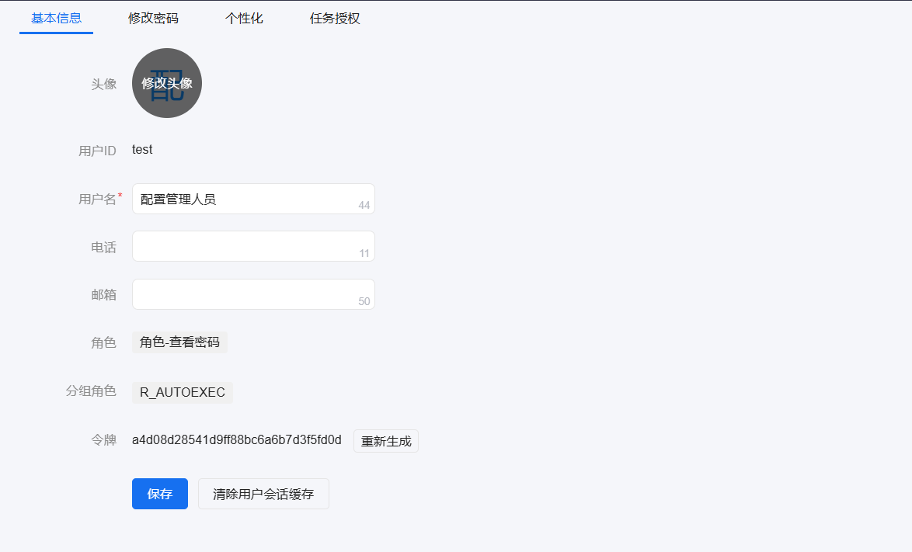
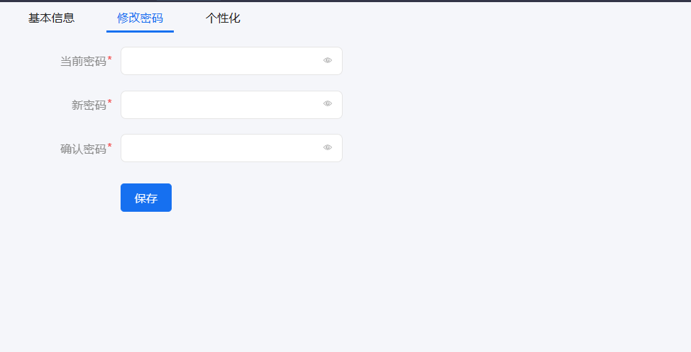
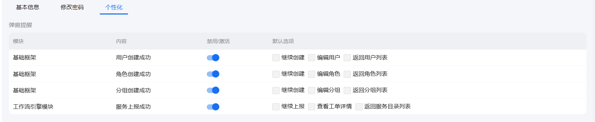
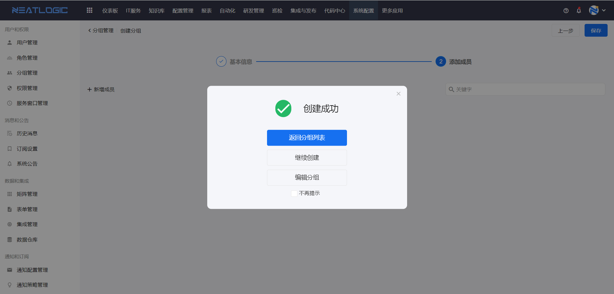
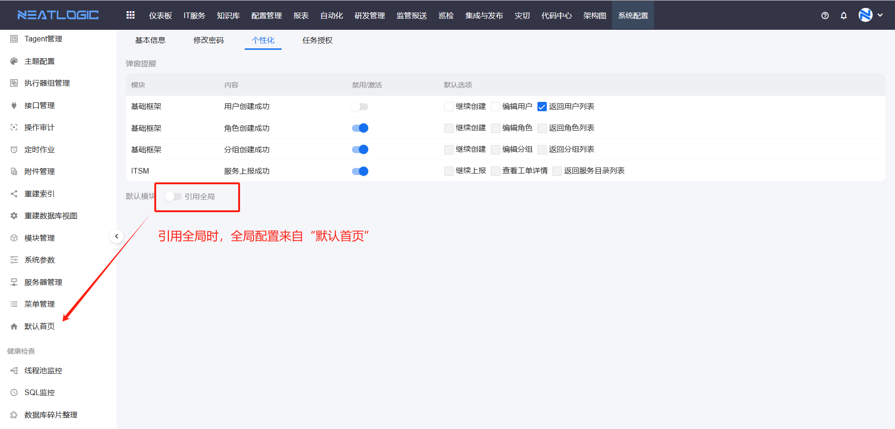
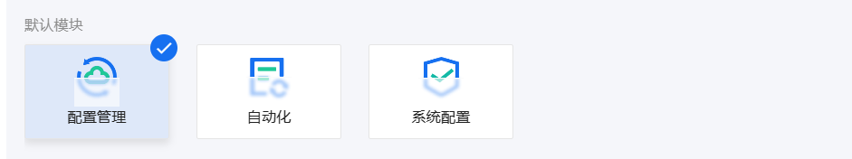
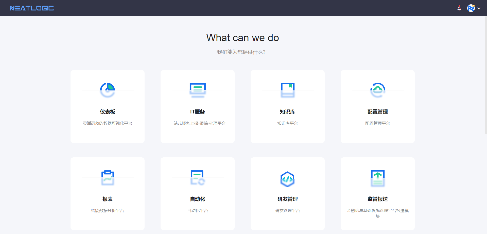
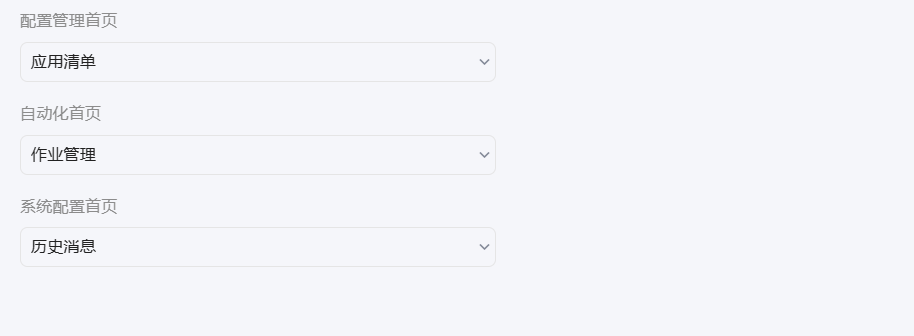
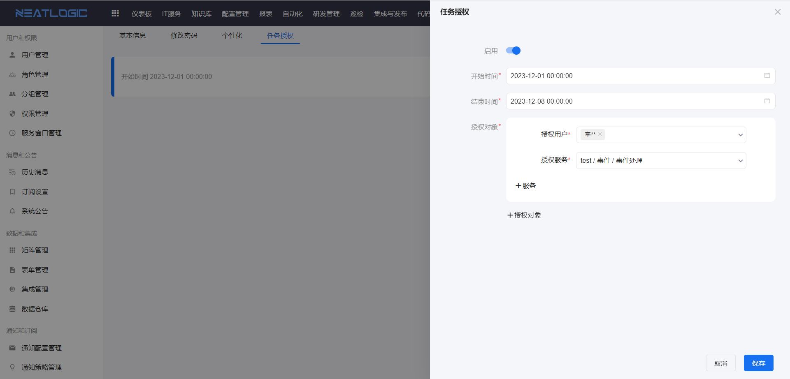

# 个人设置
个人设置是编辑个人基本信息和个性化配置的页面，有四个功能，分别是基本信息、修改密码、个性化和任务授权。
入口：点击用户头像-个人设置

## 基本信息
基本信息中可以修改当前用户的用户名、电话、邮箱、分组角色、分组角色、权限、令牌和服务器id数据。 
- 分组，用户关联的分组；
- 分组角色，是指用户所属分组关联的角色；
- 角色包括，用户直接关联的角色和分组角色；
- 权限，当前用户所有的权限；
- 服务器id，对应服务节点状态管理页的id字段。

## 修改密码

## 个性化
个性化中可以设置弹窗提醒、默认模块及模块默认首页。

### 弹窗提醒
平台有四个功能支持弹窗提醒功能，分别是创建用户、创建角色、创建分组、工单上报。

弹窗提醒配置有两个状态，禁用和激活，默认选项单选。 
1. 激活
   
   激活状态下，每次执行操作成功后，都会出现弹窗，没有默认选项，需要用户手动操作才能关闭弹窗。
   
2. 禁用
   
   禁用状态下，每次执行操作成功后，按照默认选项配置自动跳转页面。

### 默认模块
默认模块是指登录系统时默认跳转的模块，引用全局配置时，按照[默认首页](../5.基础服务/默认首页.md)的配置生效。 
只有已激活且授权给当前用户的配置有效，当用户匹配到多个配置时，会执行排序最靠前的配置。

未引用全局，支持用户自定义默认模块，默认模块单选但非必填。

未设置默认模块，登录成功后，默认跳转到欢迎页面。

**备注** ：用户可选模块只显示有访问权限的模块，与上方模块菜单保持一致。

### 默认首页
默认首页是指打开模块时默认跳转的页面，每个模块都可以设置默认首页，默认首页单选但非必填。 

**备注** ：用户可设置默认首页的模块只包括有访问权限的模块，与上方模块菜单一致。

## 任务授权
任务授权是指把当前用户的待处理工单授权给指定用户代替其处理，这个功能可以解决用户临时无法处理工单的场景。

处理人任务授权是只应用于工单中，所以用户必须有IT服务基础权限才能配置任务授权。

任务授权的配置：激活状态、起止时间、授权用户、授权服务

**备注** ：授权的维度是在工单所属的服务层面，不能具体到工单。