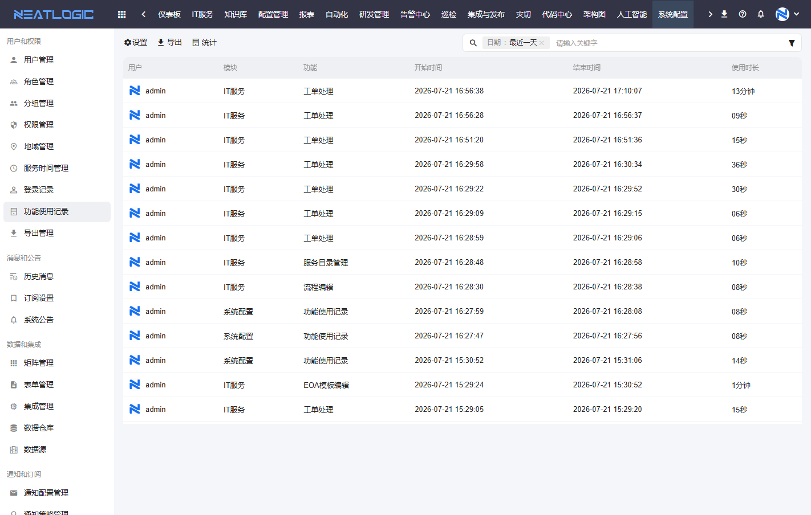
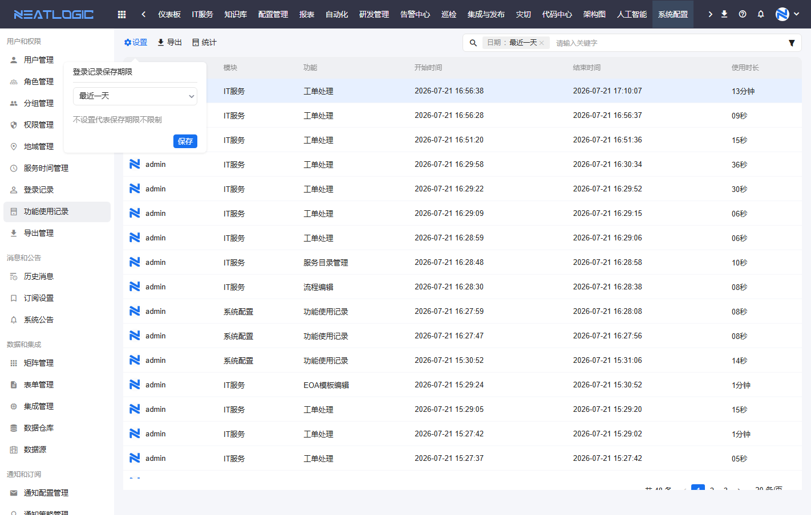
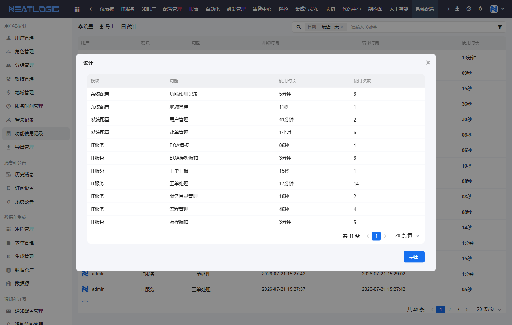

# 功能使用记录

功能使用记录用于查看用户在系统中访问功能的明细记录。

当需要了解某个用户在什么时间使用过哪些功能、某个模块的功能是否被频繁访问，或需要导出功能使用明细进行审计分析时，可以从功能使用记录开始。

本文以“查询功能使用明细”和“统计功能使用情况”为主线，说明功能使用记录中的常见操作。

## 阅读路径

可根据当前要解决的问题选择阅读入口。

- 如果需要查看用户具体访问了哪些功能，阅读“使用记录列表”和“搜索和筛选”。
- 如果需要控制记录保存范围，阅读“保存期限设置”。
- 如果需要把明细交给审计或运维分析，阅读“导出使用记录”。
- 如果需要了解各模块、各功能的使用频率，阅读“功能使用统计”。

## 使用记录列表

使用记录列表用于查看用户进入功能页面后的访问明细。

页面默认按最近一天查询，列表展示用户、模块、功能、开始时间、结束时间和使用时长。管理员可以通过这些信息判断用户在某个时间段内访问了哪些功能，以及单次停留大约持续了多久。

**操作权限**
- 系统配置-[权限管理](权限管理.md)-授权-用户管理权限
- 包含操作：查看功能使用记录、设置保存期限、导出和统计
- 配置人员：系统超级管理员

| 字段 | 说明 |
|:--|:--|
| 用户 | 使用功能的用户。 |
| 模块 | 功能所属模块，例如系统配置、IT服务。 |
| 功能 | 用户访问的具体功能页面或操作入口。 |
| 开始时间 | 本次功能使用开始的时间。 |
| 结束时间 | 本次功能使用结束的时间。 |
| 使用时长 | 本次功能使用的持续时间。 |

## 搜索和筛选

搜索和筛选用于缩小功能使用记录的查看范围。

当记录较多时，可以先选择日期范围，再通过关键字快速定位相关记录。页面右上角还提供筛选入口，适合在审计排查时进一步缩小范围。

常见查询方式包括：

1. **按日期查询**

   默认查询最近一天的记录。需要排查指定时间段内的功能访问情况时，可以先调整日期范围。

2. **按关键字查询**

   在搜索框输入关键字后，可以快速定位与用户、模块或功能相关的记录。

3. **按列表结果判断访问行为**

   如果同一用户在短时间内多次进入同一功能，列表中会出现多条记录。可以结合开始时间、结束时间和使用时长判断访问频率和停留情况。

## 保存期限设置

保存期限设置用于控制功能使用记录的保留范围。

当功能使用记录数量较多时，可以通过设置保存期限控制记录保留时间，避免历史数据长期累积。页面提示“不设置代表保存期限不限制”。

## 导出使用记录

导出用于将当前功能使用记录导出为文件。

在需要提交审计材料、离线分析用户访问行为，或按时间段归档功能使用情况时，可以先设置日期和关键字条件，再执行导出。导出后的文件可在[导出管理](导出管理.md)中查看和下载。

## 功能使用统计

功能使用统计用于按模块和功能汇总访问情况。

统计窗口会按模块和功能展示使用时长、使用次数。它适合用于判断哪些功能被频繁访问、哪些模块使用较少，以及系统上线后用户是否真正进入了目标功能。

| 字段 | 说明 |
|:--|:--|
| 模块 | 被统计功能所属模块。 |
| 功能 | 被统计的具体功能。 |
| 使用时长 | 当前查询范围内该功能的累计使用时长。 |
| 使用次数 | 当前查询范围内该功能被访问的次数。 |

统计结果也支持导出。当需要做使用频率分析或周期性汇报时，可以直接导出统计结果。

## 常见使用场景

### 排查用户是否访问过某个功能

先选择对应日期范围，再通过关键字搜索用户或功能名称。根据开始时间、结束时间和使用时长确认访问记录。

### 评估功能上线后的使用情况

打开统计窗口，查看目标模块和功能的使用次数、累计使用时长。如果使用次数偏低，可以结合权限配置、菜单入口和用户培训情况继续排查。

### 控制历史记录数据量

进入设置，配置记录保存期限。若需要长期保留审计数据，可以不设置保存期限；若只需要保留近期记录，可以按实际审计要求设置保留范围。
