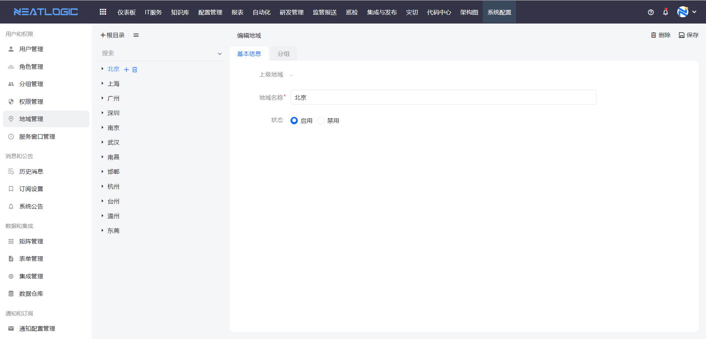
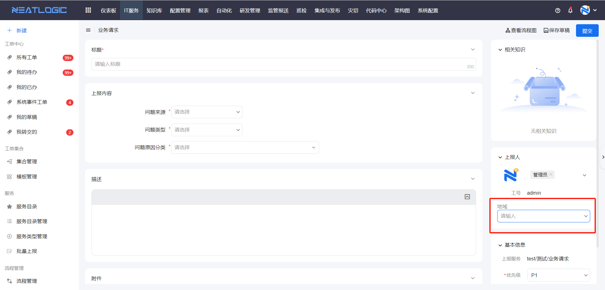

# 地域管理

地域管理用于维护系统中的地域目录。

当用户、分组或业务数据需要按地区、区域、机房位置等维度归类时，可以先在地域管理中建立地域层级。后续其他功能引用地域时，就能使用统一的地域数据。

## 阅读路径

- 如果只是维护地域层级，先阅读“地域目录”。
- 如果需要让上报人信息带出地域，阅读“关联分组”。

## 地域目录

地域目录用于统一维护可被系统其他功能引用的地域数据。

管理员可以根据实际组织或业务需要，自定义地域目录。

## 关联分组

关联分组用于让分组成员在业务场景中使用对应地域。

地域支持关联分组。分组成员在上报工单时，可以在上报人信息中选择所属地域。

