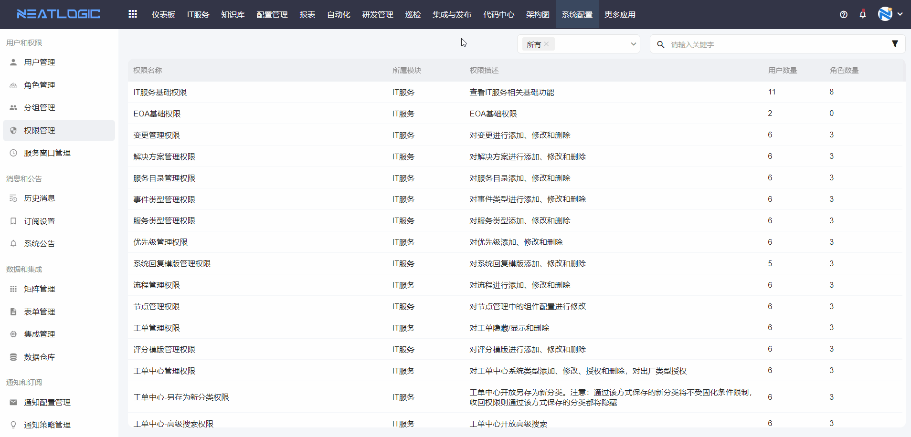
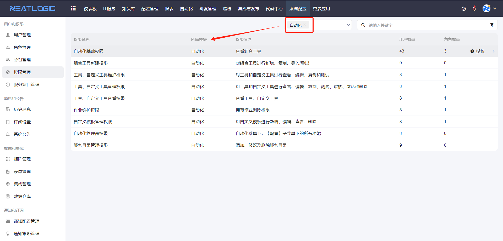
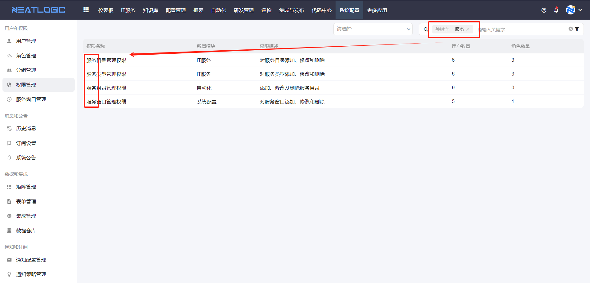
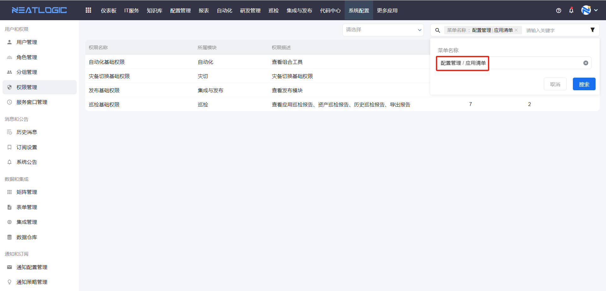
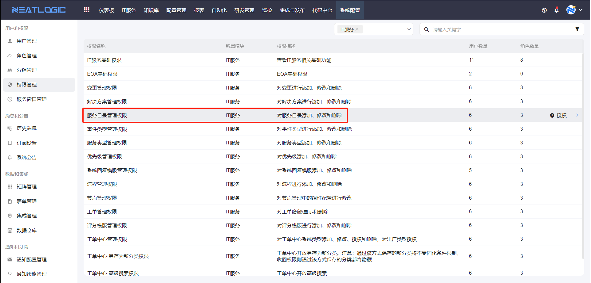
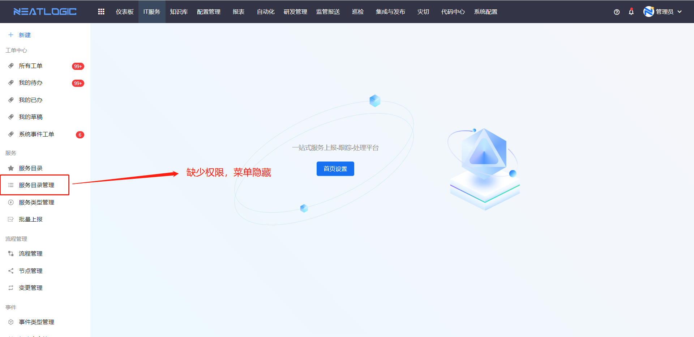
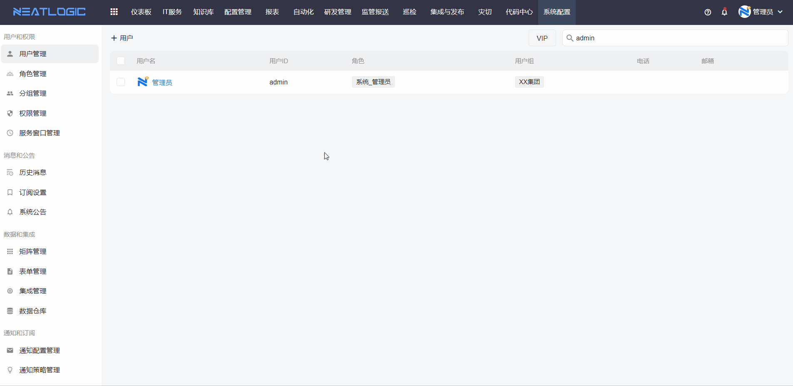

# 权限管理
权限管理页面是管理当前系统所有模块的权限，可进行授权操作，授权的对象包括用户和角色。

## 搜索过滤
1. 按模块过滤权限
   
2. 名称关键字匹配
   
3. 按菜单过滤权限 
   选择菜单名称过滤的结果是用户查看当前菜单需要的权限。
   
## 未授权的场景

1. 管理页面的菜单隐藏，例如用户缺少服务目录管理权限时，导航菜单不显示服务目录管理页面的访问入口。
   
    
2. 操作按钮禁用，例如用户在不是自动化管理员时，也无组合工具新建权限，
   