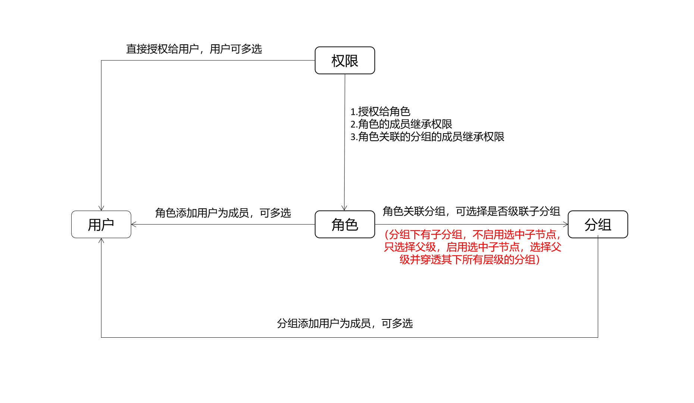
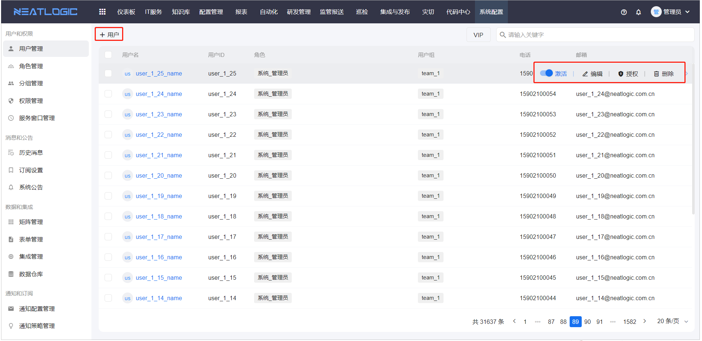
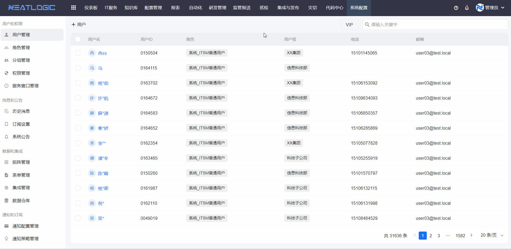
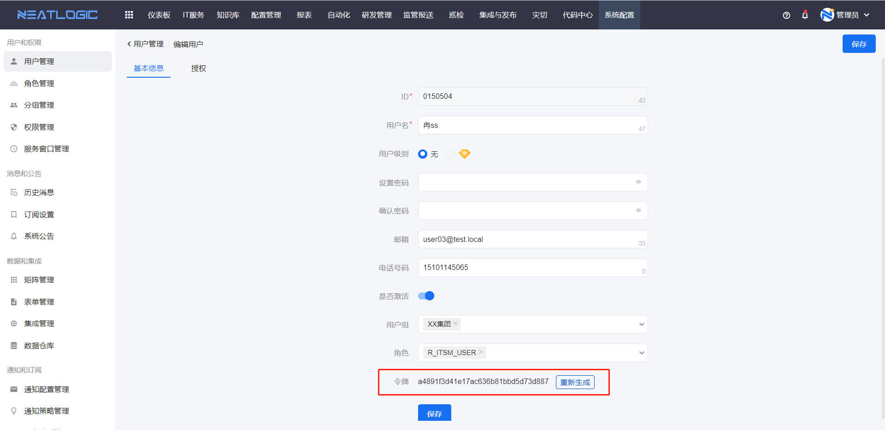
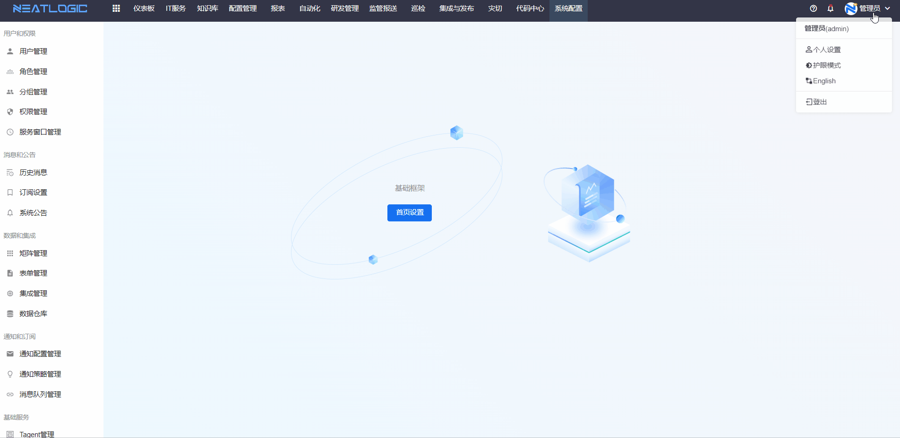
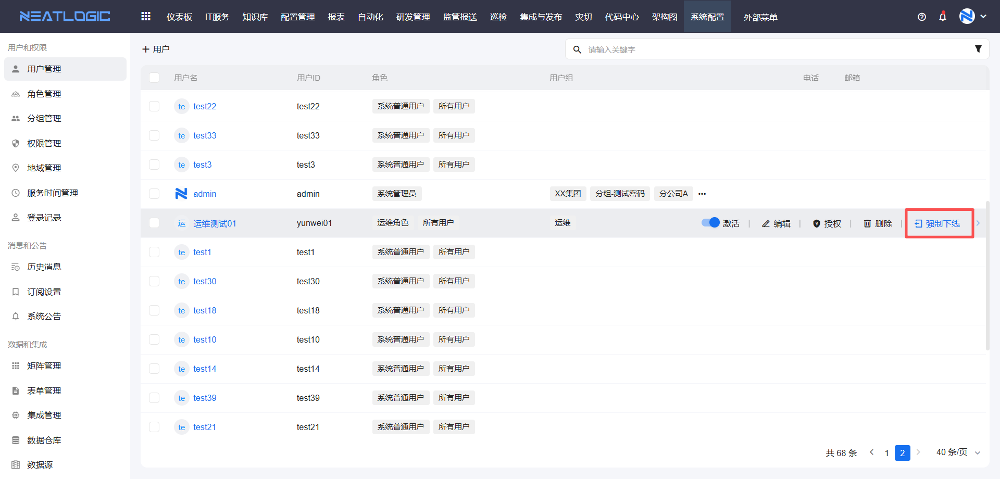
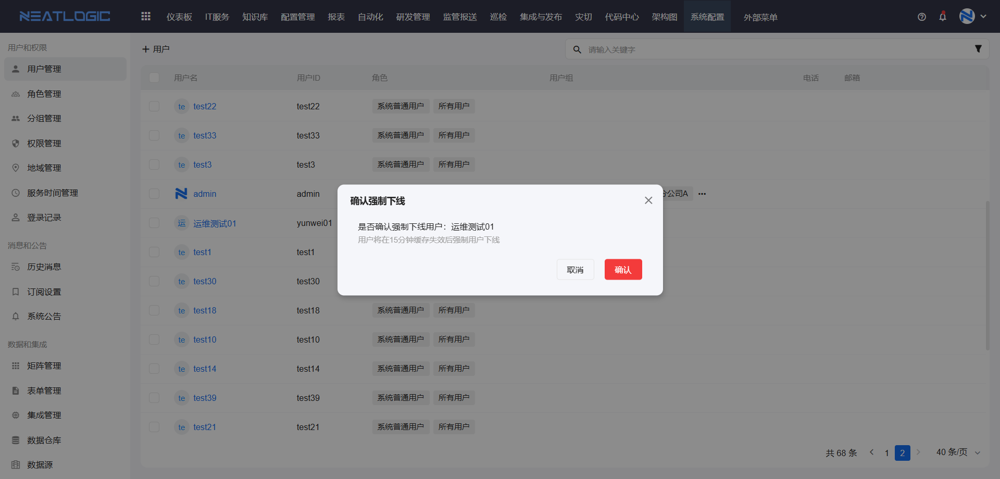

# 用户、角色、分组关系及授权
用户是指系统的登录人，除了出场自带的超级管理员用户，所有用户功能使用范围都是由被授予的权限决定的。

[角色](角色管理.md)是用于定义具有相同身份的用户的集合，如运维人员和开发人员。

[分组](分组管理.md)是指组织架构，例如企业管理层组织架构。

用户、角色和分组的关系：
- 角色的成员是用户，角色可以关联分组，被关联的分组的用户也继承角色的所有权限。分组的成员只有用户。
- 关于[权限](权限管理.md)，授权对象可以是用户和角色，用户除了自己的权限，还继承角色的权限。

# 用户管理
**！！用户和角色新成立关联关系（如用户添加角色，角色成员添加用户等操作），用户必须重新登录，用户从角色继承的权限、通知等效果才能生效。**

用户管理页面支持添加、编辑、删除、激活、授权、强制下线操作。

用户的状态必须是激活才能使用，禁用的用户账号不能登录。

外部系统访问neatlogic-webroot时，需要进行hmac认证（会使用到该用户token）。编辑用户信息时，可以手动更新令牌。

普通用户没有用户管理页面的权限时，没有访问用户管理页面的权限，可以在个人设置中更新自己的用户令牌。

## 强制下线
强制用户下线后，用户缓存15分钟后失效，用户被强制登出。

## 用户登录有效时间

以下情况会自动登出：
1. 用户超过60min不在neatlogic的页面(没有发起对后端的请求)
   
   调整方法：可以通过config.properties 设置user.expiretime的值来调整单位min

2. 同个账号在不同的浏览器重新登录，会挤退之前在别的浏览器登录这个账号的用户（15分钟后会被挤退）
   
   调整方法：可以通过在VM Option增加-DenableValidTokenFcd=false 来允许同个账号在不同浏览器登录且不会相互挤退

**提醒：必须确保所有服务器的时间是正确的**