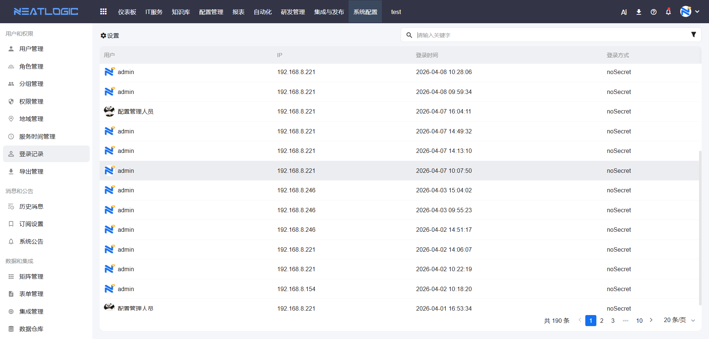
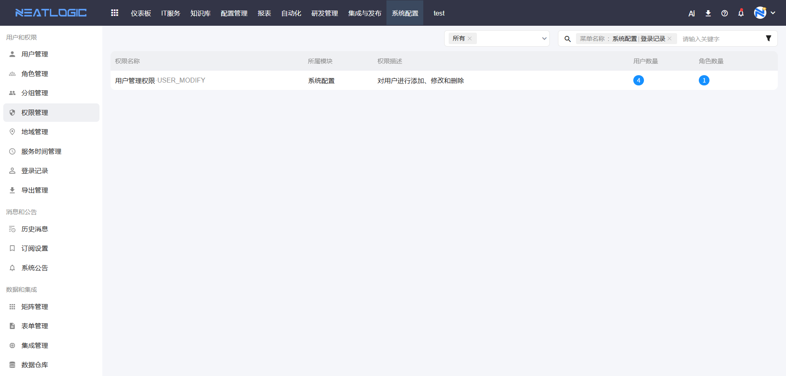

# 登录记录
登录记录页面用于查看系统所有用户的登录历史信息，包括登录人、登录时间、登录IP、登录方式等，便于管理员审计用户登录行为。

## 功能说明

登录记录列表展示以下信息：

- **登录人**：登录用户的账号名称
- **登录时间**：用户登录系统的时间
- **登录IP**：用户登录时的IP地址
- **登录方式**：用户登录的认证方式，如免密登录、密码登录等

## 查询功能

支持按以下条件筛选登录记录：

1. 按用户名搜索
2. 按登录时间范围筛选

## 相关权限

系统配置-[权限管理](权限管理.md)-系统配置-用户管理权限

