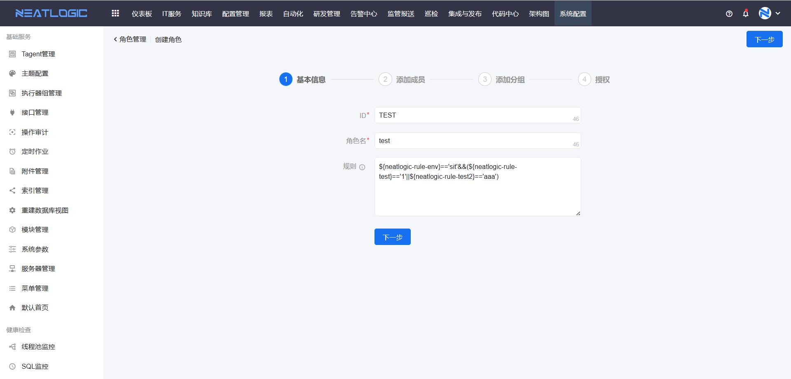
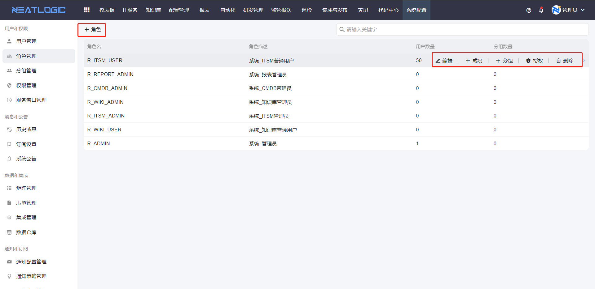
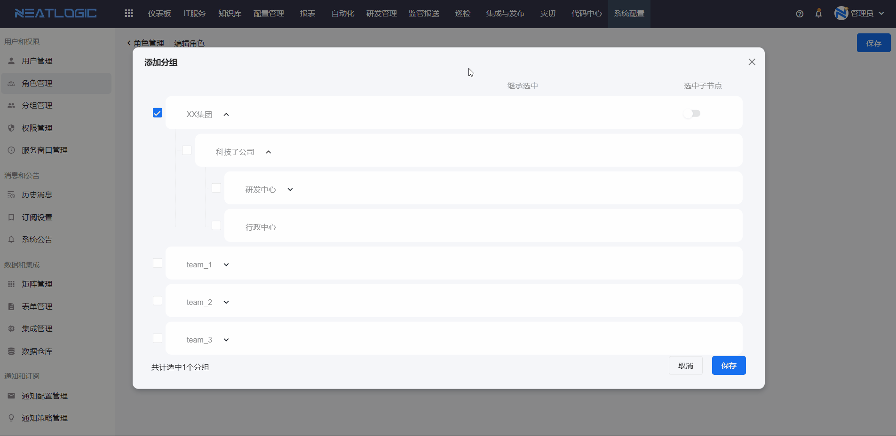

# 角色管理

角色管理用于维护一组可复用的权限集合。

当多个用户需要拥有相同菜单权限或操作权限时，可以先创建角色并完成授权，再把用户或分组关联到角色。这样后续只要维护角色，就能统一控制一批用户的权限范围。

本文主要说明角色基本信息、角色规则、成员维护、分组关联和权限继承效果。

## 阅读路径

- 如果只是新增角色，先阅读“角色基本信息”。
- 如果需要根据环境让角色有条件生效，阅读“角色规则”。
- 如果需要批量给用户授予权限，阅读“角色成员”和“关联分组”。

## 角色基本信息

角色基本信息用于标识角色，并决定角色是否存在条件生效规则。

角色的基本信息包括 ID、角色名和规则。

## 角色规则

角色规则用于控制角色是否在当前登录环境中生效。

登录认证请求需要携带 Header。管理员可以在角色规则中定义表达式，用户登录时，如果 Header 参数值满足表达式，则该角色生效；否则该角色不生效。

该能力适合多个环境共用同一个数据库，但同一用户在不同环境中需要拥有不同权限的场景。

**示例：**

当前环境是 UAT，配置角色“ROLE-UAT”，规则为 `"${DATA.env}"=="UAT"`。角色“ROLE-UAT”关联了用户“TEST-UAT”。当用户“TEST-UAT”登录 UAT 环境时，满足表达式规则，该角色生效，角色传递给用户的权限也生效。若用户登录其他环境，则不满足表达式，角色不生效，角色传递的权限也不生效。

## 角色操作

角色操作用于维护角色本身、角色成员和角色授权。

角色管理页面支持添加、编辑、删除、添加角色成员、添加角色分组和授权操作。

## 角色成员

角色成员用于把角色权限授予指定用户。

用户被加入角色后，会继承该角色的权限。用户和角色新建立关联关系后，用户需要重新登录，继承的权限和通知效果才会生效。

## 关联分组

关联分组用于批量给分组中的用户授予角色权限。

角色添加关联分组时，可启用“选中子节点”。启用后，角色会穿透该分组下的所有层级分组。角色关联的所有分组中的用户都会继承角色权限。

