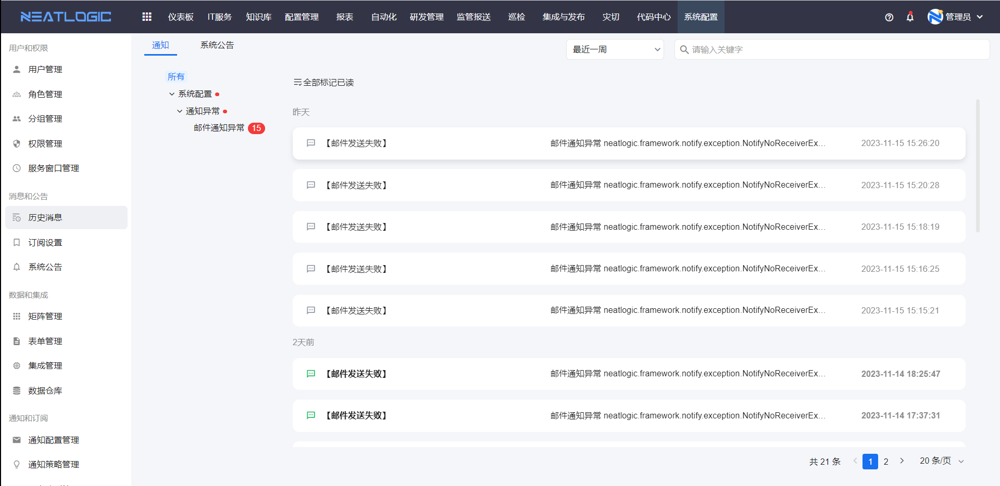
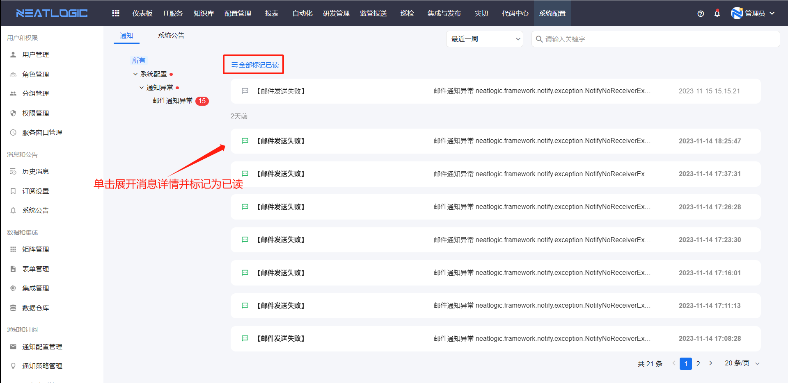
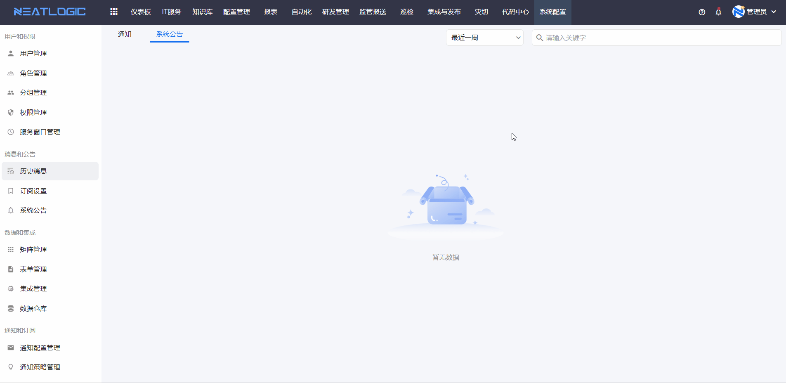

# 历史消息

历史消息用于查看当前用户收到的系统消息。消息状态包括未读和已读，通知目录出现红点时，表示当前用户还有未读消息。

当需要确认系统是否已经发送通知、查看通知内容，或把未读消息统一标记为已读时，可以从历史消息开始。

## 阅读路径

可根据当前要解决的问题选择阅读入口。

- 如果需要查看收到的消息，阅读“消息列表”。
- 如果需要处理未读消息，阅读“标记为已读”。
- 如果需要从顶部通知入口快速进入消息，阅读“通知入口”。
- 如果需要判断为什么会收到消息，阅读“触发消息的场景”。

## 消息列表

消息列表汇总当前用户收到的系统消息。

用户可以在这里查看消息内容和消息状态。未读消息会在通知入口和消息目录中提示，方便用户及时处理。

**操作权限**
- 配置：无单独菜单权限
- 包含操作：查看历史消息、展开消息详情、标记消息为已读
- 配置人员：无需单独配置

## 标记为已读

标记为已读用于清理未读消息状态。

单击消息可以展开查看详情，消息状态会变成已读。页面也支持一键将未读消息全部标记为已读。

## 通知入口

通知入口用于快速查看当前用户的未读消息。

页面右上方的系统通知图标会展示当前用户的未读消息。点击历史消息，可以跳转到历史消息页面继续查看完整消息列表。

## 触发消息的场景

消息通常由业务模块触发。模块需要先启用订阅并配置通知方式，相应消息才能发送给用户。

常见触发场景包括：

1. IT服务通知，包括节点动作通知、工单层面活动通知和时效通知。详情可参考[流程管理](../../2.IT服务/流程管理/流程管理.md)中的节点设置、流程设置和时效设置。
2. 自动化通知，例如组合工具失败通知。详情可参考[组合工具](../../5.自动化/工具/组合工具.md)。
3. 集成与发布通知，例如应用层相关通知。详情可参考[应用配置](../../6.集成与发布/配置/应用配置.md)。

如果用户没有收到预期消息，可以先检查[订阅设置](订阅设置.md)，再检查对应业务模块的通知配置。
