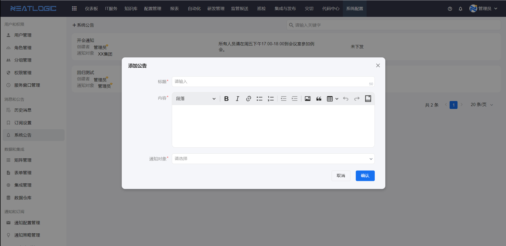
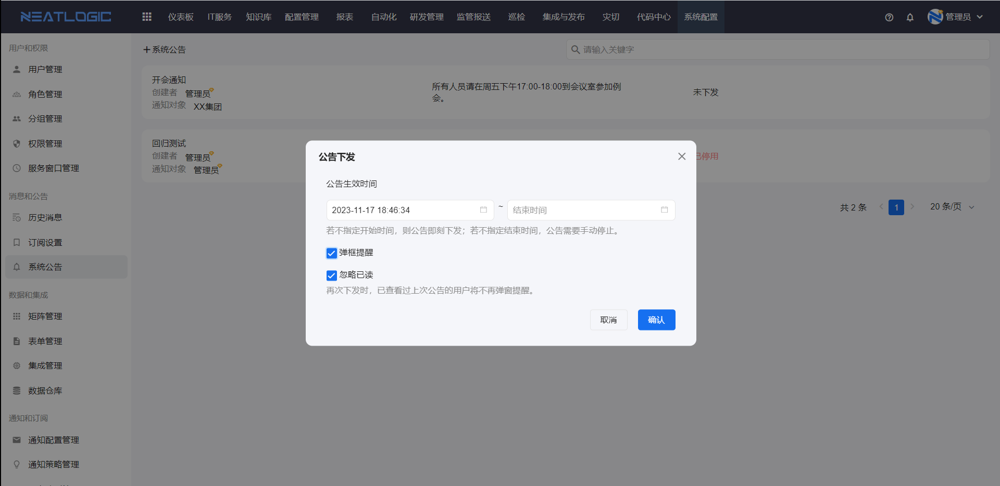
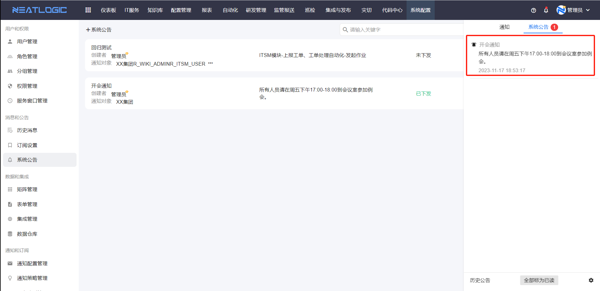
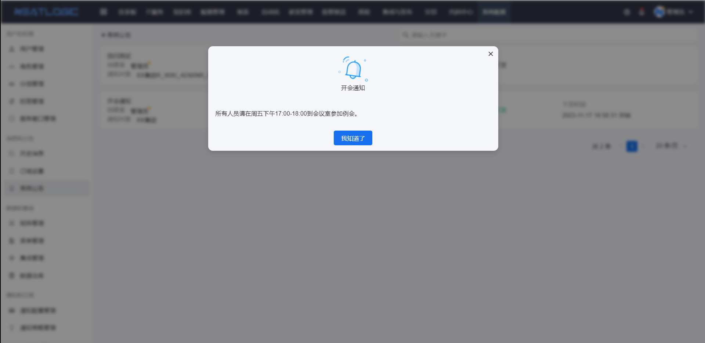
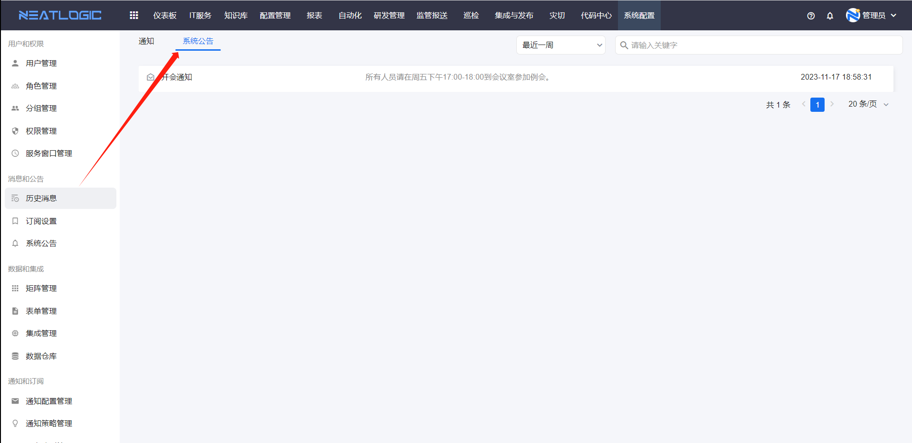

# 系统公告

系统公告用于由管理员发布面向指定用户的系统通知。公告支持公告栏提示和全屏弹框提醒，适合发布系统维护、升级通知、重要事项提醒等内容。

当需要统一通知用户某个系统事项，或需要在指定时间范围内持续提醒用户时，可以从系统公告开始。

## 阅读路径

可根据当前要解决的问题选择阅读入口。

- 如果需要创建公告内容，阅读“添加公告”。
- 如果需要把公告发送给用户，阅读“下发公告”。
- 如果需要了解用户看到的公告效果，阅读“公告提醒效果”。
- 如果需要查看已发布公告，阅读“历史公告”。

## 权限说明

系统公告由管理员维护。

**操作权限**
- 配置：系统配置-[权限管理](../1.用户和权限/权限管理.md)-授权-系统公告管理权限
- 包含操作：添加公告、下发公告、查看历史公告
- 配置人员：系统超级管理员

## 添加公告

添加公告用于维护公告模板内容。

点击添加系统公告按钮，公告配置中包括标题、内容和通知对象。

添加后的公告只是一个模板，还不会立即通知用户。需要执行下发后，指定用户才会收到系统公告。

## 下发公告

下发公告用于把公告发送给指定用户。

公告下发配置包括公告生效时间和弹窗提醒方式。

| 配置项 | 说明 |
|:--|:--|
| 生效时间 | 公告开始到结束的时间。若没有设置开始时间，公告立即生效；若没有结束时间，公告会一直提示直到用户已阅。 |
| 弹窗提醒 | 使用全屏弹窗提示用户，用户关闭弹窗后即标为已读。 |
| 忽略已读 | 再次下发公告时，不再下发给已读上次公告的用户。 |

## 公告提醒效果

公告下发成功后，用户可以在系统公告栏中看到公告。

如果公告配置了弹窗提醒，用户会看到全屏弹窗提示。关闭弹窗后，该公告会标记为已读。

## 历史公告

历史公告用于查看已经发布过的系统公告。

系统公告相关记录可在历史公告中查看。

