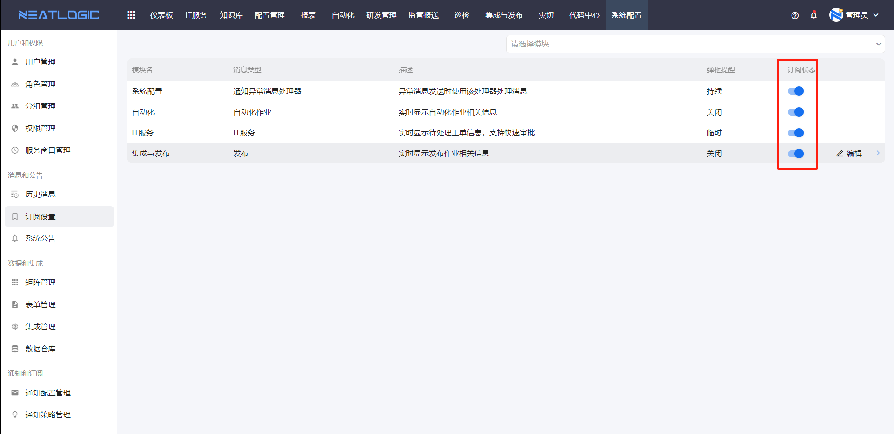
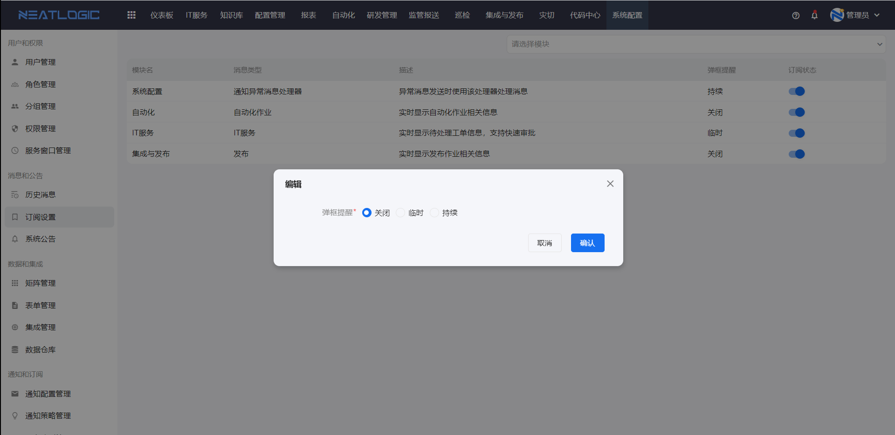

# 订阅设置

订阅设置用于控制模块消息通知的订阅状态和通知方式。

当用户收不到某类系统消息，或希望调整消息是否弹窗提醒时，可以从订阅设置开始检查。

## 阅读路径

可根据当前要解决的问题选择阅读入口。

- 如果需要确认某个模块是否会发送消息，阅读“订阅状态”。
- 如果需要调整消息提醒方式，阅读“通知方式”。
- 如果用户反馈收不到消息，阅读“消息未收到时的排查顺序”。

## 订阅状态

订阅状态决定模块消息是否会发送。

模块启用订阅后，相应的消息通知才能发送。若订阅关闭，即使业务模块触发了通知场景，用户也可能收不到消息。

**操作权限**
- 配置：无单独菜单权限
- 包含操作：查看和调整模块订阅状态、配置通知方式
- 配置人员：拥有系统配置访问能力的用户

## 通知方式

通知方式决定消息如何提醒用户。

消息通知默认会进入通知列表，另外还支持弹窗提醒。弹窗提醒状态包括关闭、临时和持续，可根据消息重要程度选择。

## 消息未收到时的排查顺序

当用户反馈没有收到消息时，可以按以下顺序排查：

1. 先确认对应模块是否启用订阅。
2. 再确认通知方式是否符合预期，例如是否启用了弹窗提醒。
3. 再检查具体业务模块是否配置了通知触发点。
4. 最后到[历史消息](历史消息.md)中确认消息是否已经生成但被用户标记为已读。
