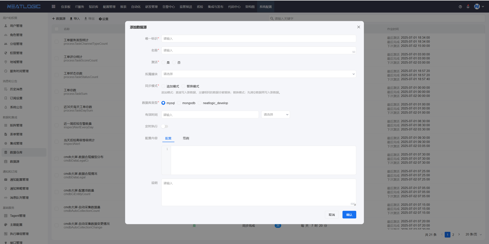
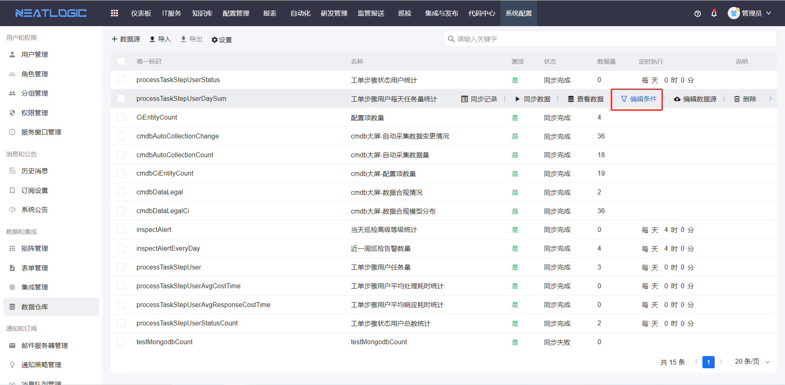
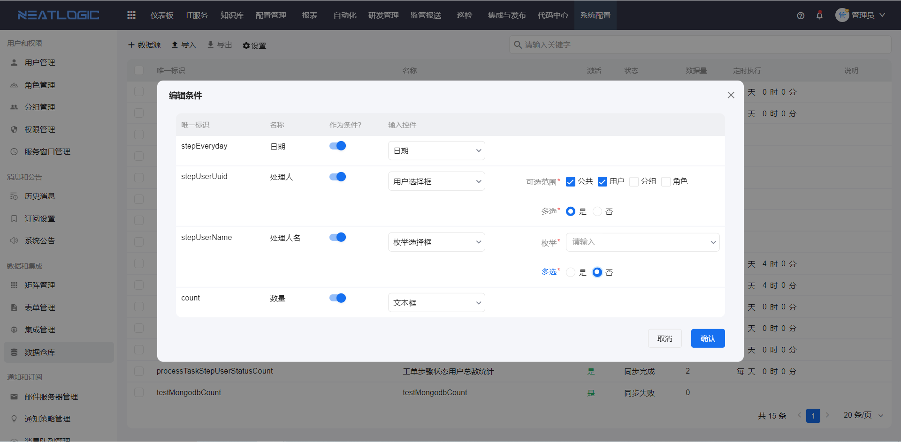
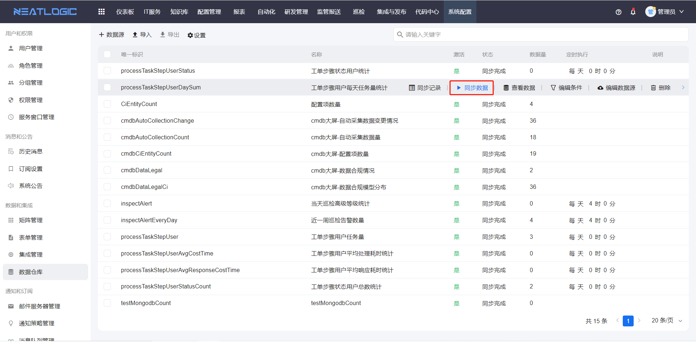
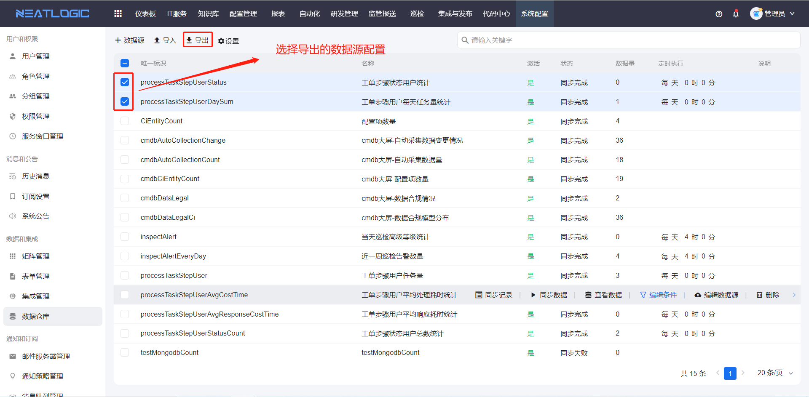
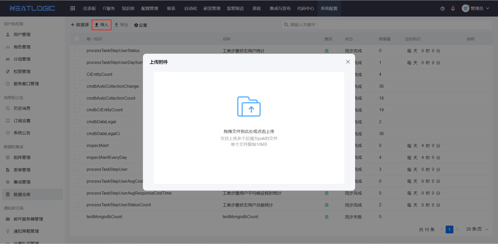
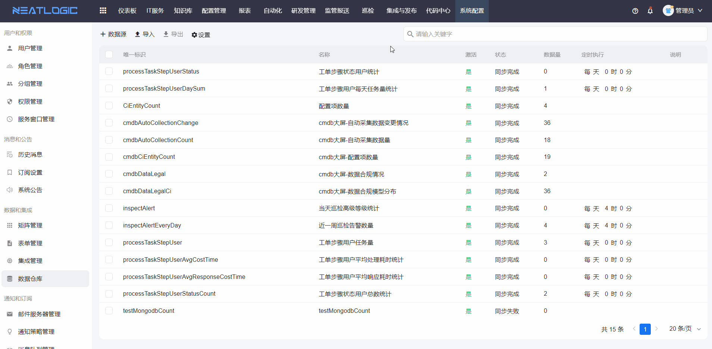
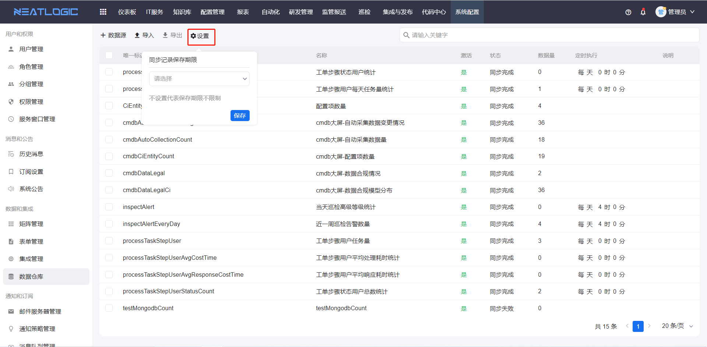

# 数据仓库

数据仓库用于维护可被系统调用的数据源配置。这里的数据源配置不是业务数据本身，而是一组“如何生成数据”的配置：管理员在配置内容中编写查询脚本，系统执行脚本后查询并生成数据，再供仪表板组件等功能引用。

一条数据源配置通常包含唯一标识、名称、所属模块、同步模式、数据库类型、有效时间、定时执行规则和配置内容。配置内容负责定义返回字段和查询脚本，编辑条件则用于在数据源配置被引用时过滤返回数据。

## 阅读路径

可根据当前要解决的问题选择阅读入口。

- 如果需要新建一条数据源配置，阅读“添加数据源配置”。
- 如果需要定义数据源返回哪些数据，阅读“配置内容”。
- 如果数据源被引用时需要按条件过滤数据，阅读“编辑条件”。
- 如果需要验证脚本执行结果或刷新生成数据，阅读“同步数据”和“定时执行”。
- 如果需要迁移配置或排查同步异常，阅读“导入导出”和“同步记录”。

## 权限

**操作权限**
- 配置：系统配置-[用户管理](../1.用户和权限/用户管理.md)-授权-数据仓库管理权限
- 包含操作：新增、编辑、导入、导出、同步和维护数据仓库中的数据源配置
- 配置人员：系统超级管理员

## 添加数据源配置

当需要让系统按脚本查询并生成某类可复用数据时，可以在数据仓库新增一条数据源配置。新增时，需要填写**唯一标识**和**名称**，并根据业务需要选择**所属模块**、**同步模式**、**数据库类型**和**有效时间**。

- 唯一标识：区分不同配置，也是其他功能引用该配置时的重要依据。
- 名称：用于描述这条配置的业务含义，建议使用容易识别的名称。
- 所属模块：标记配置归属，便于后续检索和管理。例如数据源配置用于研发管理模块时，所属模块应选择研发管理。
- 数据库类型：指定脚本的执行环境，配置脚本时应使用与数据库类型匹配的语法。
- 有效时间：控制生成数据的可用期限，超过有效时间后需要重新同步生成数据。
- 同步模式：控制同步结果的写入方式：
  1. 追加模式：保留已有数据，并写入本次脚本查询返回的新数据。主键相同的数据会被替换。
  2. 替换模式：先清空当前配置已生成的数据，再写入本次脚本查询返回的新数据。

- 定时执行：定时更新数据，启用定时执行配置，设置循环周期。

## 配置内容

配置内容用于定义这条数据源配置如何查询数据，以及最终返回哪些字段。配置人员需要在配置内容中维护**字段定义**和**查询脚本**：字段定义用于声明脚本返回数据的字段标识、显示名称和字段类型，查询脚本用于查询数据，并把查询结果返回给数据仓库。

配置完成后，应确认查询脚本返回的字段与字段定义一致。如果字段不匹配，即使脚本能够执行，也可能导致生成数据异常，或导致引用方无法正确识别字段。

## 编辑条件

编辑条件是基于数据源配置维护的过滤条件。当数据仓库中的数据源配置被其他功能引用时，如果需要按指定条件过滤返回数据，可以配置编辑条件，把通用过滤逻辑集中维护在数据仓库中，减少不同引用场景中的重复配置。

编辑条件默认不启用任何字段。配置人员可以根据使用需要启用字段作为过滤条件，并设置对应的输入控件类型和控件参数；目前支持的控件类型包括文本框、日期、用户选择框和枚举选择框。

## 同步数据

新增的配置保存后不会自动同步数据，建议手动执行一次同步数据，以确认脚本是否能正常查询、返回字段是否完整，以及同步结果是否符合预期。

## 定时执行

定时执行适合数据需要周期性刷新的场景。启用后，系统会按照设置的时间周期自动执行查询脚本，并刷新生成数据。

配置定时执行时，应结合数据变化频率和脚本执行成本设置合理周期。如果脚本查询范围较大或执行耗时较长，应避免设置过于频繁的执行周期。

## 导入导出

导入导出用于迁移或备份数据源配置。导出的内容是配置本身，包括唯一标识、字段定义、查询脚本和相关参数，不包含脚本执行后生成的数据。

导入配置后，需要根据目标环境检查数据库类型、脚本内容和字段定义是否可用，并通过同步数据验证配置是否能正常生成数据。

## 同步记录

同步记录用于查看每次查询脚本执行和数据生成的结果，记录中会展示同步时间、数据量和异常信息。当同步失败，或生成数据与预期不一致时，可以先查看同步记录，再根据错误信息检查脚本语法、数据库类型、字段定义或返回数据格式。

系统支持设置同步记录保留期限，用于控制历史记录的保留范围。合理设置保留期限，可以避免历史记录长期堆积。

