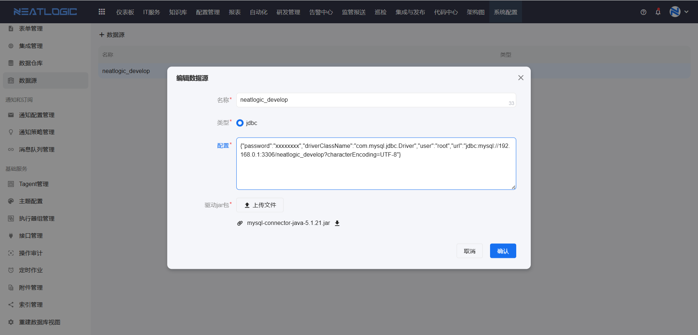
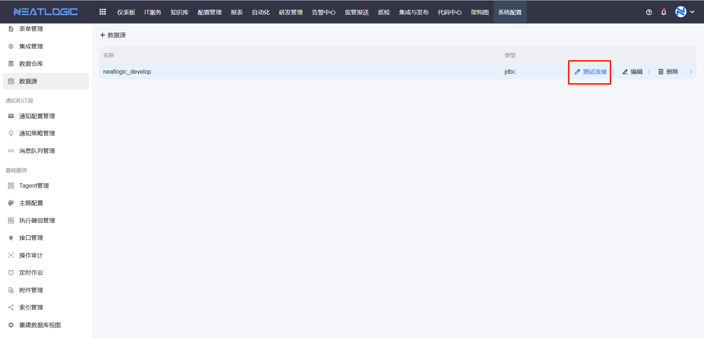

# 数据源
数据源管理页面是用来管理非本地的数据库配置，应用于数据仓库，作为数据仓库配置的数据库类型。


### 配置示例
```
{"password":"xxxxxxxx","driverClassName":"com.mysql.jdbc.Driver","user":"root","url":"jdbc:mysql://192.168.0.1:3306/neatlogic_develop?characterEncoding=UTF-8"}
```

### 测试连接
数据源保存后，可以测试数据源能否正常连接。
