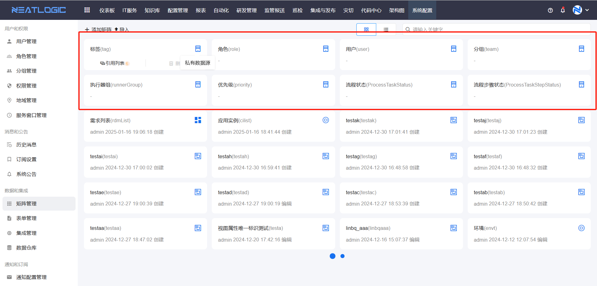
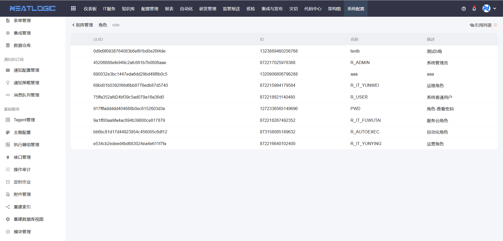
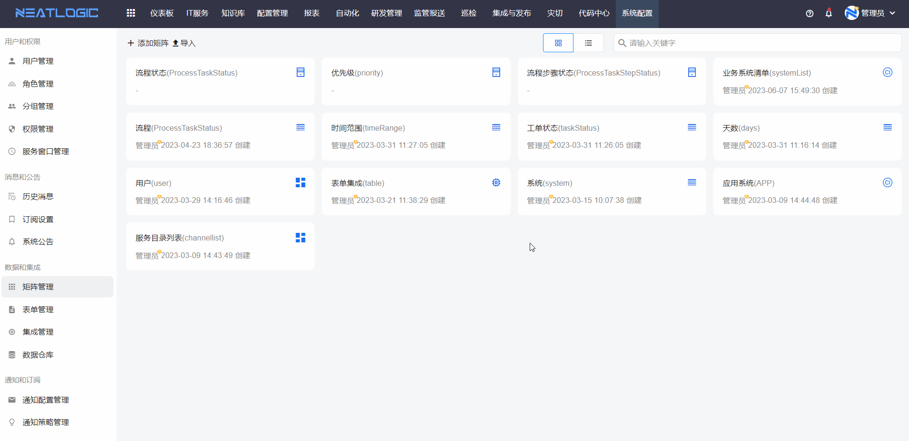
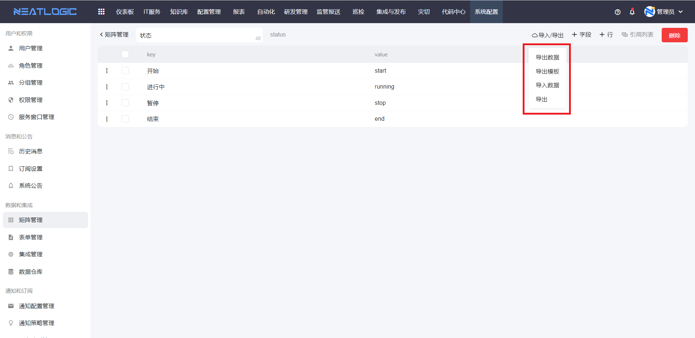
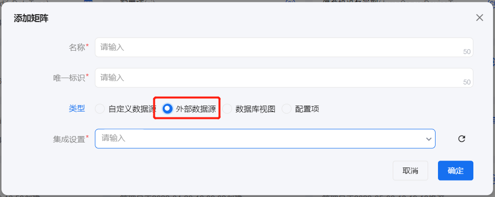
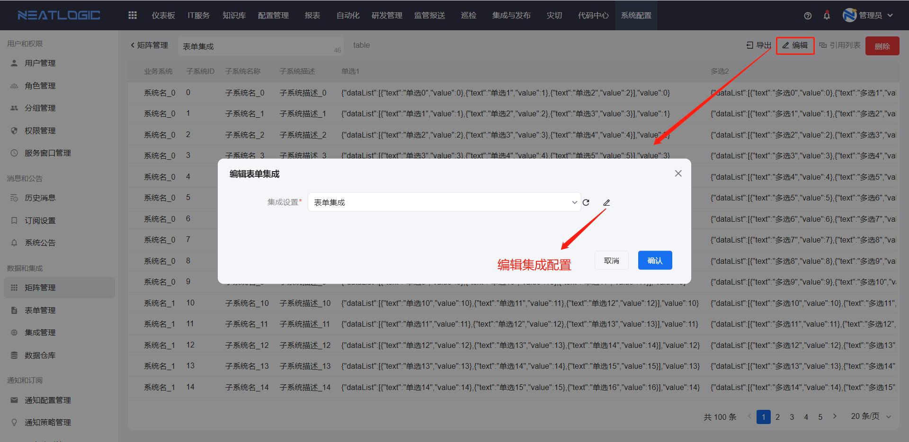
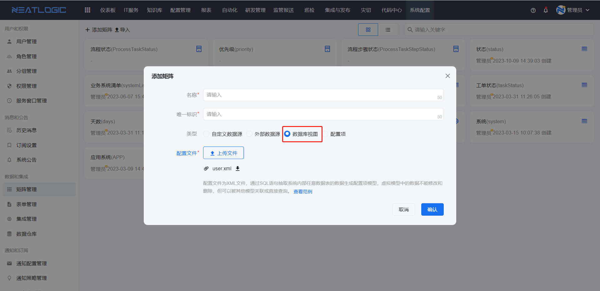
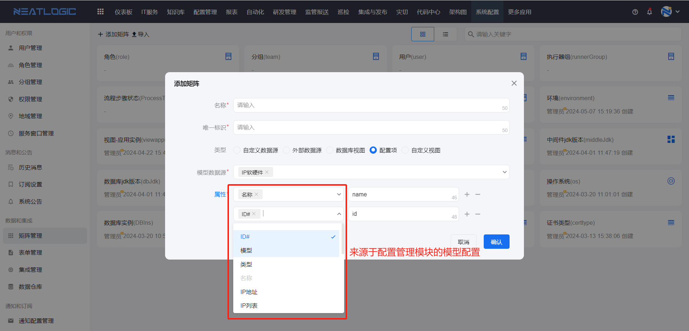
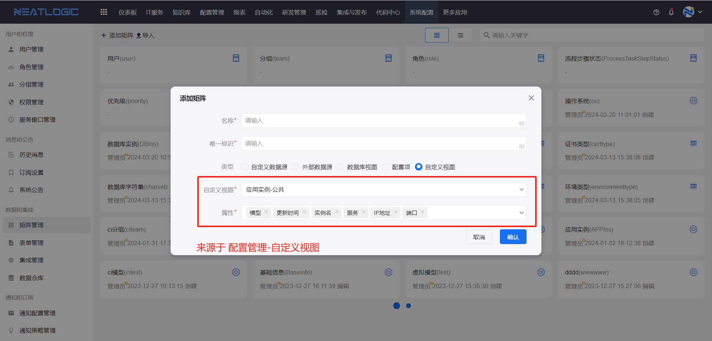

# 矩阵管理
矩阵管理页面是一个统一的数据源管理平台，主要用于为表单、自动化工具参数、组合工具作业参数等提供数据支撑。矩阵共分为六种类型：私有数据源、自定义数据源、外部数据源、数据库视图、配置项和自定义视图矩阵。

## 矩阵类型介绍

### 私有数据源

私有数据源为系统出厂预置的数据源类型，将系统内部高频使用的数据固化生成数据源矩阵。私有数据源矩阵不支持修改，包含以下内容：标签（执行器组标签）、执行器组、角色、用户、分组、优先级（工单）、流程状态、流程步骤状态等。




### 自定义数据源

自定义数据源提供较高的灵活性，矩阵属性完全由用户自行配置，并支持批量导入数据。

**操作步骤**：添加矩阵 → 配置属性 → 添加行（数据）



**属性类型说明**：支持文本框、日期、下拉框、用户、分组、角色、地域和模型。其中，用户、分组、角色、地域和模型的数据均来自系统内相应的管理页面，详情请参考：
- [用户管理](../1.用户和权限/用户管理.md)
- [分组管理](../1.用户和权限/分组管理.md)
- [角色管理](../1.用户和权限/角色管理.md)
- [地域管理](../1.用户和权限/地域管理.md)
- [模型管理](../../3.配置管理/模型管理/模型管理.md)
  
> 在添加数据时，若某个属性选择了多个值，系统将根据笛卡尔积规则自动生成多条数据。

**导入导出功能**：



- **导出数据**：将当前自定义数据源矩阵的所有数据导出为 Excel 格式。
- **导出模板**：导出用于导入数据的 Excel 格式模板。
- **导入数据**：将 Excel 格式的数据导入到当前矩阵中。
  - 用户和角色：支持通过 uuid、id 和名称导入。
  - 分组：支持通过 uuid、名称和全路径导入。
  - 地域：支持通过 uuid 和名称导入。
  
- **导出矩阵**：将整个矩阵导出为 bak 格式的备份文件。

### 外部数据源

外部数据源通过关联集成设置，调用集成配置中的外部接口获取数据作为数据源。矩阵所引用的集成配置，其接口输入和输出必须转换为规范格式，矩阵才能正常生成有效数据。更多详情请参考[集成管理](../../100.系统配置/3.数据和集成/集成管理.md)。



添加外部数据源矩阵完成后，系统将跳转至矩阵编辑页面，支持更换关联的集成配置。**需要注意的是，若矩阵已被引用，则无法更换集成配置**。



### 数据库视图

数据库视图通过导入 SQL 配置文件，查询本地数据库中的数据并生成视图。



**配置文件示例**：

```
<view>
   <!--视图字段定义，需要SQL语句返回对应列-->
  <attrs>
    <attr name="user_id" label="用户ID" />
    <attr name="user_name" label="用户名" />
    <attr name="teamName" label="分组" />
  </attrs>
  <sql>
    SELECT
    <!--必须包含id字段-->
    `u`.`id` AS id,
    <!--必须包含uuid字段-->
 `u`.`uuid` AS uuid,
    <!--下列字段需要在上面attrs中定义才生效-->
    `u`.`user_name` AS name,
    `u`.`user_id` as user_id,
    `u`.`user_name` as user_name,
    group_concat( `t`.`name`) AS teamName
    FROM `user` `u`
    LEFT JOIN `user_team` `ut` ON `u`.`uuid` = `ut`.`user_uuid`
    LEFT JOIN `team` `t` ON `t`.`uuid` = `ut`.`team_uuid`
    GROUP BY u.`uuid`
  </sql>
</view>
```

### 配置项

配置项数据源通过关联配置项模型并选择模型属性，生成矩阵数据源。模型数据源请参考配置管理-[模型管理](../../3.配置管理/模型管理/模型管理.md)。



### 自定义视图

自定义视图数据源通过引用配置管理-自定义视图，勾选需要的属性，生成矩阵数据源，矩阵数据会随自定义视图的数据动态变化，仅支持公共视图。自定义视图详情请参考配置管理-[自定义视图](../../3.配置管理/自定义视图/自定义视图.md)

