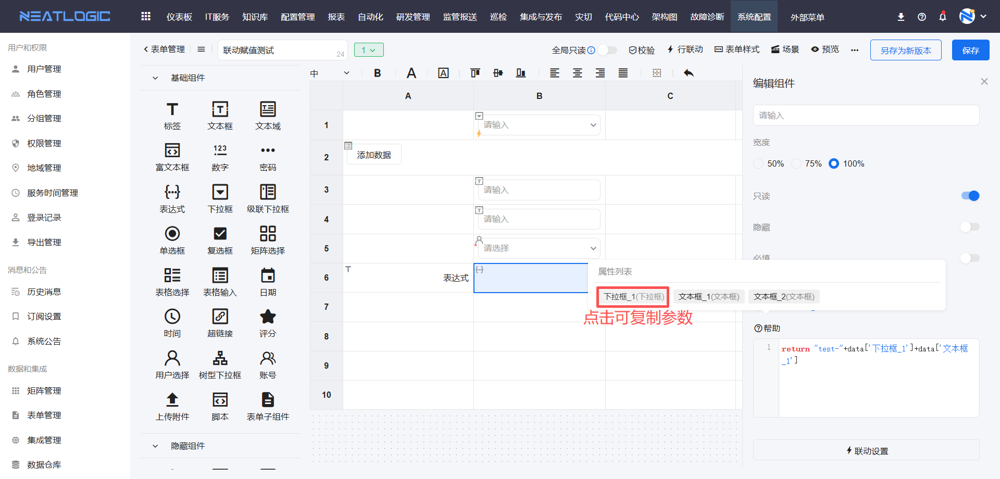

# 表单管理

表单是由各类组件组合而成的**表格模板**，用于定义数据的录入与展示格式。表单包含**系统自带组件**和**自定义组件**两类。系统自带组件支持通过可视化界面进行配置；自定义组件则允许用户通过脚本自主定义，以满足更复杂的业务需求。表单管理页面仅用于创建和维护表单模板本身，不涉及具体业务数据的录入。

表单可应用于 **IT服务** 的 [流程管理](../../2.IT服务/流程管理/流程管理.md) 和 **自动化** 的 [目录管理](../../5.自动化/快捷服务/快捷服务.md) 中。通过表单的引用列表，可以快速查看和追溯引用了该表单的对象。

## 1. 表单配置

表单配置主要包含**名称**、**组件**和**样式**三部分。此外，还支持配置**组件联动**、**行联动**、**场景**和**版本**，以实现更动态和精细化的控制。

### 1.1. 表单组件

表单组件分为五大类：**基础组件**、**布局组件**、**自动化组件**、**配置管理组件**和**自定义组件**。

- **基础组件**：包括文本框、文本域、下拉框、单选框、复选框、日期、表格选择等。
- **隐藏组件**：包括上报人、文本框、下拉框（此类组件在表单运行时隐藏，用于数据传递）。
- **布局组件**：包括分割线、选项卡、折叠面板，用于优化表单的页面结构。
- **自动化组件**：包括连接协议、执行目标、自动化服务，主要用于自动化节点的参数映射。
- **配置管理组件**：即配置项修改组件，用于变更配置项数据。
- **自定义组件**：通过脚本自定义开发的组件。

#### 1.1.1. 组件配置

下面将详细介绍使用频率较高的组件配置。未提及的组件配置相对简单，可自行探索。请注意，组件中引用的矩阵数据源均来自[矩阵管理](../../100.系统配置/3.数据和集成/矩阵管理.md)。

1.  **标签**
    
    标签组件用于在表单中显示固定的文本说明，例如作为某个输入字段前的标题。
    
    

2.  **文本框、文本域、富文本框、数字、密码**
    
    这些是文本输入类组件，可在组件类型间相互切换。它们的通用配置包括：名称、描述、默认状态、字符长度、输入提示和默认值等。其中，**数字** 组件额外提供了数字范围和小数位数的配置，用于限制输入格式。
    
    
    
    **文本框** 支持自定义正则表达式进行校验。若正则表达式为空，则校验提示为非必填，输入框不校验内容；若正则表达式非空，则校验提示为必填，输入值必须满足该正则表达式才能通过校验。
    
    
    
    **密码** 组件支持查看授权功能。只有被授权的对象（用户、分组或角色）才允许查看密码明文。
    
    
    

3.  **下拉框、单选框、复选框**
    
    这三种选择类组件都必须配置数据源，支持**静态数据源**和**矩阵数据源**两种方式。
    
    - **静态数据源**：手动输入选项的显示名和值。
    
    
    
    支持批量编辑，方便快速录入。
    
    
    
    - **矩阵数据源**：关联一个已存在的矩阵，并设置选项的显示名和实际值与矩阵属性的映射关系。
    
    
    
    **下拉框** 组件在引用矩阵数据源时，还支持“隐藏属性”和“新增数据”等高级配置。
    
    - **隐藏属性**：这些属性在表单界面上不可见，但可以被表单中的其他组件（如文本框）通过联动规则引用，常用于动态赋值。
    
    
    
    **隐藏属性应用示例**：被文本框、文本域引用，作为组件联动中动态赋值的来源。
    
    
    
    - **是否默认选中**：启用此配置后，当下拉框只有一个选项时，系统将默认选中该选项。
    
    
    
    - **新增数据**：启用后，在表单应用时，下拉框选项上方会显示“添加”按钮。用户可快速向关联的矩阵数据源（仅支持自定义类型矩阵 `custom`）中添加新数据。
    
    
    

4.  **时间、日期**
    
    时间和日期组件可配置数据显示的格式。
    
    
    
    **日期校验规则**：包括“工作日”和“自定义规则”。
    
    - **工作日**：选择的日期必须是工作日。
    - **自定义**：通过表达式指定日期必须满足某个时间段条件。表达式的比较对象可以是“自定义日期”、“填写时间”（即填写表单当天的日期）或表单中的其他日期组件。
    
    
    
    **时间校验规则**：目前支持“自定义”，通过表达式指定时间必须满足某个时段。例如，设置“晚于 8:00”，则输入时间必须大于 8:00（8:00 本身不满足条件）。
    
    

5.  **表格选择、表格输入、矩阵选择**
    
    这三个组件均以表格形式呈现。
    
    **表格输入组件** 允许用户自定义表头字段，每个字段支持文本框、下拉框、时间、日期等常见类型。应用效果为：在表格中新增空白行，由用户填写数据。
    
    
    
    此外，组件内的下拉框字段可以与其他表格输入组件关联，实现属性的动态过滤。
    
    
    
    下拉框字段的数据源也可以引用其他表格输入组件，其选项将随被引用表格的数据动态变化。
    
    
    
    **表格选择组件** 直接关联一个矩阵数据源，并允许在矩阵原有属性的基础上，扩展新的自定义属性（手动填写）。应用时，用户从矩阵中选择数据行，适用于需要展示和选择多条配置项数据的场景。
    
    
    
    **矩阵选择组件** 通过定义纵轴（类别）和横轴（选项）来生成一个选择矩阵。用户可在类别和选项的交点处进行选择，支持单选或多选。
    
    

6.  **用户选择组件**
    
    此组件引用系统中的用户、分组和角色数据，满足需要选择特定系统用户的场景。其数据源参考[用户管理](../../100.系统配置/1.用户和权限/用户管理.md)。
    
    

7.  **表单子组件**
    
    表单子组件是一个内嵌的子表单，其组件配置方式与主表单完全一致。通过“默认行数”可以控制子表单初始化时显示的数据行数（可为 0）。
    
    

8.  **树形下拉框**
    
    此下拉框的选项以树形结构展示，适用于具有层级关系的数据选择。目前，其数据源仅支持[知识圈](../../98.知识库/新建知识文档.md)。
    
    

9.  **表达式**
    
    表达式组件通过常量和引用其他组件的值，自动计算并生成最终值。表达式的书写方式有两种：**字段拼接**和**JS脚本转换**。字段拼接支持常量和表单中的普通组件。
    
    
    

10. **配置项修改**
    
    此组件用于对一个**模型**及其关联模型的配置项数据进行新增、编辑或删除操作。
    
    组件配置时，需选择一个关联模型（普通模型）作为操作对象，并指定允许的操作类型（新增/编辑/删除，至少选一项）。
    
    
    
    在“操作”设置中，可以控制该模型下哪些属性/关系可被操作。若未选择任何属性/关系，则按照模型的“显示设置”进行显示或编辑；若选择了部分，则仅限选择的属性/关系可操作。
    
    手动变更时，点击“编辑数据”，在弹窗中选择操作类型并填写信息后确认即可。
    
    
    
    
    该组件也支持批量导入数据以实现批量变更。导入的配置项 ID 为空，则执行新增操作；ID 不为空且匹配到现有配置项，则执行修改操作。
    
    

11. **自动化组件**
    
    这些组件专用于[自动化节点](../../2.IT服务/流程管理/流程管理.md)的参数映射，包括**连接协议**、**执行目标**和**自动化服务**。

12. **隐藏组件**
    
    此类组件在表单应用时完全隐藏，不可见也不可编辑。它们主要用于在后台进行数据赋值和消费，通常通过组件联动来设置其值。
    
    
    
    - **隐藏表单信息组件**：用于在工单上报时获取工单的上下文信息，如用户名、用户ID、工单ID。
    - **隐藏下拉框、隐藏文本框**：其基础配置与普通下拉框、文本框类似，但联动配置中只保留了过滤、赋值和触发等用于数据交互的动作。

13. **脚本**
    
    脚本组件支持多种常见的脚本语言，适用于需要在表单中直接编写和提交脚本内容的场景。
    
    

#### 1.1.2. 组件联动

组件联动允许您定义：当表单中一个组件的值发生变化时，自动触发其他组件发生相应的变化。支持的联动动作共有9种：过滤、隐藏、只读、禁用、显示、必填、不可见、触发、条件赋值、联动赋值。

1.  **清空**：清空目标组件已填充的值。清空联动需要配置触发条件才能生效。
    
    

2.  **禁用**：禁止用户使用目标组件。与“只读”的区别是，只读会保留并显示值，而禁用后值通常不会被提交。配置驱动条件和预设值后，当驱动组件满足条件时，当前组件即被禁用。
    
    

3.  **显示**：显示当前组件。此联动通常与组件的“默认隐藏”属性结合使用。当驱动组件满足配置的条件时，该组件才被显示出来。
    
    
    

4.  **触发**：目前仅支持“修改优先级”。此联动应用于IT服务工单，当特定组件的值被修改时，会触发工单优先级的改变。要求当前组件必须是选择类组件，且引用了“优先级矩阵”作为数据源，其值的映射对象必须设置为优先级的名称。
    
    

5.  **过滤**：用一个组件的值去过滤另一个组件的选项。驱动组件的值会与被过滤组件所引用矩阵的某个属性进行匹配，最终只显示过滤后的结果。
    
    **支持过滤的组件：下拉框、单选框、复选框、表格输入组件中的下拉框。**
    
    如果驱动组件是“用户选择组件”，那么被过滤组件引用的矩阵数据源必须是关于系统用户、角色或分组的数据，过滤联动才能生效（因为用户选择组件的值是用户的 UUID）。
    
    

6.  **隐藏**：隐藏当前组件。配置驱动条件后，当条件满足时，该组件在界面上不可见。
    
    

7.  **不可见**：对组件内容进行模糊化处理，常用于隐藏敏感信息。

8.  **只读**：将当前组件切换为只读状态，用户无法编辑其内容。配置驱动条件后，当条件满足时生效。
    
    

9.  **必填**：将组件设置为必填项。此联动常用于将默认非必填的组件，在特定条件下变为必填。

10. **条件赋值**：当满足配置的条件时，为当前组件赋予一个固定的值。注意，只有当组件的值为空时，此赋值操作才能生效。
    
    
    
    **文本框、文本域** 的条件赋值还支持“动态赋值”，可以引用[下拉框](#组件配置)组件的值或其隐藏属性。当下拉框为多选时，会回显所有选中项拼接后的值。

11. **联动赋值**：当当前组件满足某个条件时，给指定的一个或多个其他组件赋值。目前只有**下拉框**组件支持发起联动赋值，而被赋值的组件类型**只支持文本框**。
    
    - **静态值**：赋值为一个常量。
    - **动态值**：选择当前下拉框组件的某个**隐藏属性**作为赋值来源。
    
    

### 1.2. 场景

场景功能旨在满足工单在不同处理步骤中需要呈现不同表单的需求。每个表单版本的场景都是相互独立的。

- **主场景**：即当前版本下的默认表单配置。
- **自定义场景**：可以在主场景的基础上重新定义表单的布局和配置。普通场景只能使用主场景中已有的组件，无法新增组件。

- **默认场景**：指流程节点默认选用的场景。新建表单时，其默认场景就是主场景。之后可以将默认场景修改为其他自定义场景。

在新增的自定义场景中，只能使用当前表单版本中已配置的组件，且每个组件在场景中只能使用一次。场景中的联动规则和组件配置，可以选择重新定义或直接继承自主场景。

### 1.3. 版本

表单版本分为**激活版本**和**非激活版本**。激活版本是表单当前正在应用的版本，且同一时刻只能有一个；非激活版本可以有多个，作为历史版本留存。

编辑表单后，若想保留上一版的配置，可以点击“另存为新版本”。保存后的新版本默认是非激活的历史版本。对版本的操作包括保存、删除和激活。只有激活版本是表单的当前应用版本，其余均为历史版本。

对于已激活的版本，“激活”和“删除”操作会被禁用。

执行“另存为新版本”成功后，将在版本列表中生成一个新的版本。

## 2. 表单应用场景

### 2.1. IT服务-流程管理

流程可以引用表单作为其工单的模板。在流程的节点设置中，可以关联表单的特定**场景**，从而解决不同节点需要不同表单的差异化需求。更多详情请参考[流程管理](../../2.IT服务/流程管理/流程管理.md)。

### 2.2. 自动化-服务目录

在自动化服务中，通过引用表单，可以将表单组件的值映射到自动化作业的执行参数上。更多详情请参考[快捷服务](../../5.自动化/快捷服务/快捷服务.md)。

### 2.3. 结合自动化节点使用

自动化组件（如连接协议和执行目标）的数据源与自动化模块中的定义一致。在流程管理中，它们需要与自动化节点结合使用。当工单流转到自动化节点时，系统会触发自动化作业，并将表单组件的值作为参数传递给作业。更多详情请参考[流程管理](../../2.IT服务/流程管理/流程管理.md)。

首先，在表单中添加“连接协议”和“执行目标”组件。

然后，在流程的自动化节点设置中，添加作业详情配置，并将作业所需的“连接协议”和“执行目标”参数，引用到刚刚添加的表单组件上。

## 3. 导入、导出

导入和导出功能分为两个维度：**表单维度**和**表单版本维度**。

- **导入/导出表单**
  
  在表单管理页进行的导出，会生成一个表单文件，该文件只能在同级的表单管理页进行导入。
  
  

- **导入/导出表单版本**
  
  在某个表单的编辑页进行的导出，会导出一个表单版本文件。该文件只能在此表单的编辑页中导入，并作为一个新版本。
  
  