# 表单管理

表单是由各类组件组合而成的数据采集模板，用于定义数据的录入、展示和流转格式。

表单包含**系统自带组件**和**自定义组件**两类。系统自带组件支持通过可视化界面配置。自定义组件支持通过脚本扩展，用于满足标准组件无法覆盖的业务需求。

表单管理页面用于创建和维护表单模板。

具体业务数据会在工单、服务或自动化执行过程中填写，不在表单管理页面录入。

表单可应用于 **IT服务** 的 [流程管理](../../2.IT服务/流程管理/流程管理.md) 中。

表单也可应用于 **自动化** 的 [目录管理](../../5.自动化/快捷服务/快捷服务.md) 中。

通过表单的引用列表，可以查看哪些流程、服务或自动化配置正在使用当前表单。

## 阅读路径

可根据当前要解决的问题选择阅读入口。

- 如果需要了解表单由哪些组件组成，阅读“表单组件”。
- 如果需要配置具体组件，阅读“组件配置”。
- 如果需要让组件之间自动过滤、显示、隐藏或赋值，阅读“组件联动”。
- 如果需要在不同流程节点展示不同表单内容，阅读“场景”。
- 如果需要调整已被引用的表单，阅读“版本”和“表单应用场景”。
- 如果需要迁移表单配置，阅读“导入、导出”。

## 权限

**操作权限**
- 配置：系统配置-[用户管理](../1.用户和权限/用户管理.md)-授权-表单管理权限
- 包含操作：新增、编辑、复制、删除、导入、导出和维护表单
- 配置人员：系统超级管理员

## 1. 表单配置

表单配置主要包含**名称**、**组件**和**样式**三部分。

此外，还支持配置**组件联动**、**行联动**、**场景**和**版本**。这些配置用于控制字段行为、表单展示范围和版本生效关系。

### 1.1. 表单组件

表单组件按用途分为**基础组件**、**隐藏组件**、**布局组件**、**自动化组件**、**配置管理组件**和**自定义组件**。

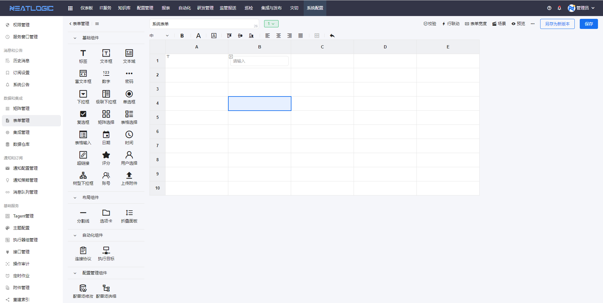

- **基础组件**：用于采集常规字段，包括文本框、文本域、下拉框、单选框、复选框、日期、表格选择等。
- **隐藏组件**：用于后台传值，包括上报人、文本框、下拉框。隐藏组件在表单运行时不可见。
- **布局组件**：用于组织页面结构，包括分割线、选项卡和折叠面板。
- **自动化组件**：用于自动化节点参数映射，包括连接协议、执行目标和自动化服务。
- **配置管理组件**：用于变更配置项数据，即配置项修改组件。
- **自定义组件**：用于扩展标准组件无法覆盖的表单能力，由脚本自定义开发。

#### 1.1.1. 组件配置

下面介绍使用频率较高、配置项较多的组件。

未提及的组件配置项较少，可按页面提示完成。

组件中引用的矩阵数据均来自[矩阵管理](../../100.系统配置/3.数据和集成/矩阵管理.md)。

1.  **标签**
    
    标签组件用于在表单中显示固定的文本说明，例如作为某个输入字段前的标题。
    
    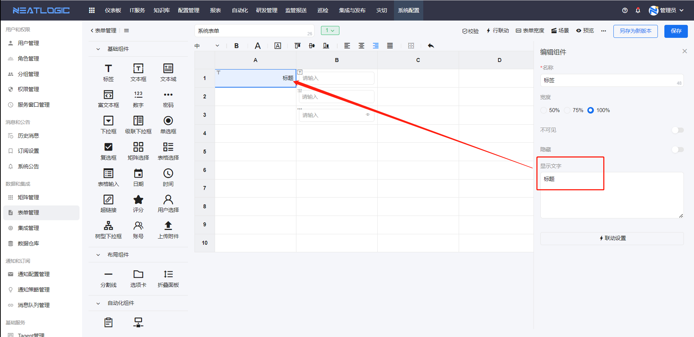

2.  **文本框、文本域、富文本框、数字、密码**
    
    文本框、文本域、富文本框、数字和密码都属于文本输入类组件，可在组件类型间相互切换。
    
    文本输入类组件的通用配置包括名称、描述、默认状态、字符长度、输入提示和默认值等。**数字** 组件还提供数字范围和小数位数配置，用于限制输入格式。
    
    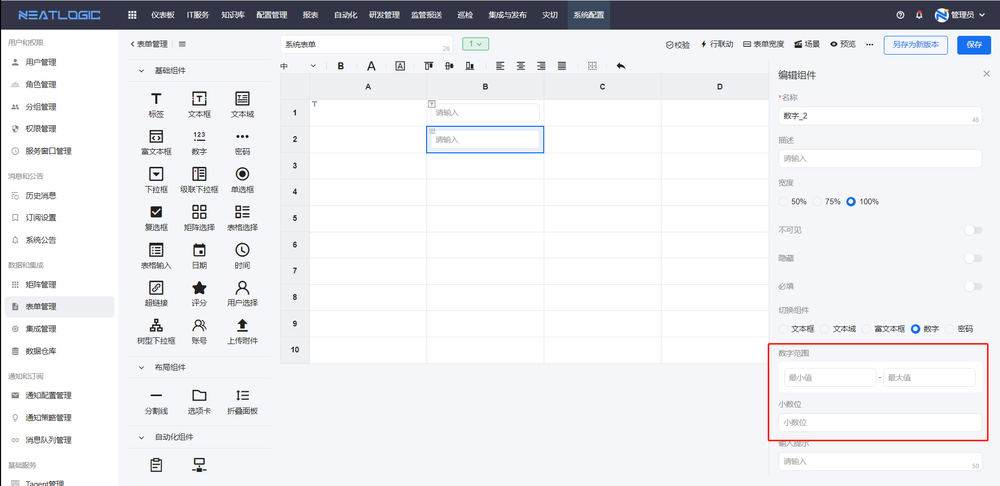
    
    **文本框** 支持通过正则表达式校验输入内容。
    
    正则表达式为空时，校验提示为非必填，输入框不校验输入内容。
    
    正则表达式非空时，校验提示为必填。输入值必须匹配该正则表达式，才能通过校验。
    
    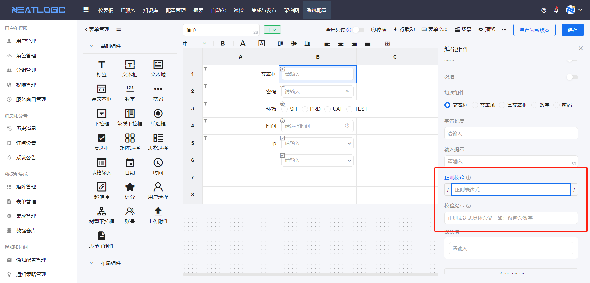
    
    **密码** 组件支持查看授权。
    
    查看授权用于控制谁可以查看密码明文。只有被授权的用户、分组或角色，才允许查看密码明文。
    
    
    

3.  **下拉框、单选框、复选框**
    
    这三种选择类组件都必须配置选项来源。
    
    选项来源支持**静态数据源**和**矩阵数据源**两种方式。
    
    - **静态数据源**：手动输入选项的显示名和值，适合固定选项。
    
    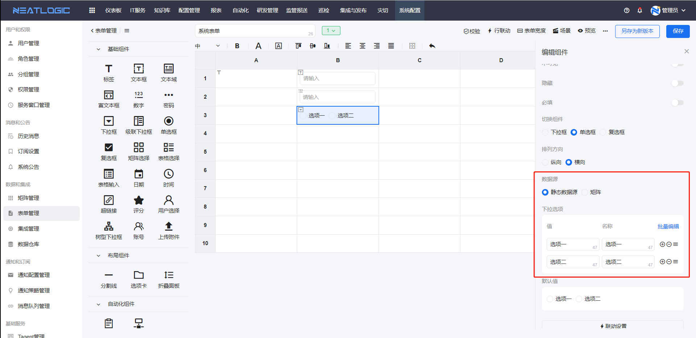
    
    支持批量编辑，方便快速录入。
    
    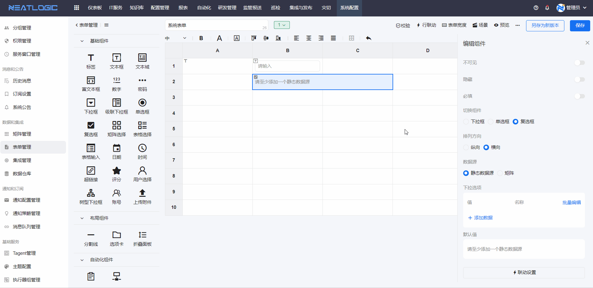
    
    - **矩阵数据源**：关联一个已存在的矩阵，并设置显示名、实际值与矩阵属性的映射关系。
    
    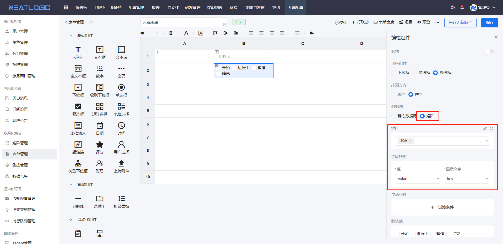
    
    **下拉框** 组件引用矩阵数据源时，还支持“隐藏属性”和“新增数据”等扩展配置。
    
    - **隐藏属性**：隐藏属性来自矩阵数据，但不会在表单界面上显示。
    
      表单中的其他组件（如文本框）可以通过联动规则引用隐藏属性。隐藏属性常用于动态赋值和数据传递。
    
    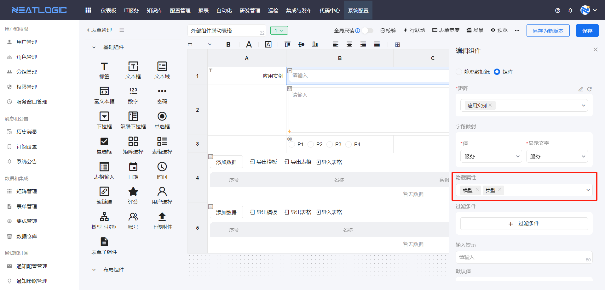
    
    **隐藏属性应用示例**：文本框、文本域可引用隐藏属性，作为组件联动中动态赋值的来源。
    
    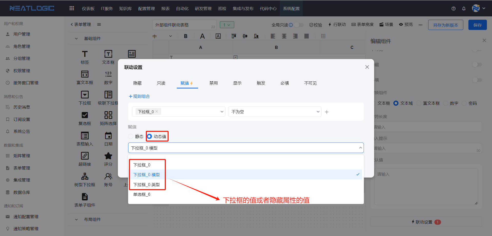
    
    - **是否默认选中**：启用后，当下拉框只有一个选项时，系统会自动选中该选项。
    
    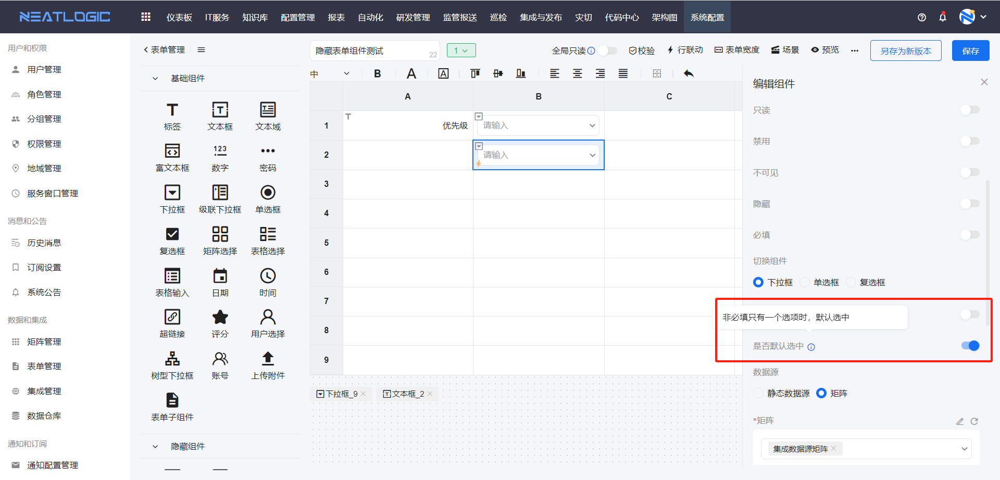
    
    - **新增数据**：启用后，在表单应用时，下拉框选项上方会显示“添加”按钮。
    
      用户可快速向关联的矩阵数据源中添加新数据。该能力仅支持自定义类型矩阵 `custom`。
    
    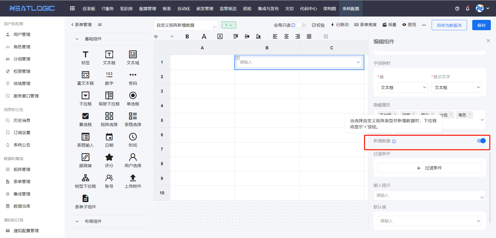
    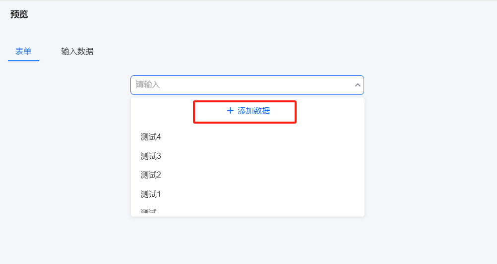

4.  **时间、日期**
    
    时间和日期组件可配置数据显示的格式。
    
    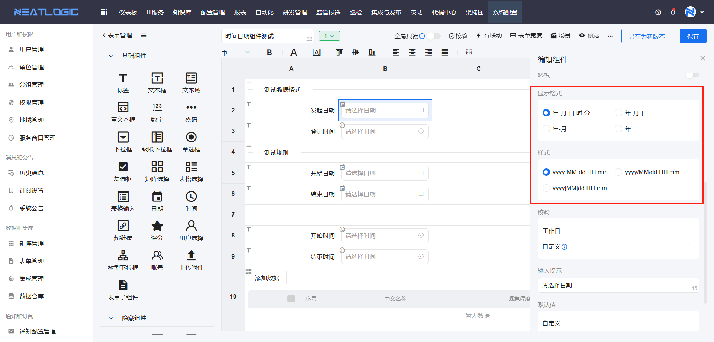
    
    **日期校验规则**：用于限制可填写的日期范围，包括“工作日”和“自定义规则”。
    
    - **工作日**：用户选择的日期必须是工作日。
    - **自定义**：通过表达式指定日期必须满足某个时间段条件。
    
      表达式的比较对象可以是“自定义日期”、“填写时间”（即填写表单当天的日期）或表单中的其他日期组件。
    
    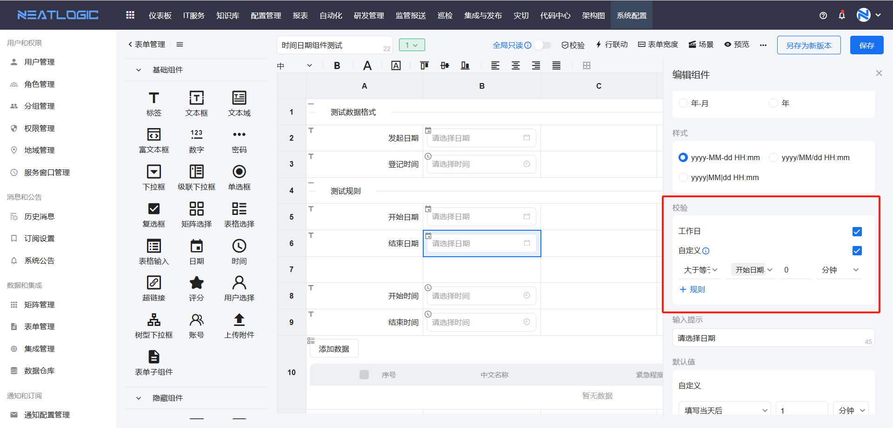
    
    **时间校验规则**：支持“自定义”。
    
    可通过表达式限制可填写的时间范围。例如设置“晚于 8:00”时，输入时间必须大于 8:00，8:00 本身不满足条件。
    
    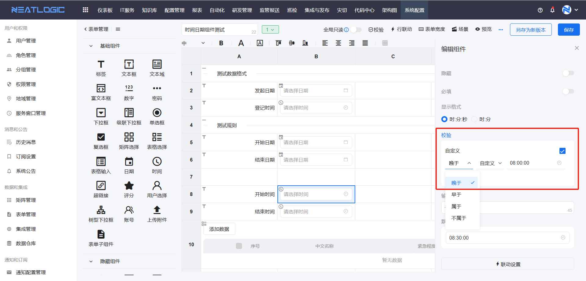

5.  **表格选择、表格输入、矩阵选择**
    
    这三个组件均以表格形式呈现。
    
    **表格输入组件** 用于在表单中录入多行明细数据，并支持自定义表头字段。
    
    每个字段支持文本框、下拉框、时间、日期等常见类型。
    
    表单使用时，用户可以在表格中新增空白行并填写数据。
    
    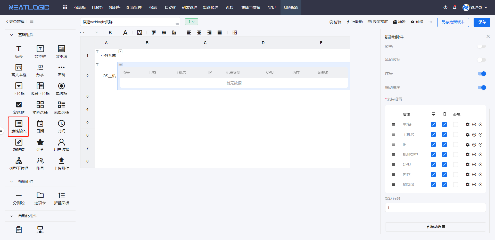
    
    此外，组件内的下拉框字段可以与其他表格输入组件关联，实现属性的动态过滤。
    
    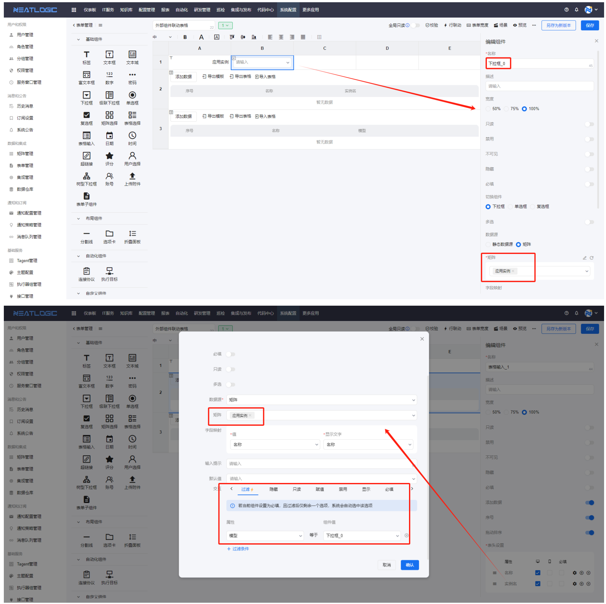
    
    下拉框字段的数据源也可以引用其他表格输入组件，其选项将随被引用表格的数据动态变化。
    
    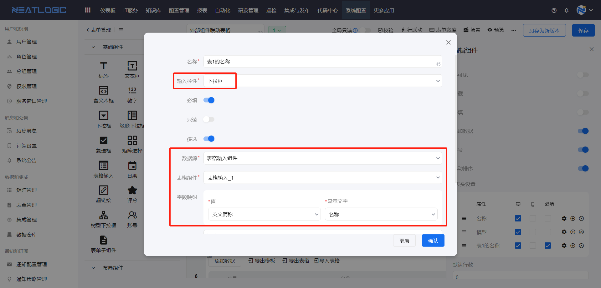
    
    **表格选择组件** 用于从矩阵数据源中选择多行数据。
    
    该组件可以在矩阵原有属性的基础上扩展新的自定义属性。
    
    扩展属性由用户手动填写。表单使用时，用户从矩阵中选择数据行。
    
    表格选择适合需要展示并选择多条配置项数据的场景。
    
    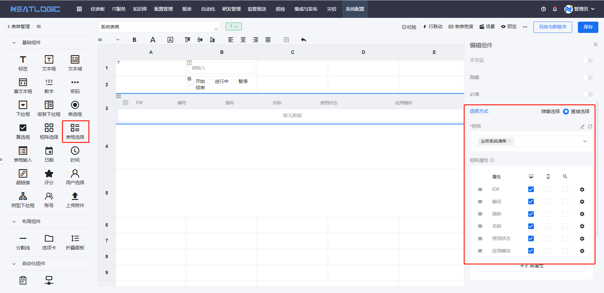
    
    **矩阵选择组件** 通过定义纵轴（类别）和横轴（选项）来生成一个选择矩阵。
    
    用户可在类别和选项的交点处选择内容，支持单选或多选。
    
    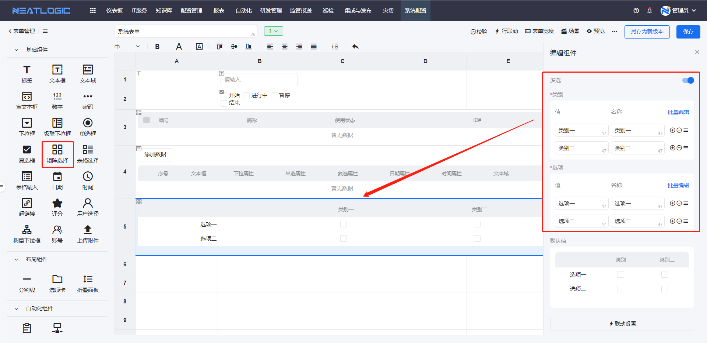

6.  **用户选择组件**
    
    用户选择组件用于引用系统中的用户、分组和角色数据。
    
    当表单需要指定处理人、通知对象或授权对象时，可以使用该组件。
    
    数据源可参考[用户管理](../../100.系统配置/1.用户和权限/用户管理.md)。
    
    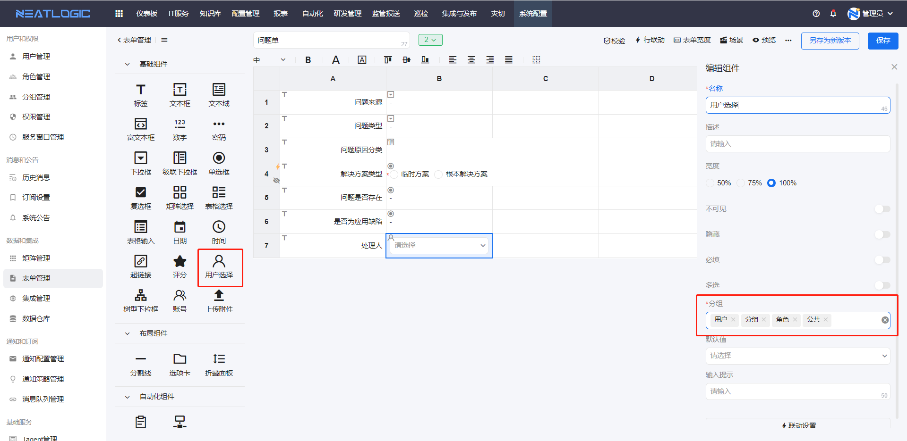

7.  **表单子组件**
    
    表单子组件用于在主表单中嵌入一组可重复填写的子表单。
    
    子表单的组件配置方式与主表单一致。
    
    通过“默认行数”可以控制子表单初始化时显示的数据行数，默认行数可设置为 0。
    
    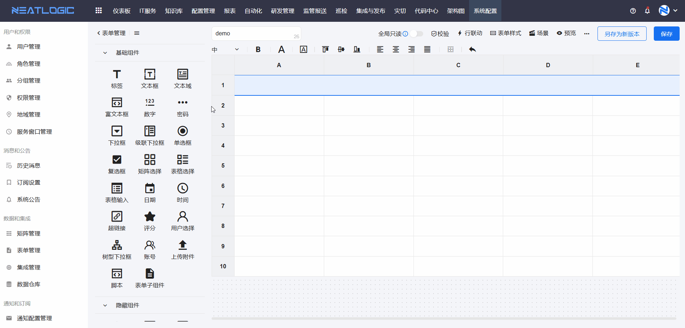

8.  **树形下拉框**
    
    树形下拉框的选项以树形结构展示，适合选择具有层级关系的数据。
    
    该组件当前仅支持引用[知识圈](../../98.知识库/新建知识文档.md)作为数据源。
    
    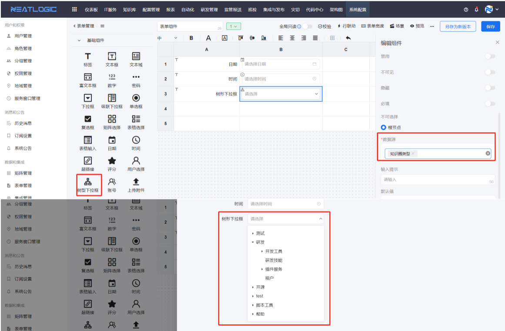

9.  **数据转换**
    
    数据转换组件通过常量和其他组件的值，自动计算并生成最终值。
    
    表达式支持两种写法：**字段拼接**和**JS脚本转换**。
    
    字段拼接支持常量和表单中的普通组件。JS 脚本转换适合需要更复杂计算逻辑的场景。
    
    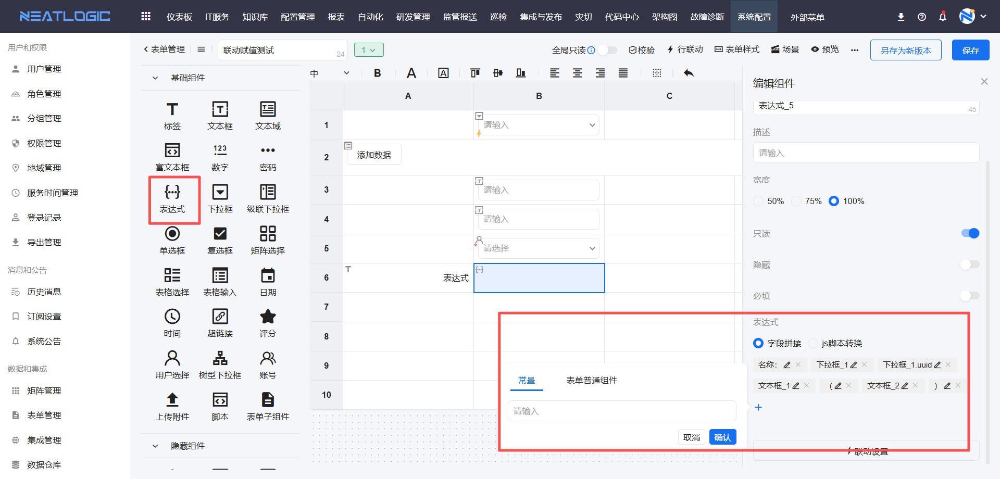
    

10. **配置项修改**
    
    配置项修改组件用于对一个**模型**及其关联模型的配置项数据进行新增、编辑或删除操作。
    
    配置组件时，需要选择一个关联模型（普通模型）作为操作对象。
    
    还需要指定允许的操作类型，包括新增、编辑和删除，至少选择一项。
    
    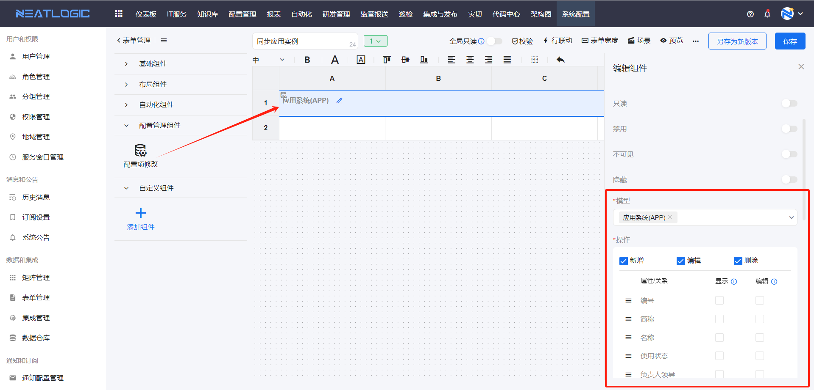
    
    在“操作”设置中，可以控制该模型下哪些属性或关系可被操作。
    
    未选择任何属性或关系时，组件按照模型的“显示设置”进行显示或编辑。
    
    选择部分属性或关系时，仅选中的属性或关系可操作。
    
    手动变更时，点击“编辑数据”。
    
    在弹窗中选择操作类型并填写信息后，点击确认即可完成变更。
    
    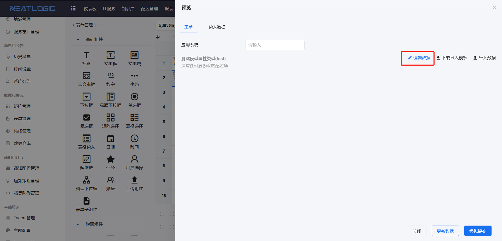
    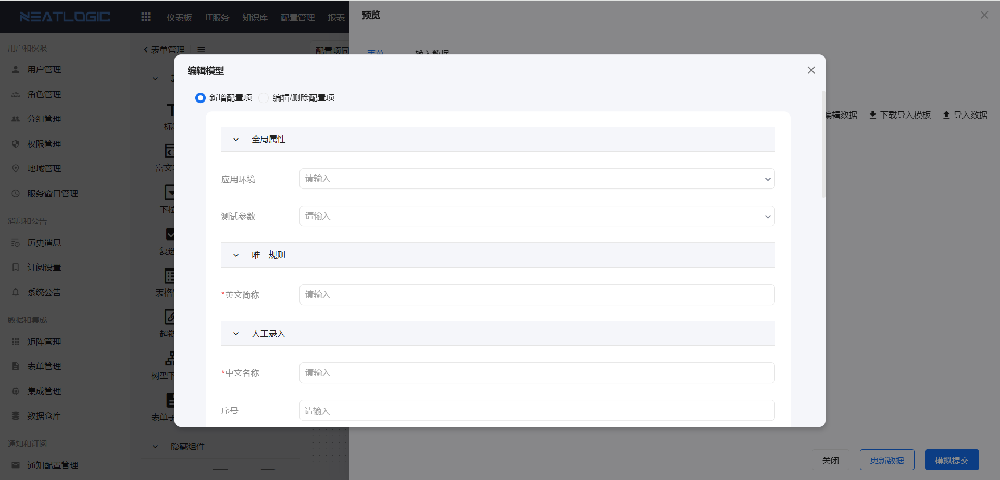
    
    该组件也支持批量导入数据，用于一次性完成多条配置项变更。
    
    导入的配置项 ID 为空时，执行新增操作。
    
    ID 不为空且匹配到现有配置项时，执行修改操作。
    
    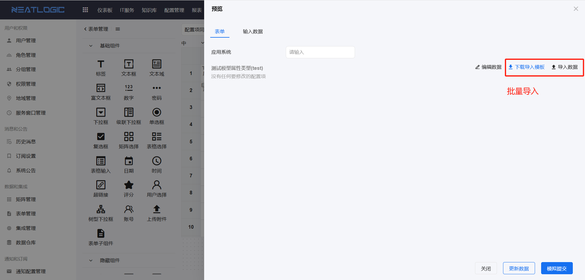

11. **自动化组件**
    
    自动化组件专用于[自动化节点](../../2.IT服务/流程管理/流程管理.md)的参数映射。
    
    组件包括**连接协议**、**执行目标**和**自动化服务**。

12. **隐藏组件**
    
    隐藏组件在表单应用时完全隐藏，不可见也不可编辑。
    
    隐藏组件主要用于在后台传递、赋值或消费数据。
    
    通常通过组件联动设置隐藏组件的值。
    
    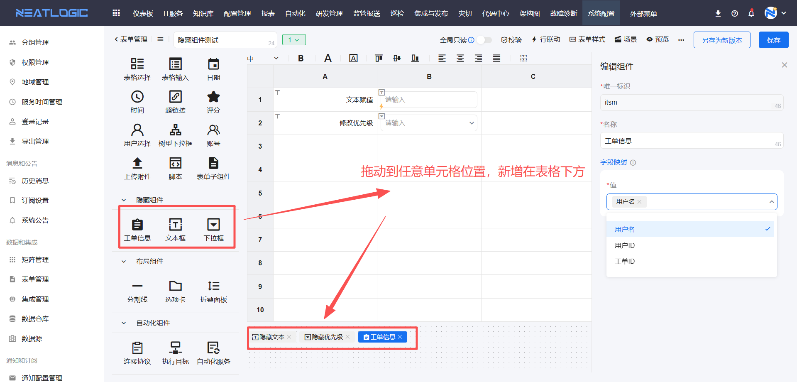
    
    - **隐藏表单信息组件**：用于在工单上报时获取工单的上下文信息，如用户名、用户ID、工单ID。
    - **隐藏下拉框、隐藏文本框**：其基础配置与普通下拉框、文本框类似，但联动配置中只保留了过滤、赋值和触发等用于数据交互的动作。

13. **代码块**
    
    代码块组件支持多种常见脚本语言。
    
    当表单需要直接编写并提交脚本内容时，可以使用该组件。
    
    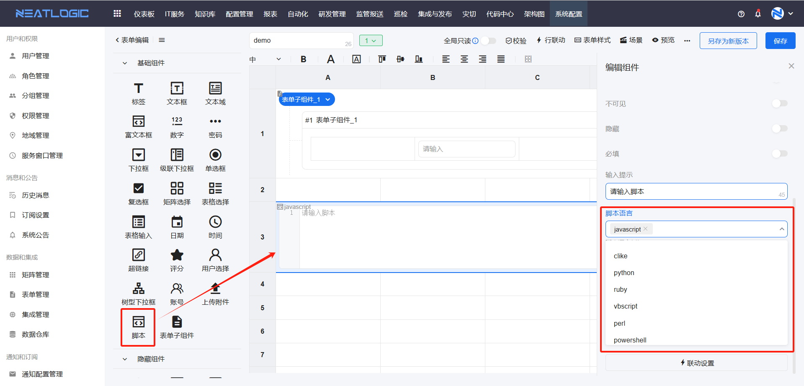

#### 1.1.2. 组件联动

组件联动用于配置表单组件之间的自动响应关系。

当表单中一个组件的值发生变化时，系统可以自动调整其他组件的显示状态、可编辑状态或字段值。

支持的联动动作包括清空、禁用、显示、触发、过滤、隐藏、不可见、只读、必填、条件赋值和联动赋值。

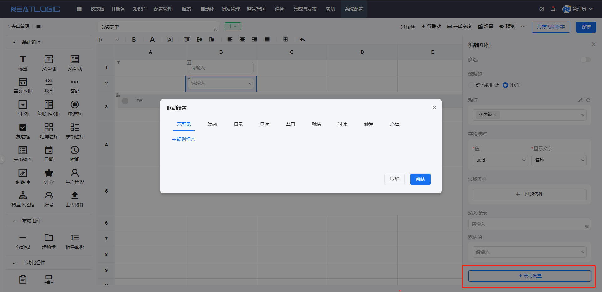

1.  **清空**：清空目标组件已填充的值。清空联动需要配置触发条件才能生效。
    
    

2.  **禁用**：禁止用户操作目标组件。
    
    与“只读”的区别是，只读会保留并显示值；禁用后，值通常不会被提交。
    
    配置驱动条件和预设值后，当驱动组件满足条件时，目标组件会被禁用。
    
    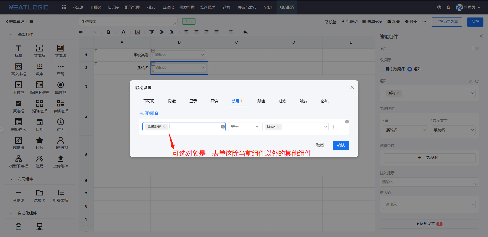

3.  **显示**：控制目标组件从隐藏状态切换为显示状态。
    
    该联动通常与组件的“默认隐藏”属性结合使用。
    
    驱动组件满足配置条件后，目标组件才会显示。
    
    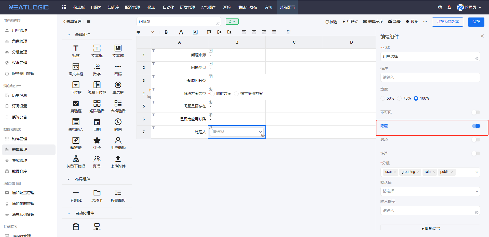
    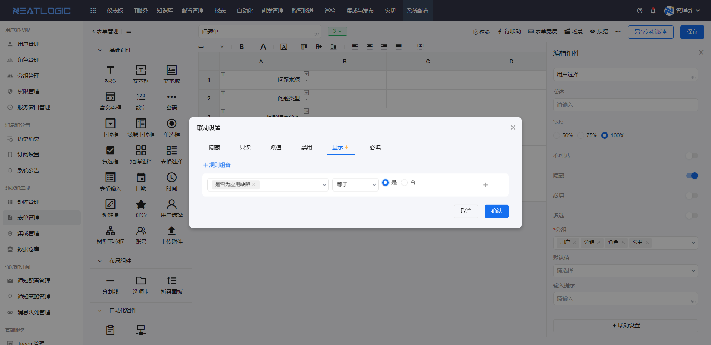

4.  **触发**：当前仅支持“修改优先级”。
    
    该联动应用于 IT 服务工单。当特定组件的值被修改时，系统会同步调整工单优先级。
    
    当前组件必须是选择类组件，并且需要引用“优先级矩阵”作为数据源。
    
    组件值的映射对象必须设置为优先级名称。
    
    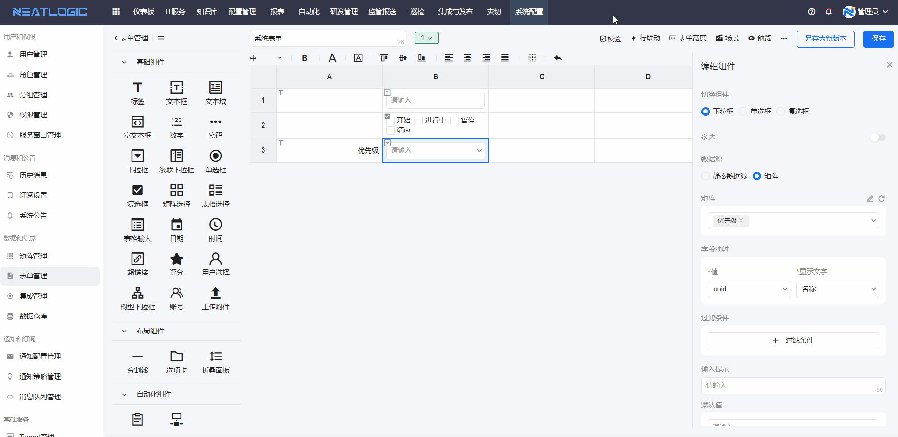

5.  **过滤**：使用一个组件的值过滤另一个组件的可选项。
    
    驱动组件的值会与被过滤组件所引用矩阵的某个属性进行匹配。
    
    匹配后，目标组件只显示过滤后的选项。
    
    **支持过滤的组件：下拉框、单选框、复选框、表格输入组件中的下拉框。**
    
    如果驱动组件是“用户选择组件”，被过滤组件引用的矩阵数据源必须来自系统用户、角色或分组数据。
    
    这是因为用户选择组件的值是用户 UUID。只有数据源字段能与 UUID 匹配时，过滤联动才能生效。
    
    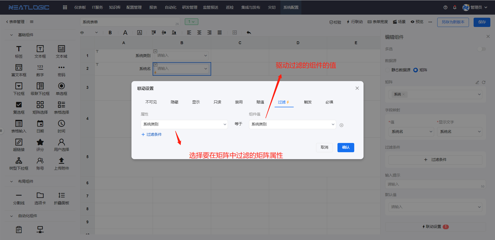

6.  **隐藏**：控制目标组件在界面上隐藏。
    
    配置驱动条件后，当条件满足时，该组件不再显示。
    
    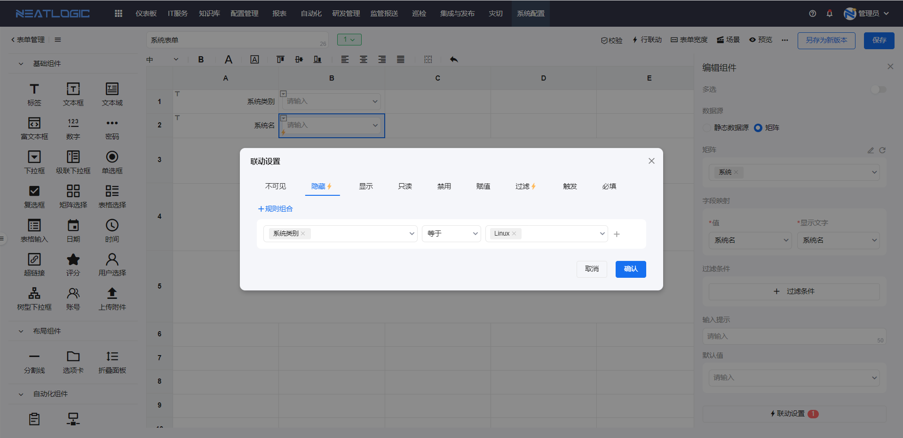

7.  **不可见**：对组件内容进行模糊化处理，常用于隐藏敏感信息。

8.  **只读**：将当前组件切换为只读状态。
    
    只读状态下，用户可以查看组件内容，但不能编辑。
    
    配置驱动条件后，当条件满足时生效。
    
    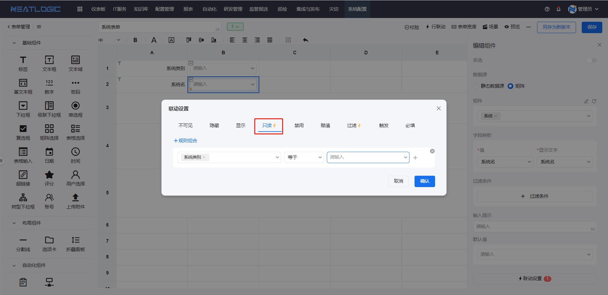

9.  **必填**：将组件设置为必填项。
    
    该联动常用于将默认非必填的组件，在特定条件下变为必填。

10. **条件赋值**：当满足配置的条件时，为当前组件赋予一个固定的值。
    
    只有当组件的值为空时，条件赋值才会生效。
    
    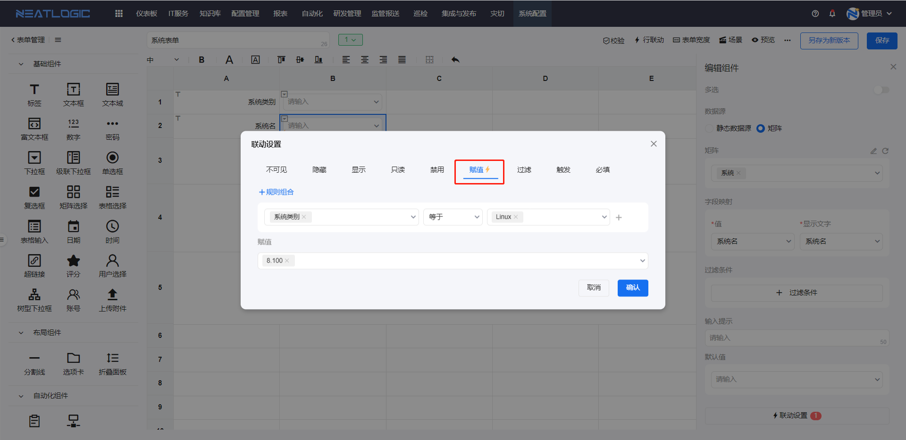
    
    **文本框、文本域** 的条件赋值还支持“动态赋值”。
    
    动态赋值可以引用[下拉框](#组件配置)组件的值或隐藏属性。
    
    下拉框为多选时，会回显所有选中项拼接后的值。

11. **联动赋值**：当前组件满足某个条件时，为指定的一个或多个其他组件赋值。
    
    当前只有**下拉框**组件支持发起联动赋值。被赋值的组件类型**只支持文本框**。
    
    - **静态值**：赋值为一个常量。
    - **动态值**：选择当前下拉框组件的某个**隐藏属性**作为赋值来源。
    
    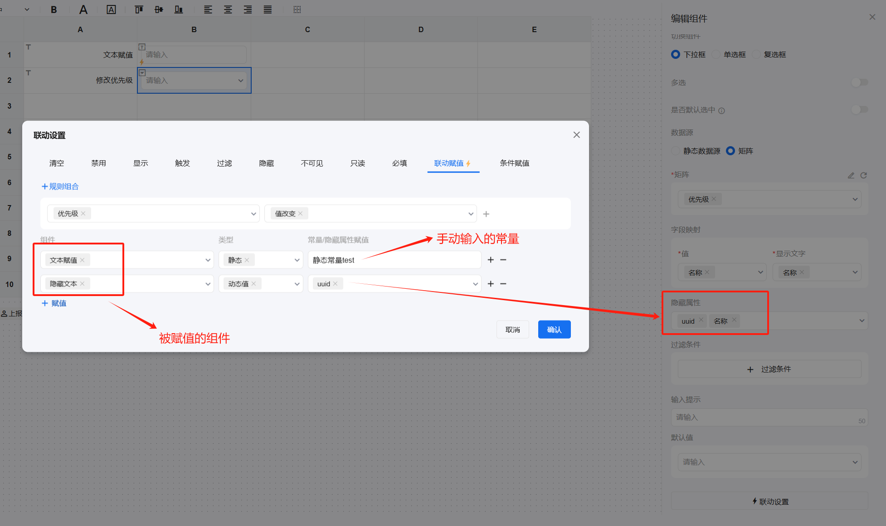

### 1.2. 场景

场景用于控制同一张表单在不同业务环节中的展示效果。

在工单处理过程中，不同流程步骤可能需要展示不同字段。

通过场景，可以为同一表单版本配置不同的字段布局和组件状态。

每个表单版本的场景相互独立。

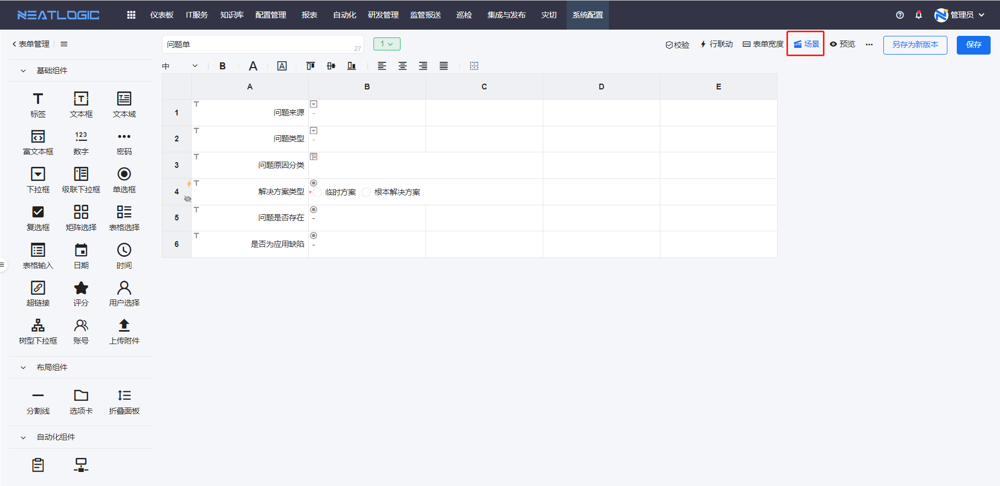

- **主场景**：当前版本下的基础表单配置。
- **自定义场景**：可以在主场景的基础上重新定义表单的布局和配置。自定义场景只能使用主场景中已有的组件，无法新增组件。

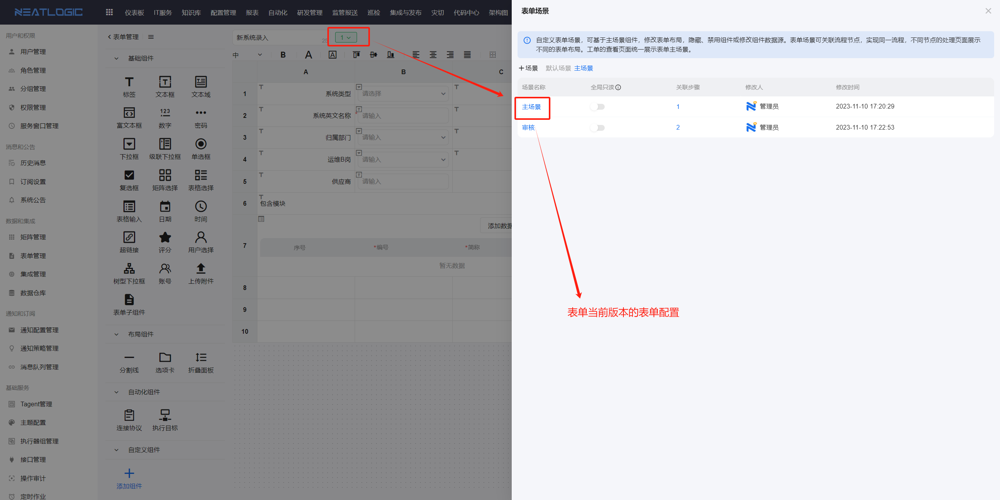

- **默认场景**：流程节点默认选用的场景。新建表单时，默认场景为主场景。后续可以将默认场景修改为其他自定义场景。

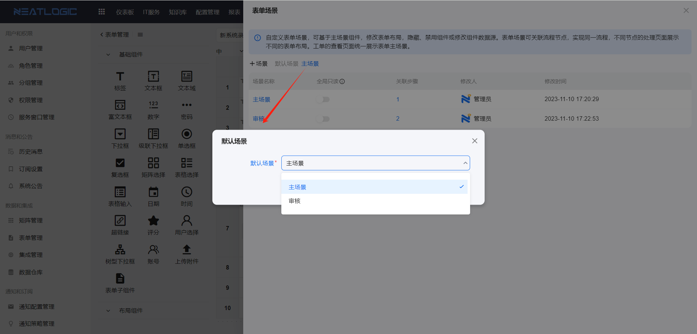

新增自定义场景时，只能使用当前表单版本中已配置的组件。每个组件在同一场景中只能使用一次。

场景中的联动规则和组件配置，可以重新定义，也可以直接继承自主场景。

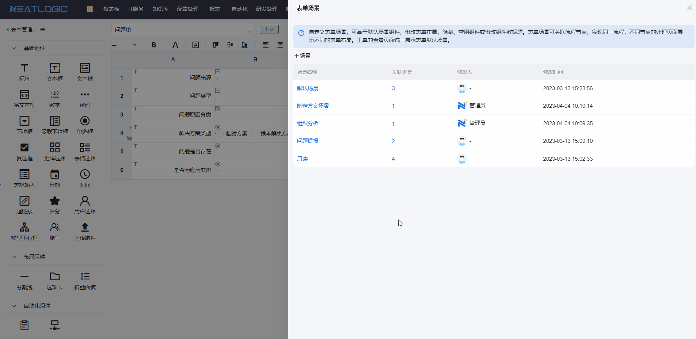

### 1.3. 版本

表单版本分为**激活版本**和**非激活版本**。

激活版本是表单当前正在应用的版本，同一时刻只能有一个。

非激活版本可以有多个，通常作为历史版本或待发布版本留存。

编辑表单后，如果需要保留上一版配置，可以点击“另存为新版本”。

保存后的新版本默认是非激活版本。

版本支持保存、删除和激活操作。

只有激活版本会作为当前应用版本生效，其余版本不会直接影响业务使用。

对于已激活的版本，“激活”和“删除”操作会被禁用。

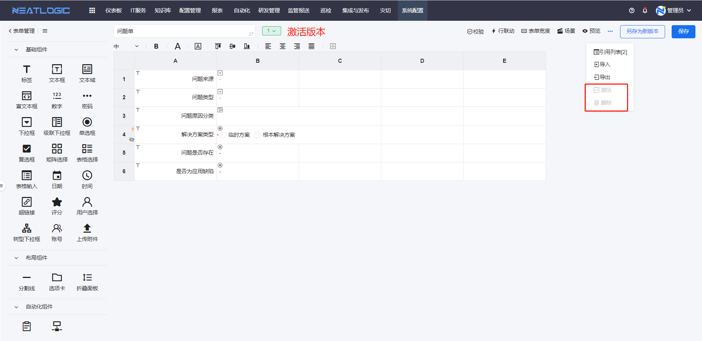

执行“另存为新版本”成功后，版本列表中会生成一个新的非激活版本。

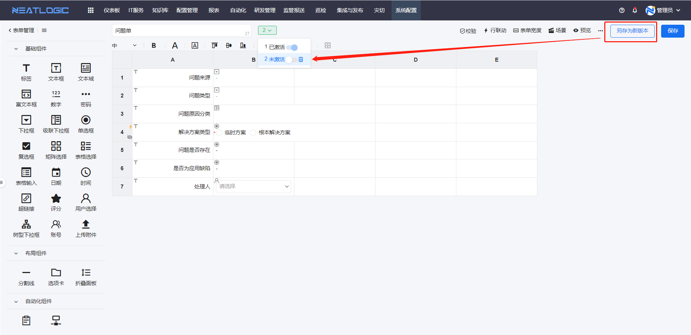

## 2. 表单应用场景

### 2.1. IT服务-流程管理

流程可以引用表单作为工单信息的填写模板。

在流程的节点设置中，可以关联表单的特定**场景**。

这样可以满足不同节点展示不同字段的需求。

更多详情请参考[流程管理](../../2.IT服务/流程管理/流程管理.md)。

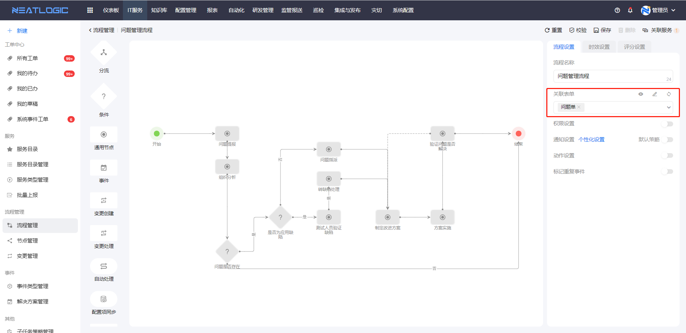
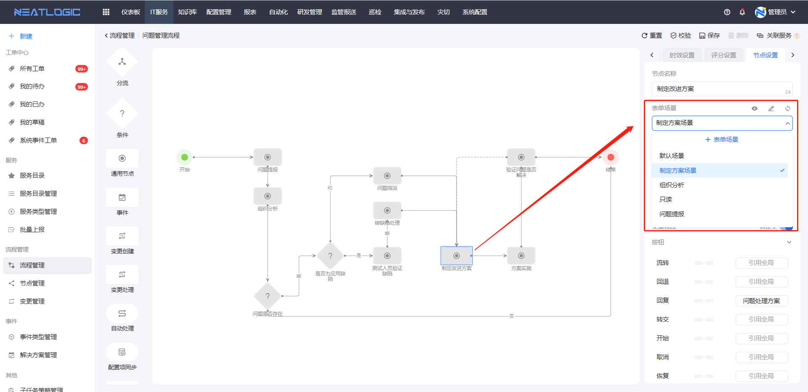

### 2.2. 自动化-服务目录

在自动化服务中，可以通过引用表单收集作业参数。

表单组件的值可以映射到自动化作业的执行参数上。

更多详情请参考[快捷服务](../../5.自动化/快捷服务/快捷服务.md)。

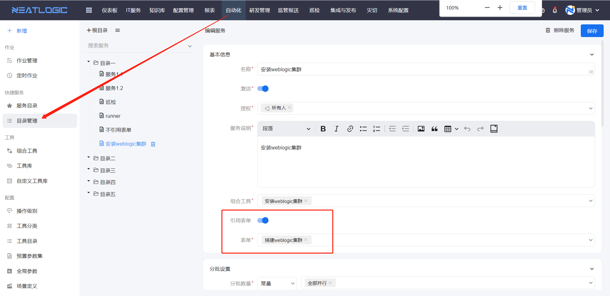

### 2.3. 结合自动化节点使用

自动化组件（如连接协议和执行目标）的数据源与自动化模块中的定义一致。

在流程管理中，自动化组件需要与自动化节点结合使用。

当工单流转到自动化节点时，系统会触发自动化作业。

系统会将表单组件的值作为参数传递给作业。

更多详情请参考[流程管理](../../2.IT服务/流程管理/流程管理.md)。

首先，在表单中添加“连接协议”和“执行目标”组件。

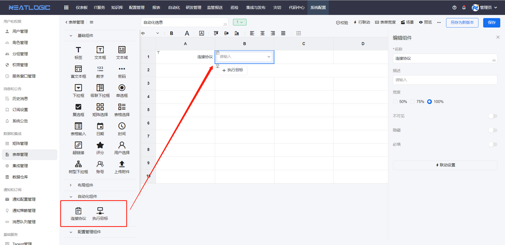

然后，在流程的自动化节点设置中添加作业详情配置。

再将作业所需的“连接协议”和“执行目标”参数，引用到刚刚添加的表单组件上。

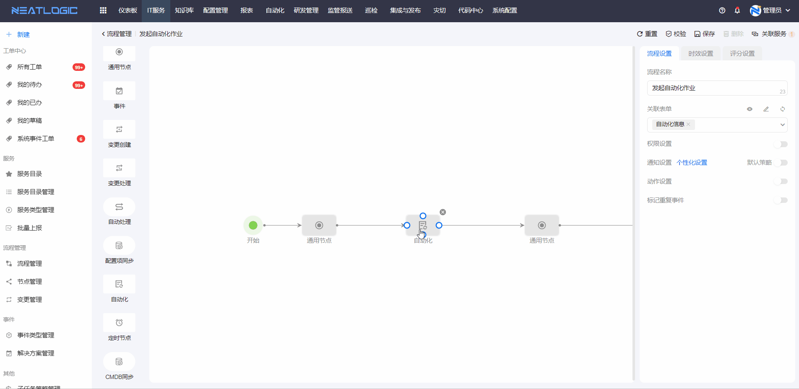

## 3. 导入、导出

导入和导出功能分为两个维度：**表单维度**和**表单版本维度**。

- **导入/导出表单**
  
  在表单管理页执行导出后，系统会生成一个表单文件。
  
  该文件只能在同级的表单管理页中导入。
  
  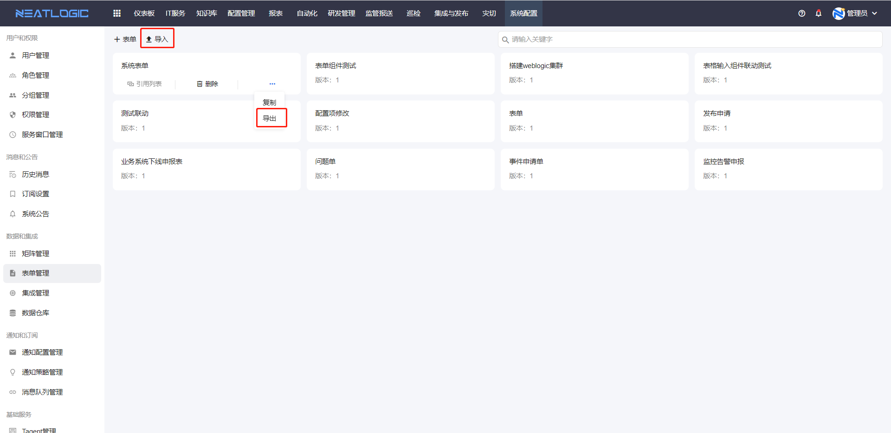

- **导入/导出表单版本**
  
  在某个表单的编辑页执行导出后，系统会生成一个表单版本文件。
  
  该文件只能在当前表单的编辑页中导入，并作为一个新版本。
  
  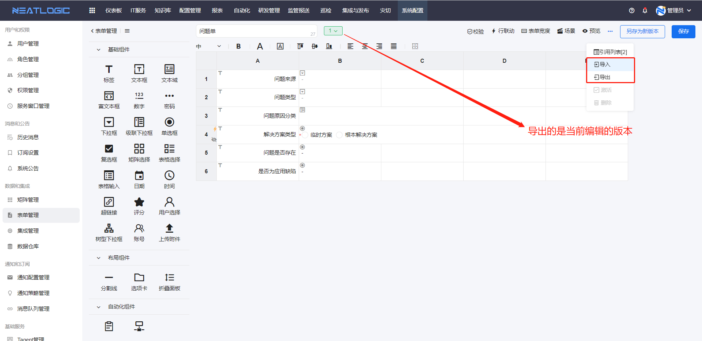
