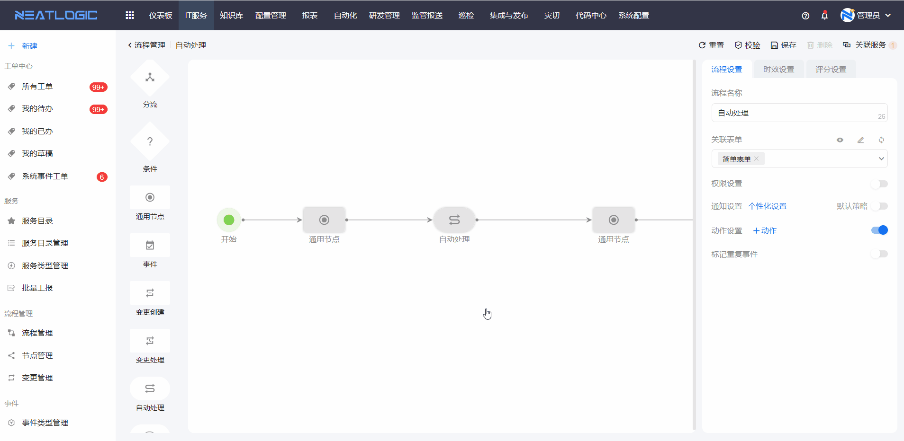
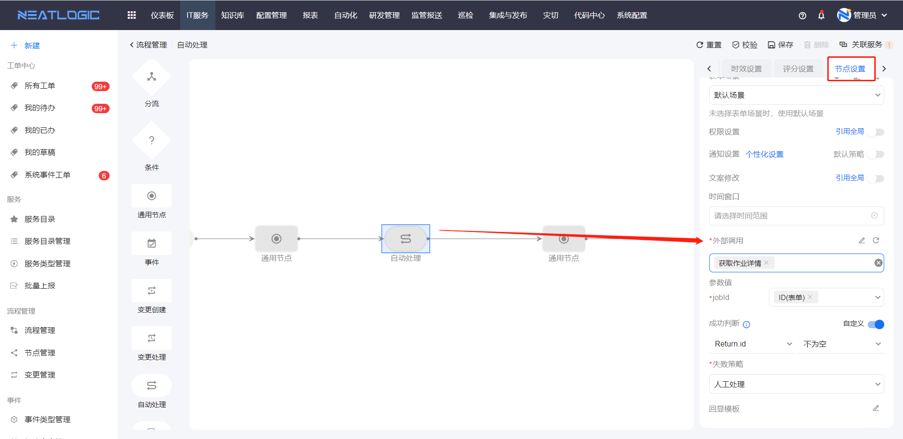
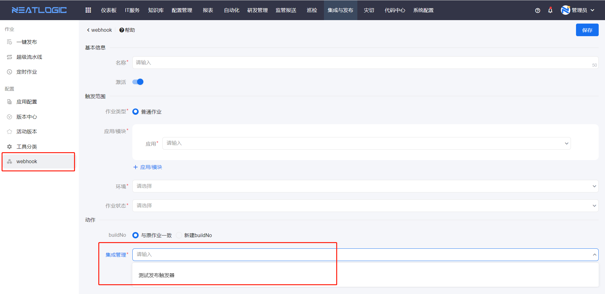
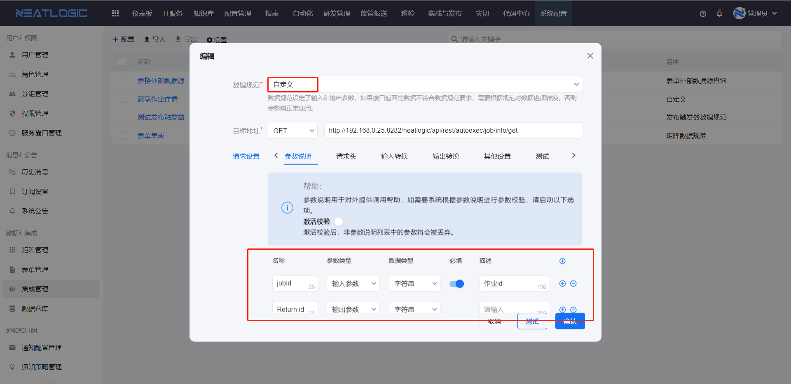
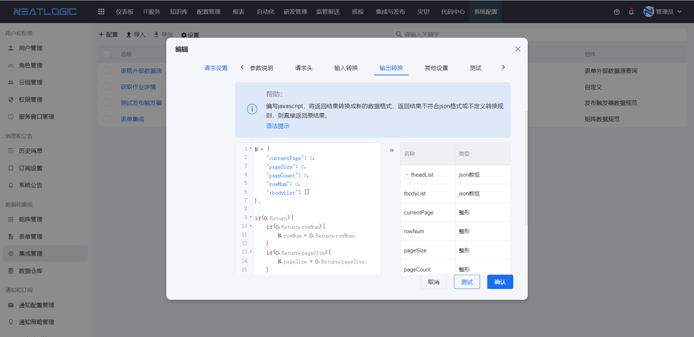

# 集成管理
集成管理是管理自定义接口调用配置的页面，有四种数据规范类型分别应用于不同场景，分别是自定义、矩阵数据规范、表单外部数据源查询、发布触发器数据规范。

配置内容除了数据规范，还包括目标地址、请求设置。

## 数据规范
数据规范是定义接口的输入和输出参数格式，选择数据规范后，请求设置的输入转换或输出转换会根据所选规范显示对应的提示。

### 自定义
应用场景：
1. 流程编辑页，流程或节点的动作设置
   
2. 流程编辑页，自动处理节点
   
### 矩阵数据规范
应用于外部数据源矩阵，必须按照系统提示的格式配置输入和输出的转换脚本。

输入规范
```
{
  "keyword": "字符串",
  "defaultValue": "json数组",
  "currentPage": "整形",
  "pageSize": "整形",
  "needPage": "布尔型",
  "sourceColumnList": [
    {
      "column": "字符串",
      "expression": "字符串",
      "value": "字符串"
    }
  ]
}
```
输出规范
```
{
  "currentPage": 0,
  "pageSize": 0,
  "pageCount": 0,
  "rowNum": 0,
  "tbodyList": [],
  "theadList": [
    {
      "title": "字符串",
      "key": "字符串",
      "type": "input",
      "isSearchable": 1,
      "isSearch": 1,
      "primaryKey": 0,
      "isMobile": false,
      "isPC": false
    }
  ]
}
```

### 发布触发器数据规范
应用于集成预发布模块的webhook配置，若输入参数不符合提示输入规范，必须设置输入转换。
   
输入规范
```
{
  "appSystemId": "长整数",
  "appSystemName": "字符串",
  "appSystemAbbrName": "字符串",
  "appModuleId": "长整数",
  "appModuleName": "字符串",
  "appModuleAbbrName": "字符串",
  "envName": "字符串",
  "buildNo": "整形",
  "scenarioName": "字符串",
  "targetEnvName": "字符串"
}
```

## 请求设置

### 认证
集成配置的接口支持四种认证方式，有无需认证、内部认证、basic认证和Bearer Token认证。访问内部接口时，才可使用内部认证。


### 参数说明
参数说明是用于定义输入和输出参数的，只有数据规范为“自定义”时，才能由用户自定义输入和输出参数，其他类型数据规范，接口的输入和输出参数都是系统规定的。


### 输入转换和输出转换
应用场景中使用的输入参数的数据格式不符合接口入参所需要的格式，可以通过输入转换来实现。如果接口输出参数的数据格式不符合系统指定场景参数的数据格式，就可以通过输出转换来实现。


### 测试
可在测试输入框中输入参数进行接口测试，验证输出结果是否满足场景需求。
