# 集成管理

集成管理是用于配置和管理自定义接口调用的功能页面。它提供了四种数据规范类型，分别适用于不同的业务场景：**自定义**、**矩阵数据规范**、**表单外部数据源查询**和**发布触发器数据规范**。除数据规范外，集成配置还包含**目标地址**和**请求设置**等核心内容。

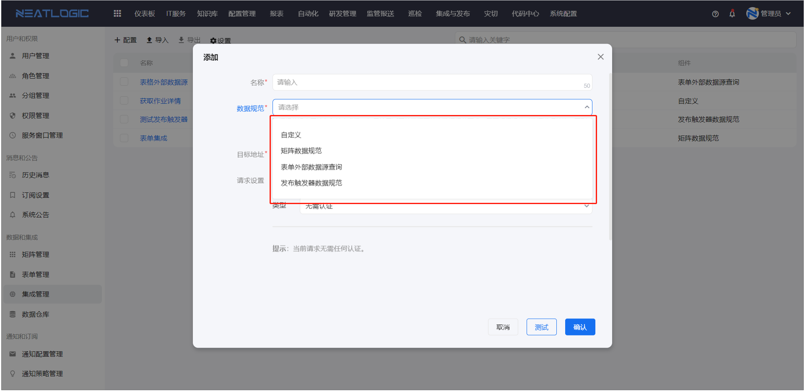

## 1. 数据规范

数据规范用于定义接口的输入和输出参数格式。选择不同的数据规范后，请求设置中的“输入转换”或“输出转换”区域会根据所选规范显示相应的配置提示。

### 1.1. 自定义

自定义数据规范允许用户完全自主定义接口的输入输出格式，灵活性最高。

**应用场景：**

1. **流程编辑页**：用于流程或节点的动作设置。
   
   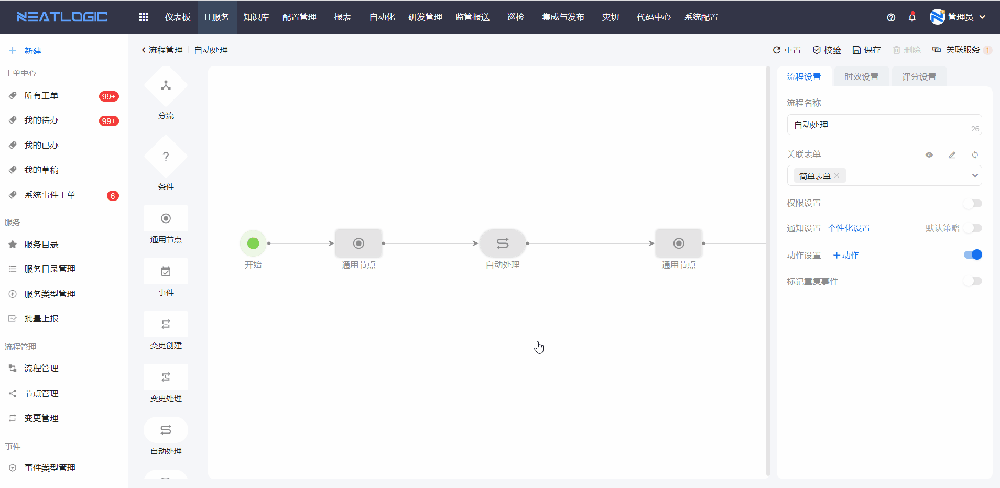

2. **流程编辑页**：用于自动处理节点的动作设置。
   
   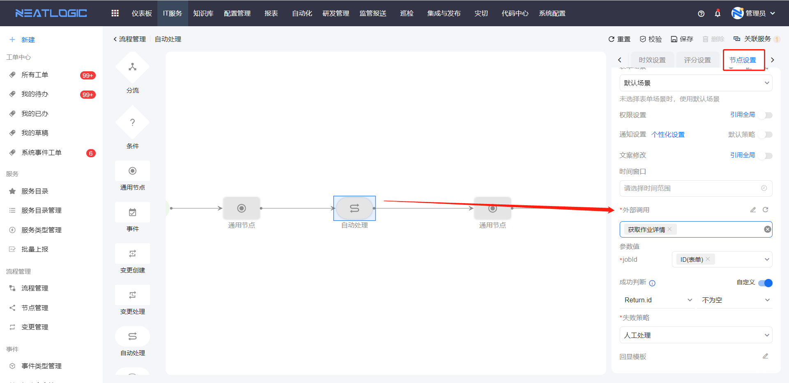

### 1.2. 矩阵数据规范

该规范应用于**外部数据源矩阵**场景。使用时，必须按照系统规定的输入和输出格式编写转换脚本。

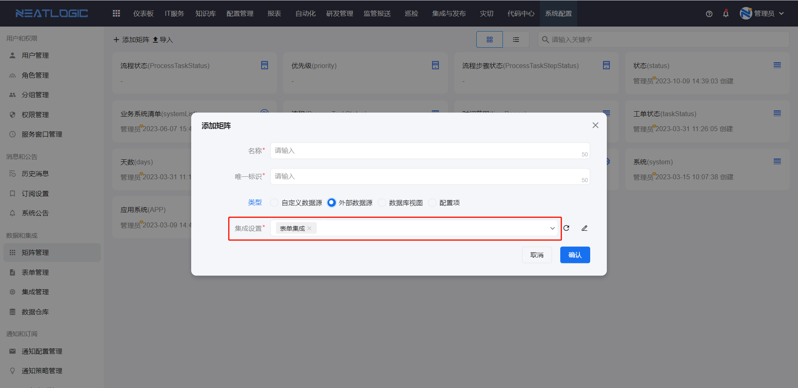

**输入规范格式：**

```
{
  "keyword": "字符串",
  "defaultValue": "json数组",
  "currentPage": "整形",
  "pageSize": "整形",
  "needPage": "布尔型",
  "sourceColumnList": [
    {
      "column": "字符串",
      "expression": "字符串",
      "value": "字符串"
    }
  ]
}
```

**输出规范格式：**

```
{
  "currentPage": 0,
  "pageSize": 0,
  "pageCount": 0,
  "rowNum": 0,
  "tbodyList": [],
  "theadList": [
    {
      "title": "字符串",
      "key": "字符串",
      "type": "input",
      "isSearchable": 1,
      "isSearch": 1,
      "primaryKey": 0,
      "isMobile": false,
      "isPC": false
    }
  ]
}
```


### 1.3. 发布触发器数据规范

该规范应用于**集成预发布模块的 Webhook 配置**。如果实际使用的输入参数与系统规定的输入规范不符，则必须通过“输入转换”功能进行调整。

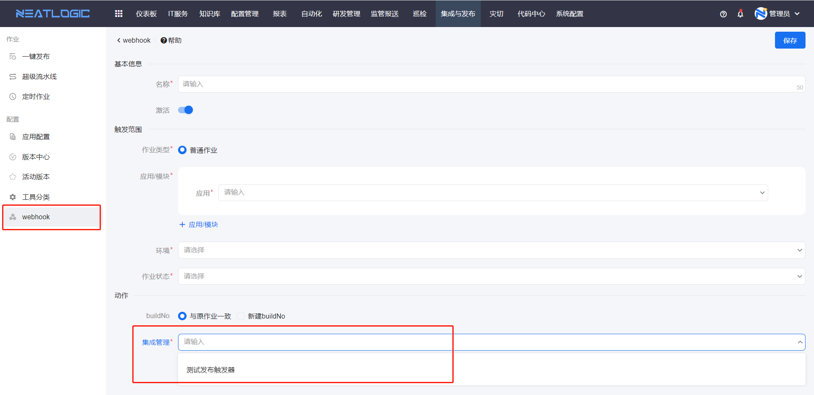

**输入规范格式：**

```
{
  "appSystemId": "长整数",
  "appSystemName": "字符串",
  "appSystemAbbrName": "字符串",
  "appModuleId": "长整数",
  "appModuleName": "字符串",
  "appModuleAbbrName": "字符串",
  "envName": "字符串",
  "buildNo": "整形",
  "scenarioName": "字符串",
  "targetEnvName": "字符串"
}
```

## 2. 请求设置

### 2.1. 认证方式

集成配置的接口支持四种认证方式，可根据目标接口的要求选择合适的类型：

- **无需认证**：接口不要求任何身份验证。
- **内部认证**：仅用于访问系统内部接口。
- **Basic 认证**：标准的 HTTP Basic 认证。
- **Bearer Token 认证**：基于 Token 的认证方式。

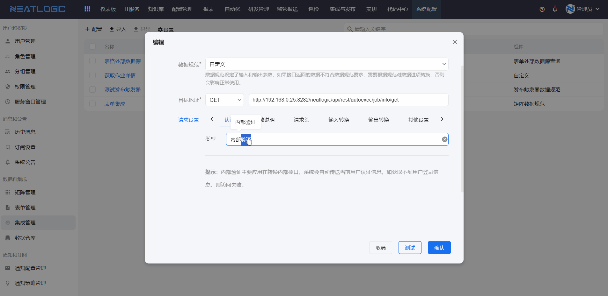

> 注意：仅当访问系统内部接口时，才可使用“内部认证”方式。

### 2.2. 参数说明

“参数说明”用于定义接口的输入和输出参数。需要特别注意的是：只有数据规范为**“自定义”**时，用户才可以在参数说明中自由定义输入和输出参数。对于其他类型的数据规范，接口的输入输出参数格式由系统固定，不可自定义。

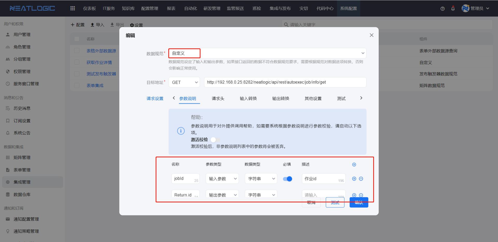

### 2.3. 输入转换与输出转换

- **输入转换**：当业务场景提供的输入参数格式与目标接口期望的入参格式不一致时，可通过编写转换脚本进行格式适配。
- **输出转换**：当接口返回的输出参数格式与系统指定场景所要求的数据格式不一致时，可通过编写转换脚本进行格式适配。

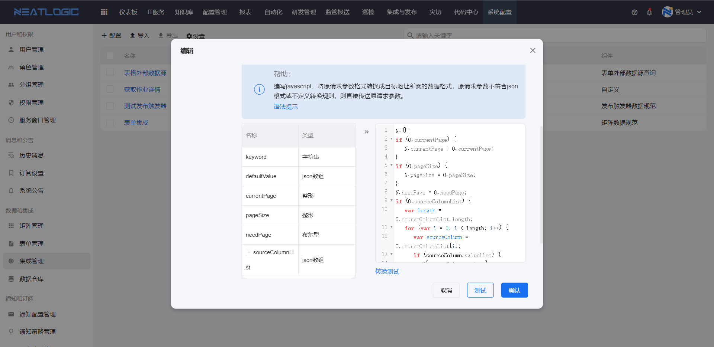
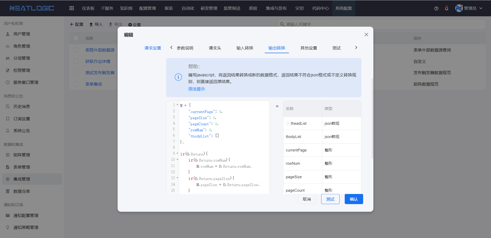

### 2.4. 接口测试

配置完成后，可在“测试”功能中输入测试参数，向目标接口发起真实调用并查看返回结果。这有助于在正式使用前验证接口配置和转换逻辑的正确性，确保输出结果满足业务场景需求。

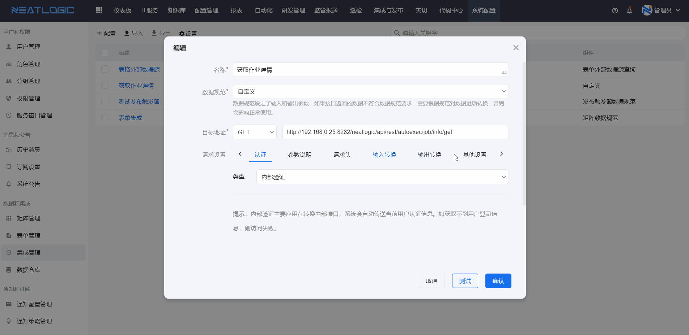

## 3. 调用记录

集成配置页面提供了**调用记录**功能，用于记录每次接口调用的历史日志。记录信息包括：请求来源、发起时间、执行状态、输入参数、返回结果以及异常信息等。

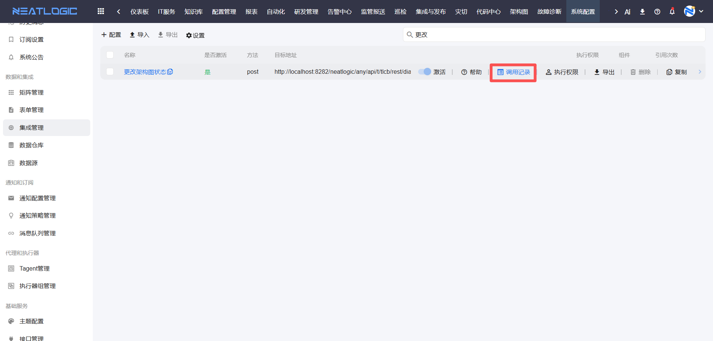

调用记录支持多维度的查看和筛选：

- **查看详情**：可分别查看某次调用的参数、结果和异常详情。
- **条件过滤**：支持根据用户、执行状态、发起时间范围以及输入参数内容进行检索。

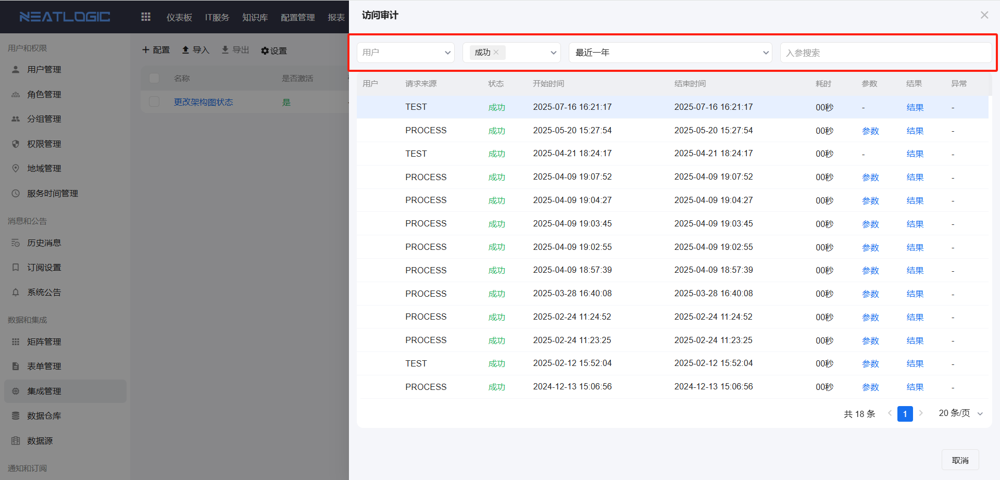

## 4. 权限说明

集成管理的使用涉及两类权限控制：

### 4.1. 菜单权限

用户需要被授予系统权限中的 **“集成管理权限”**，才能看到并进入集成管理功能菜单。

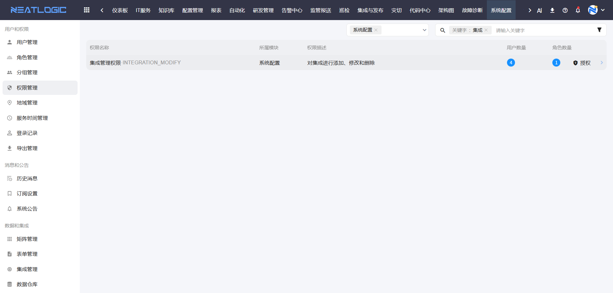

### 4.2. 集成配置的执行权限

用户仅拥有菜单权限是不够的。若要成功执行需要调用某集成配置的操作（如流程动作），还必须被授予该集成配置的 **“执行权限”**。否则，调用将失败。

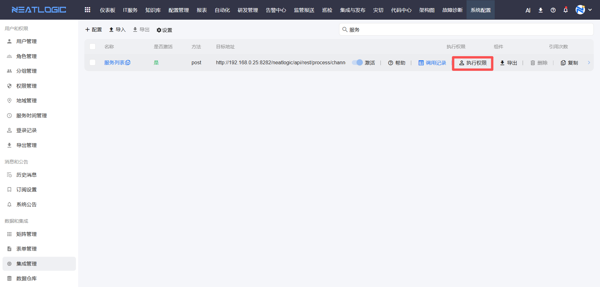