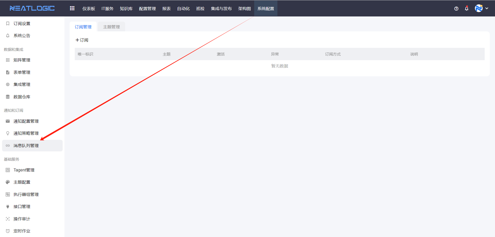
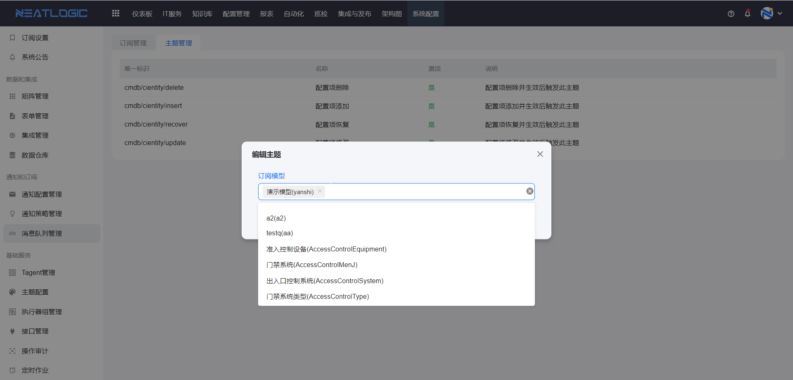
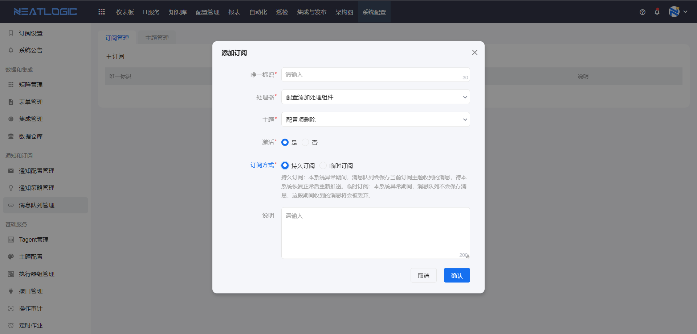

# 消息队列管理
消息队列中有订阅和主题管理两部分功能组成，先在主题管理中完成相应主题的配置，然后按需求添加订阅配置。

## 主题管理
主题管理中有一些系统自带的主题，目前只有配置项操作的主题，如配置项新增、删除、修改等。

点击主题编辑按钮，添加配置项主题关联的模型，模型可以多选，关联的模型发生主题的动作时才能触发这个主题。

## 订阅管理
订阅的配置中主要有唯一标识、处理器、主题和订阅方式。
- 主题：主题来自主题管理，订阅后可以消费主题产生的数据
- 处理器：处理器是用来处理主题的数据，是由后端开发的组件，可以根据需要开发拓展。
