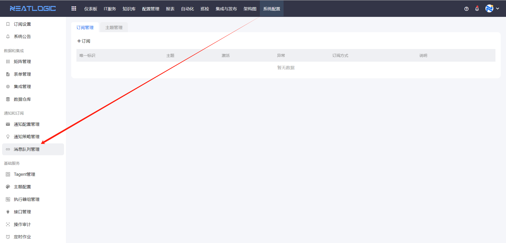
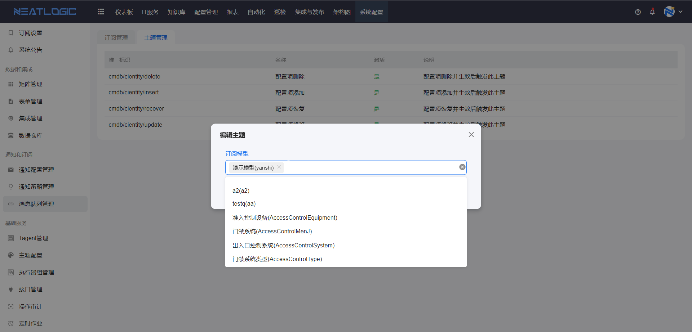
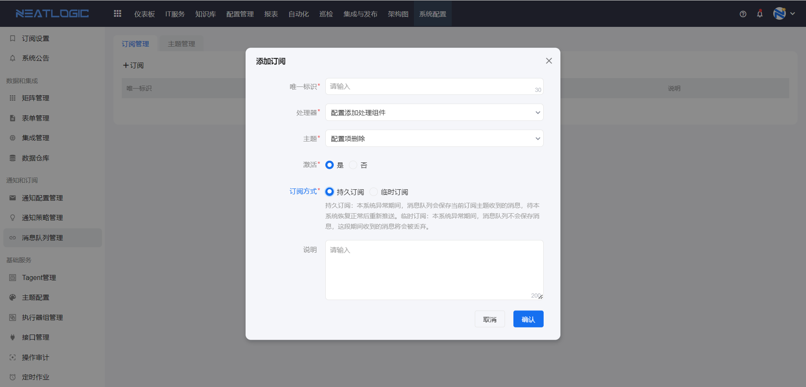

# 消息队列管理

消息队列管理用于维护系统中的主题和订阅关系。主题用于定义可被订阅的消息来源，订阅用于指定由哪个处理器消费主题产生的数据。

使用时，一般先在“主题管理”中确认或配置主题，再在“订阅管理”中添加订阅配置。

## 阅读路径

可根据当前要解决的问题选择阅读入口。

- 如果需要了解系统支持哪些消息主题，阅读“主题管理”。
- 如果需要配置哪些模型操作会触发主题，阅读“主题管理”。
- 如果需要消费主题产生的数据，阅读“订阅管理”。

## 权限

**操作权限**
- 配置：系统配置-[用户管理](../1.用户和权限/用户管理.md)-授权-消息队列管理权限
- 包含操作：维护主题和订阅配置
- 配置人员：系统超级管理员

## 主题管理

主题管理用于维护可被订阅的消息主题。系统内置了一些主题，目前主要包含配置项操作相关主题，例如配置项新增、删除和修改等。

编辑主题时，可以为配置项主题关联模型。模型支持多选，只有被关联模型发生对应操作时，才会触发该主题。

## 订阅管理

订阅管理用于配置主题数据的消费方式。订阅配置主要包括唯一标识、处理器、主题和订阅方式。

- **主题**：来自主题管理。订阅主题后，可以消费该主题产生的数据。
- **处理器**：用于处理主题数据。处理器由后端开发实现，可根据业务需要扩展。
- **订阅方式**：用于定义订阅如何接收或处理主题数据。

