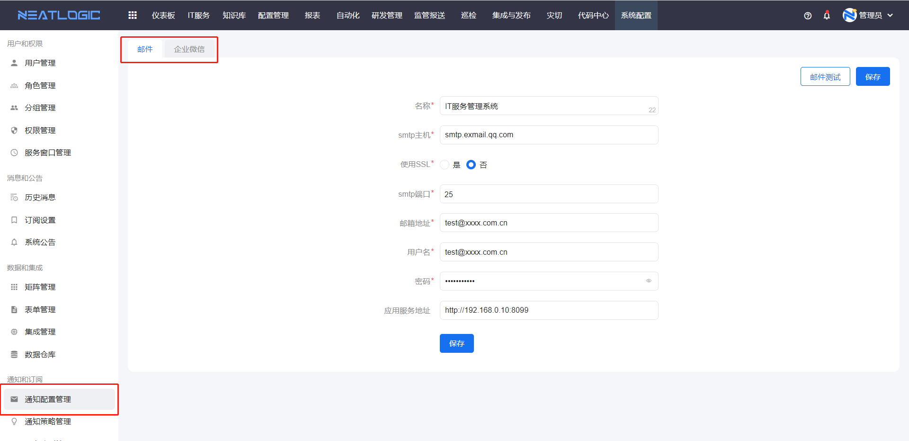
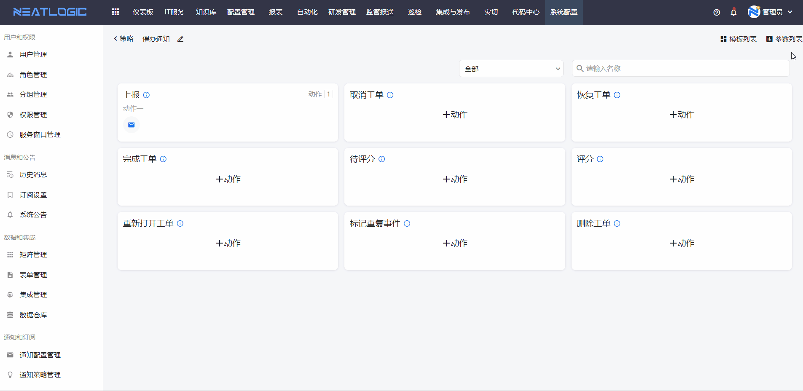
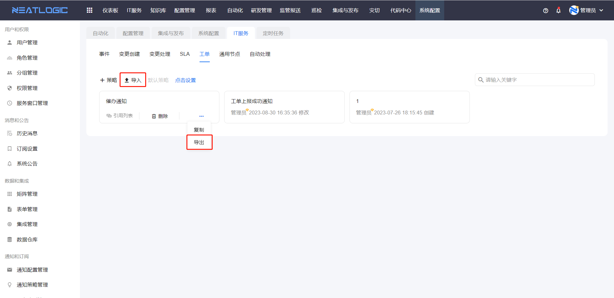
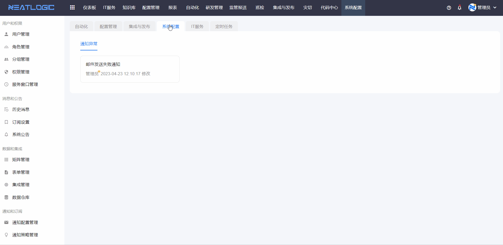
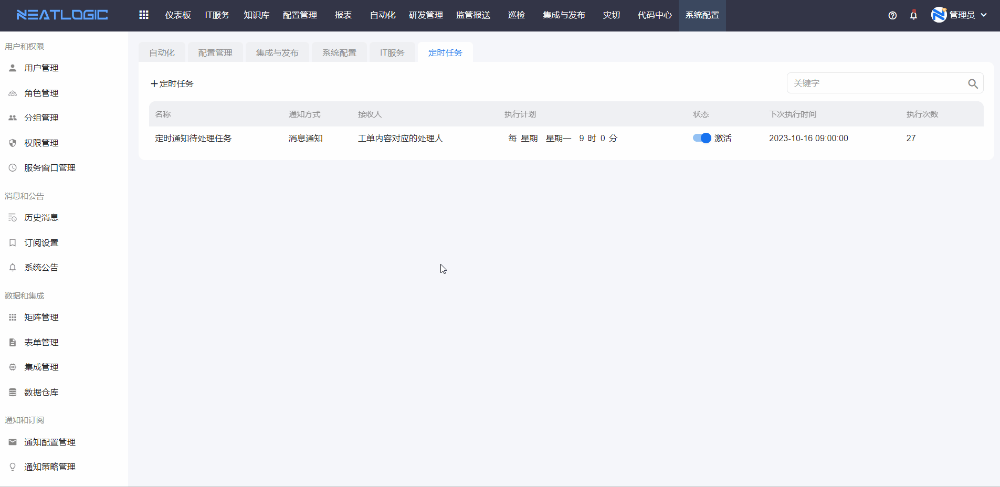

# 通知策略管理
通知策略中是管理系统所有通知场景使用的通知策略，支持通知方式有三种，分别为邮件通知、企业微信通知和站内消息通知。目前支持通知功能的模块有IT服务、自动化、集成发布。另外还支持设置系统异常的通知和定时通知任务。

## 模块通知策略
模块通知策略支持添加、编辑、删除、导入导出、设置全局默认策略等操作。

### 添加
添加通知策略步骤：添加通知策略-添加通知模板-配置触发点

#### 添加通知策略

   
#### 添加通知模板

通知模板配置包括名称、类型、标题、内容。
- 类型是指通知的类型，包括邮件通知、微信通知和消息通知。
  
  邮件和微信通知，需要在通知配置管理中完成邮件和微信的通知配置。
  
  消息通知，需要在订阅设置中启用相应模块的订阅状态。
  
- 标题和内容是指通知的标题和内容，支持引用系统参数和自定义参数。
  系统参数是系统自带的，另外还支持用户自定义参数。
  
#### 配置触发点
触发点的配置包括条件和动作两部分，其中条件选填，动作必填。

### 导入导出
导入导出功能主要是为了满足跨租户快速导入通知策略模板的场景，导入导出文件的格式是“.bak”。

### 默认策略
每个模块下都支持配置一个全局的默认通知策略，当相应模块的通知场景没有指定通知策略时，执行默认通知策略。

## 系统配置通知
系统配置的通知策略是针对系统的场景，目前只支持通知异常的场景。

## 定时任务
定时任务通知中，是把常用的通知内容固化成一个插件，选择相应通知内容的插件，然后定时发送通知给指定的用户。

添加定时任务

查看执行记录
