# 通知策略管理

通知策略管理用于维护系统各类通知场景使用的通知策略。系统支持邮件通知、企业微信通知和站内消息通知三种方式。

目前支持通知策略的模块包括 IT 服务、自动化和集成发布。除此之外，还支持系统异常通知和定时任务通知。

## 阅读路径

可根据当前要解决的问题选择阅读入口。

- 如果需要维护业务模块中的通知规则，阅读“模块通知策略”。
- 如果需要配置通知模板和触发点，阅读“添加”。
- 如果需要迁移通知策略，阅读“导入导出”。
- 如果需要设置模块兜底通知规则，阅读“默认策略”。
- 如果需要配置系统异常通知，阅读“系统配置通知”。
- 如果需要按计划发送固定通知内容，阅读“定时任务”。

## 权限

**操作权限**
- 配置：系统配置-[用户管理](../1.用户和权限/用户管理.md)-授权-通知策略管理权限
- 包含操作：新增、编辑、删除、导入、导出和维护通知策略
- 配置人员：系统超级管理员

## 模块通知策略

模块通知策略用于维护各业务模块的通知规则，支持添加、编辑、删除、导入导出和设置全局默认策略等操作。

### 添加

添加通知策略通常包含三个步骤：添加通知策略、添加通知模板、配置触发点。

#### 添加通知策略

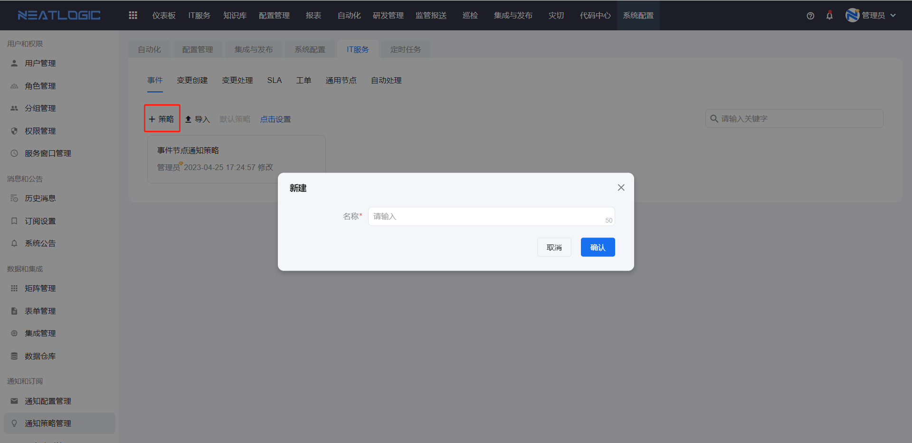

#### 添加通知模板

通知模板用于定义通知的发送方式和内容，配置项包括名称、类型、标题和内容。

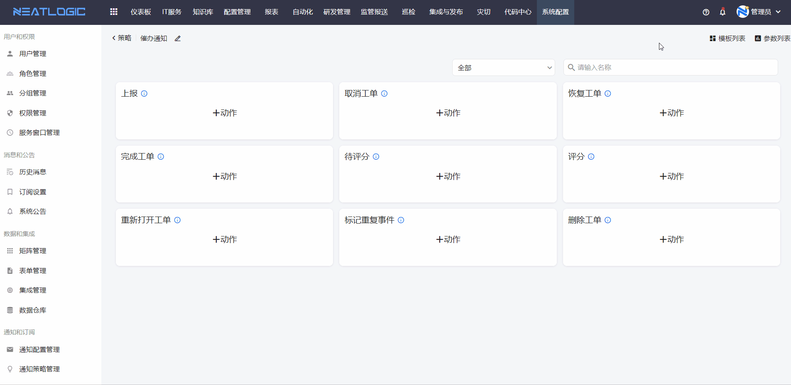

- **类型**：通知方式，包括邮件通知、企业微信通知和站内消息通知。
- **标题和内容**：通知展示的标题和正文，支持引用系统参数和自定义参数。

邮件通知和企业微信通知需要先在通知配置管理中完成对应配置。邮件配置可以维护多个，但发送时只会使用唯一的默认邮件配置。

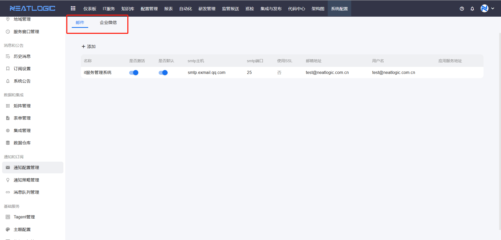

站内消息通知需要在订阅设置中启用对应模块的订阅状态。

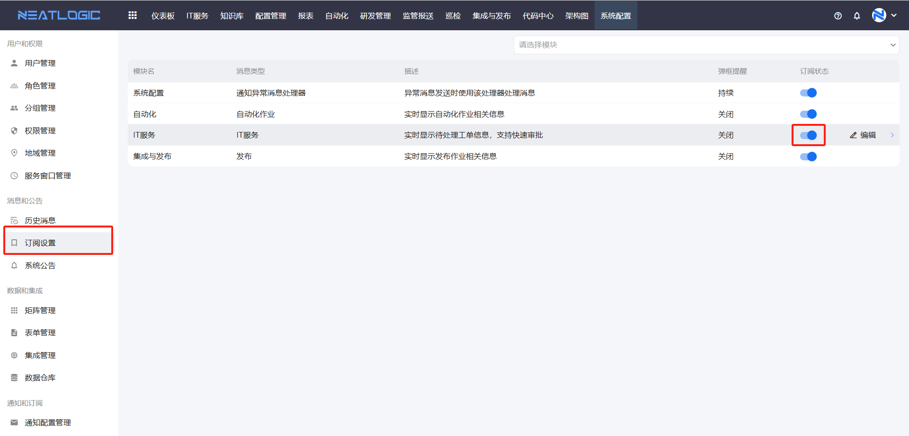

系统参数由系统提供，自定义参数可根据通知内容需要自行维护。

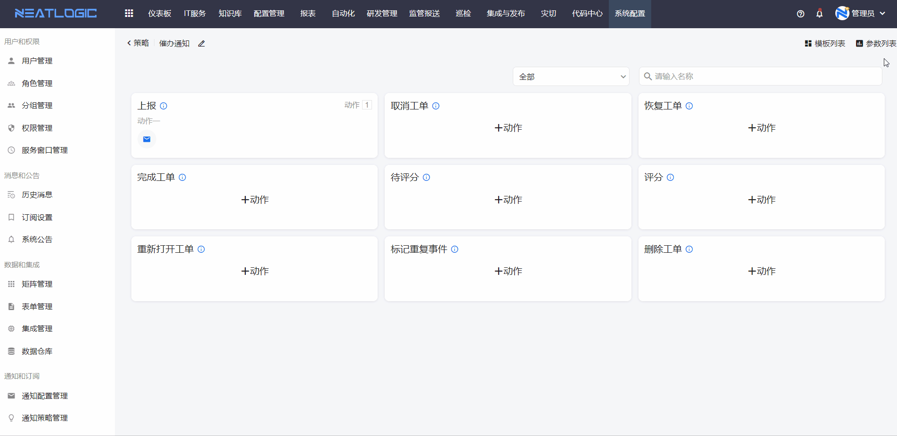

#### 配置触发点

触发点用于定义通知策略在什么条件下执行、执行哪些通知动作。触发点配置包括条件和动作两部分，其中条件选填，动作必填。

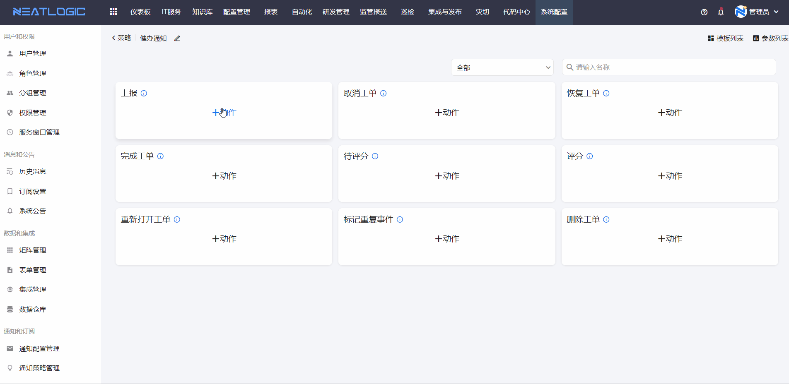

### 导入导出

导入导出用于跨租户迁移通知策略模板，导入导出文件格式为 `.bak`。

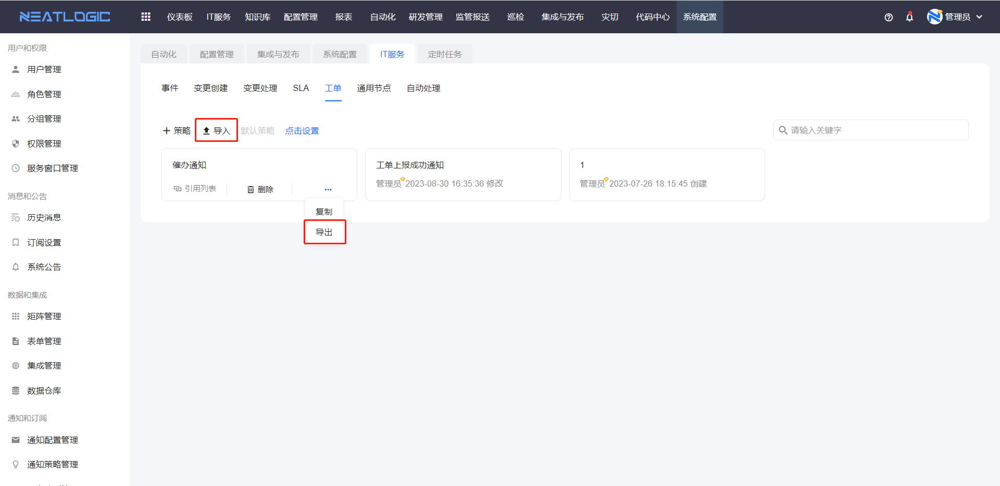

### 默认策略

每个模块都支持配置一个全局默认通知策略。当模块中的通知场景没有指定通知策略时，系统会执行默认通知策略。

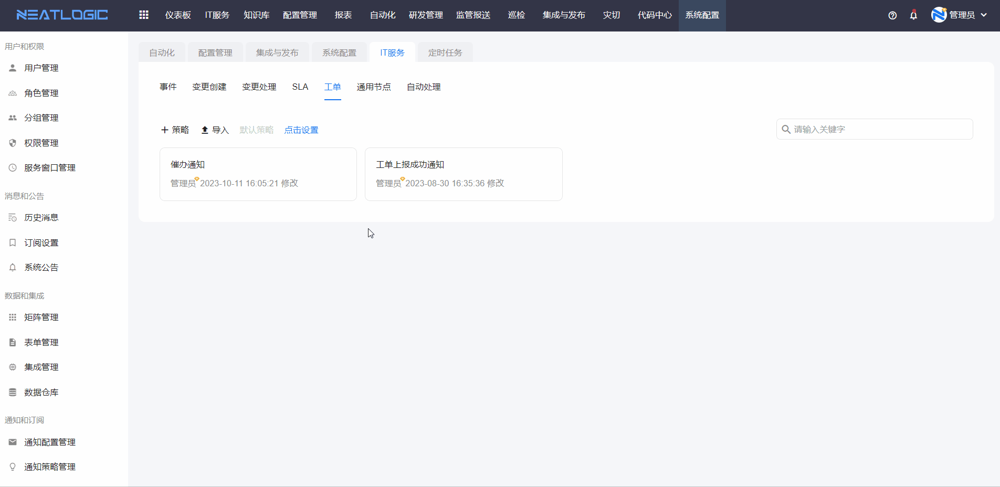

## 系统配置通知

系统配置通知用于系统级通知场景，目前支持系统异常通知。

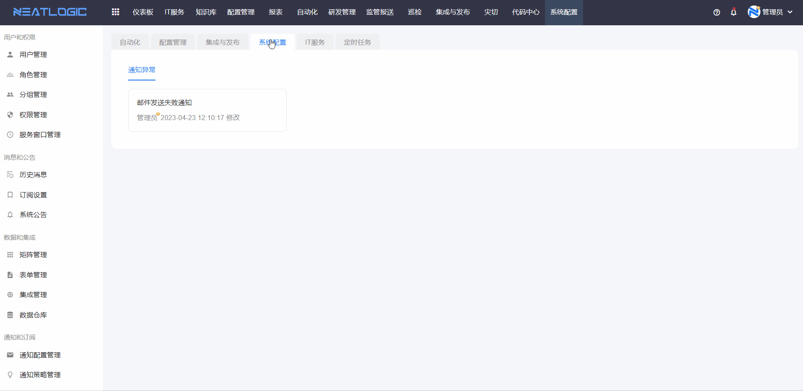

## 定时任务

定时任务通知用于按计划发送固定通知内容。系统会将常用通知内容封装为插件，配置人员选择对应插件后，可以定时向指定用户发送通知。

添加定时任务：

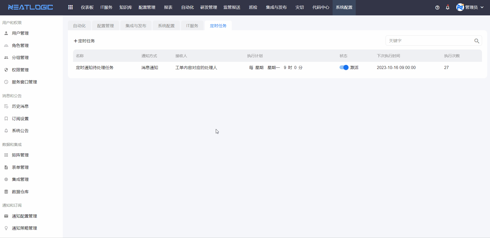

查看执行记录：

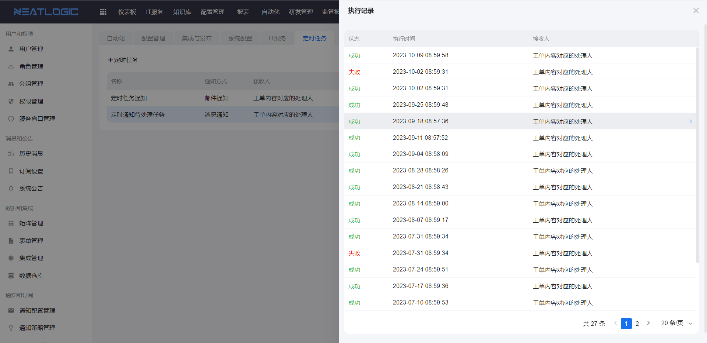
