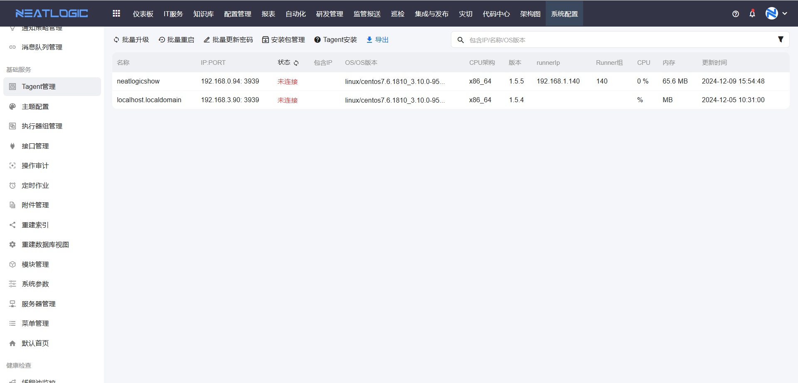
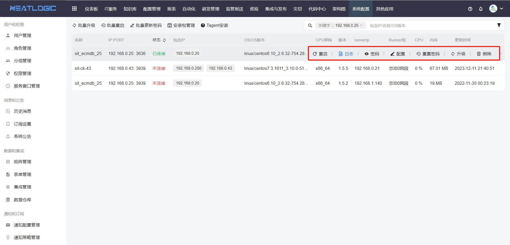
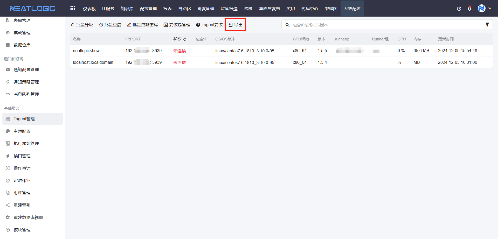

# Tagent管理

Tagent管理用于查看当前租户中通过执行器注册的 Tagent 服务，并展示服务的连接状态、版本、运行日志和可执行操作。

## 阅读路径

可根据当前要解决的问题选择阅读入口。

- 如果需要安装 Tagent，阅读“Tagent安装”。
- 如果需要理解执行器组和 Tagent 的关系，阅读“执行器组与Tagent关系”。
- 如果需要维护升级包，阅读“安装包管理”。
- 如果需要维护单个 Tagent 服务，阅读“Tagent操作”。
- 如果需要统一升级、重启或更新密码，阅读“批量操作”。

## 权限

**操作权限**
- 配置：系统配置-[用户管理](../1.用户和权限/用户管理.md)-授权-Tagent基础权限
- 包含操作：查看、编辑配置、重启、重置密码、升级、删除、查看日志、查看密码和导出
- 配置人员：系统超级管理员

## Tagent安装

详细安装步骤请参考[Tagent服务](../../5.自动化/Tagent服务/Tagent服务.md#tagent安装)。

## 执行器组与Tagent关系

Tagent 服务通过执行器组进行管理。需要先在执行器组管理中配置执行器组，再通过执行器组查看已注册的 Tagent 服务。

## 安装包管理

安装包管理用于维护 Tagent 升级版本和安装包。升级时，系统会根据目标主机的操作系统类型和 CPU 架构匹配安装包；CPU 架构可选择 `default`，表示该安装包适配所有 CPU 架构。

**说明：** 升级包仅包含源码，且只能压缩为 tar 格式。

## Tagent操作

Tagent操作用于维护单个 Tagent 服务。常用操作包括编辑配置、重启、重置密码、升级、删除、查看日志和查看密码。

- **编辑配置**：修改 Tagent 服务的配置信息。配置保存后，需要重启 Tagent 服务才会生效。
- **重启**：重启当前 Tagent 服务，适用于配置变更后重新加载服务，或服务状态异常时尝试恢复。
- **重置密码**：重新生成并更新 Tagent 服务密码。密码更新后，依赖该密码的连接配置也需要同步调整。
- **升级**：将 Tagent 升级到指定版本。升级前，需要先在安装包管理中添加版本并上传对应安装包。
- **删除**：删除当前 Tagent 服务记录。删除前应确认该服务不再被自动化作业或执行器组使用。
- **查看日志**：查看 Tagent 服务运行日志，适用于排查启动、连接和执行异常。日志文件支持下载。
- **查看密码**：查看当前 Tagent 服务密码，用于检查连接配置或排查认证问题。

## 批量操作

批量操作用于同时维护多个 Tagent 服务，适合统一升级、统一重启或批量更新密码的场景。批量操作前，应先确认筛选条件和目标范围，避免影响不相关的 Tagent 服务。

### 批量升级

批量升级用于将多个 Tagent 服务升级到同一版本。选择升级版本后，可以通过指定 `IP:端口` 或指定网段来确定升级对象，两种指定方式为并集关系。

### 批量重启

批量重启用于同时重启多个 Tagent 服务。可通过以下三种方式指定重启对象，三者为并集关系：

- 代理组下的所有 Tagent 服务。
- 指定 `IP:端口` 对应的 Tagent 服务。
- 指定网段中的所有 `IP:端口` 对应的 Tagent 服务。

### 批量更新密码

批量更新密码用于同时更新多个 Tagent 服务密码。可通过以下三种方式指定更新对象，三者为并集关系：

- 代理组下的所有 Tagent 服务。
- 指定 `IP:端口` 对应的 Tagent 服务。
- 指定网段中的所有 `IP:端口` 对应的 Tagent 服务。

### 导出

导出用于导出当前搜索结果中的 Tagent 数据，适合盘点服务清单或离线分析。

