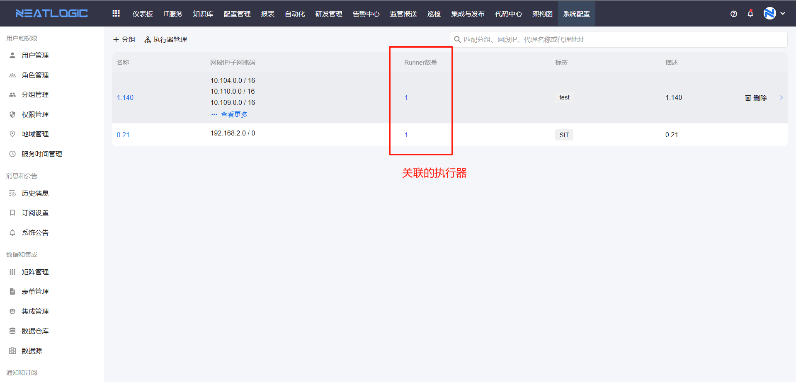
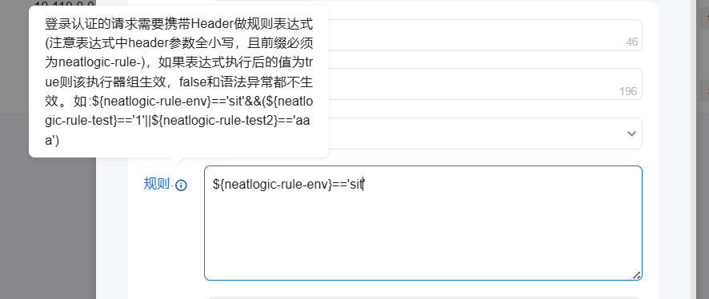
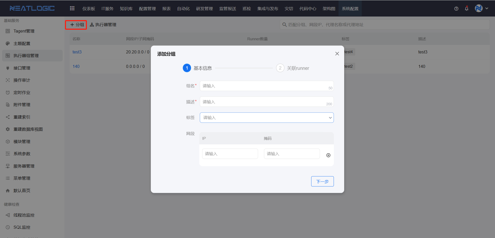
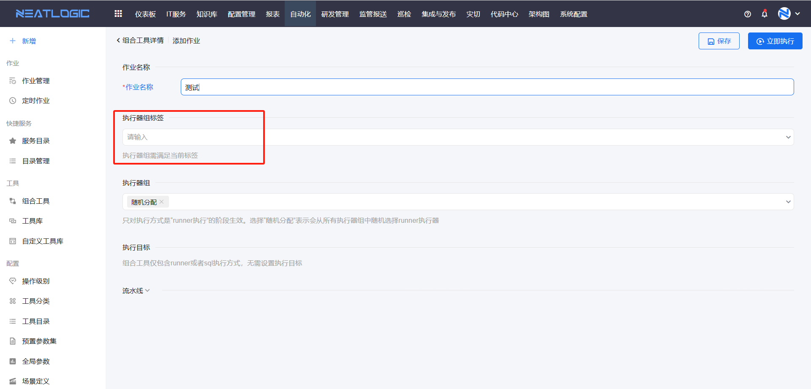
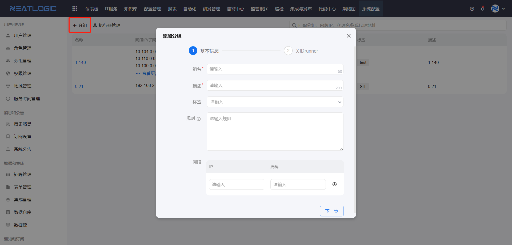
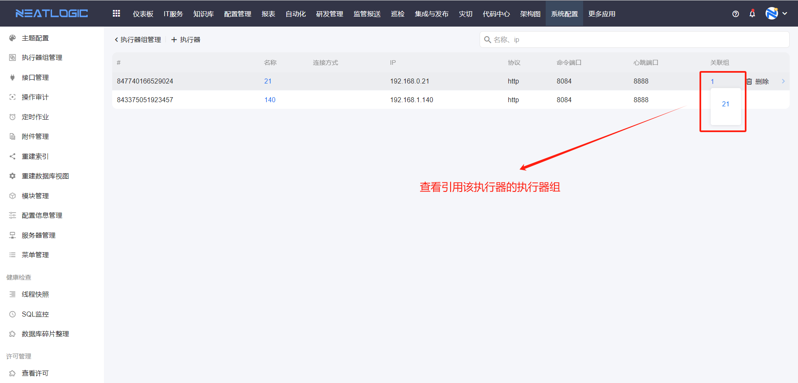
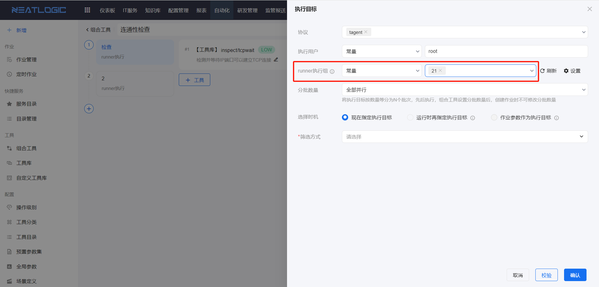

# 执行器组管理

执行器组管理用于维护执行器组和执行器。执行器组由一个或多个执行器组成，主要用于控制自动化作业可使用的执行器范围，以及执行器可应用的网段范围。

执行器组配置包括名称、描述、规则、网段和关联执行器。配置完成后，自动化作业可根据执行器组、网段和标签等条件分配合适的执行器。

## 阅读路径

可根据当前要解决的问题选择阅读入口。

- 如果需要创建执行器组，阅读“添加执行器组”。
- 如果需要控制执行器组在哪些环境或请求条件下可用，阅读“规则”。
- 如果需要维护具体执行器，阅读“执行器管理”。
- 如果需要了解执行器组在自动化作业中的使用方式，阅读“执行器的应用”。

## 权限

**操作权限**
- 配置：系统配置-[用户管理](../1.用户和权限/用户管理.md)-授权-自动化执行器管理权限
- 包含操作：新增、编辑、删除、查询执行器组和执行器
- 配置人员：系统超级管理员

## 规则

规则用于判断执行器组是否可用。登录认证请求需要携带 Header，系统会根据规则中定义的表达式匹配 Header 参数值；满足表达式时，执行器组生效，否则不生效。

该能力常用于多环境共用同一数据库的场景。通过规则，可以控制不同环境发起作业时可使用的执行器组范围。

例如，当前环境为 SIT，配置了执行器组 `1.140`，并定义规则 `${neatlogic-rule-test1}=='b'`。用户登录 SIT 环境时，如果 Header 参数满足表达式，执行器组 `1.140` 可用；登录其他环境且不满足表达式时，该执行器组不可用。

## 添加执行器组

添加执行器组包含两个步骤：填写基本信息和关联 Runner（执行器）。

网段用于限制当前执行器组可应用的网络范围。标签用于标记执行器组，在发起自动化作业时，可根据标签过滤并分配合适的执行器组。

在标签组件中输入标签文案并回车，即可添加标签。

## 执行器管理

执行器管理用于维护具体执行器，支持添加、删除、编辑和查询执行器等操作。

添加执行器时，需要填写执行器名称、IP、协议、命令端口和心跳端口等信息。外部认证支持 Basic 和 HMAC 两种方式。

执行器支持查看引用关系，可查看当前执行器被哪些执行器组引用。

## 执行器的应用

执行器组可在组合工具的执行目标中预设。自动化作业执行时，系统会根据已选择的执行器组分配对应 Runner。

