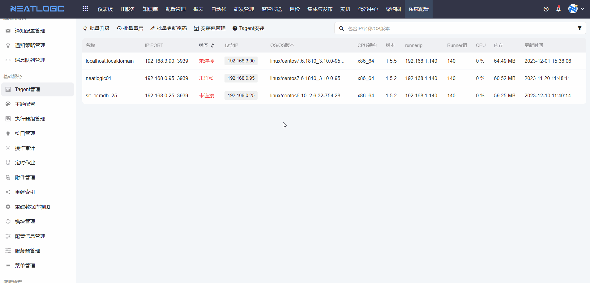
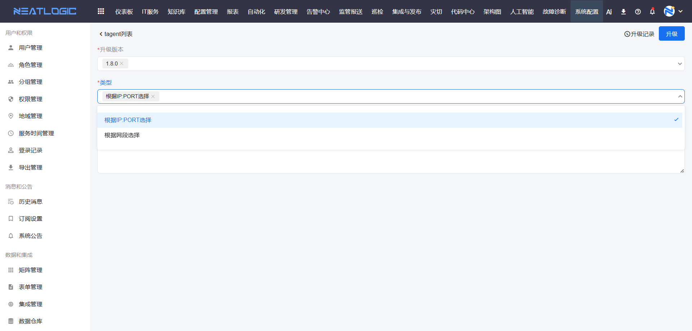
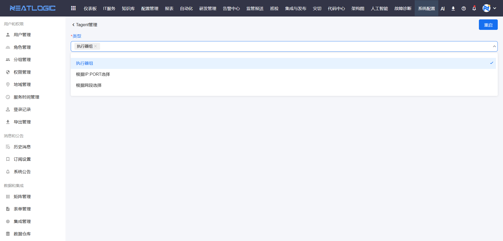
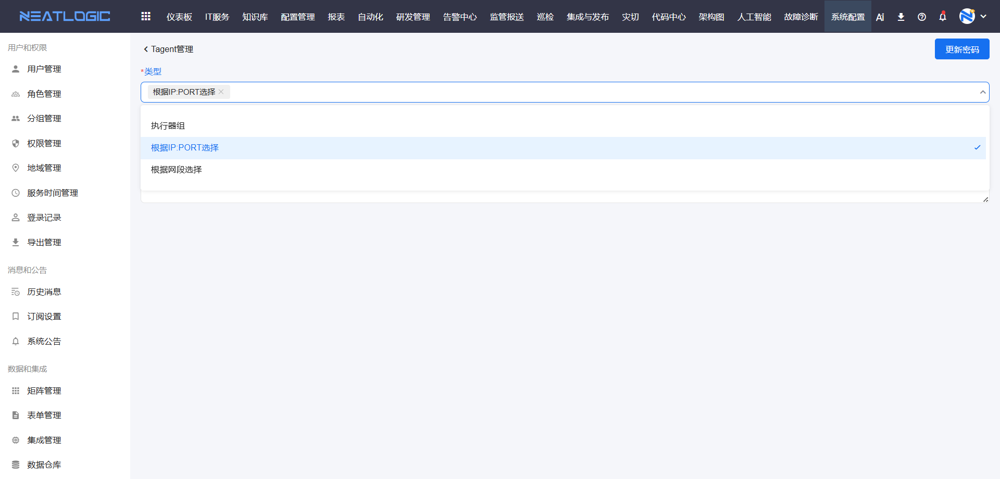

# Tagent管理
Tagent管理页面汇总了通过执行器在当前租户注册的所有Tagent服务，系统通过执行器来管理和显示其当前的连接状态。

## Tagent安装
详细安装步骤请参考[Tagent服务](../../5.自动化/Tagent服务/Tagent服务.md#tagent安装)文档。

## 执行器组与Tagent关系
首先需要在执行器组管理中配置执行器组（Runner组），然后通过配置的执行器组找到已注册的Tagent服务。

## 安装包管理
安装包管理功能支持添加版本并关联安装包，用于单个Tagent升级和批量升级操作。升级时，系统将根据目标主机的操作系统类型和CPU架构自动匹配相应的安装包。CPU架构可选择"default"，被标识为"default"的安装包可适配所有CPU架构。

**说明**：升级包仅包含源码，且只能压缩为tar格式。

## Tagent操作
Tagent管理支持以下操作：编辑配置、重启、重置密码、升级、删除、查看日志和查看密码。

- **编辑配置**：编辑Tagent服务的配置信息，保存后需重启Tagent服务才能生效
- **重启**：重启Tagent服务
- **重置密码**：一键更新Tagent服务密码
- **升级**：升级Tagent安装包，通过选择版本匹配已上传的升级安装包（需先在安装包管理中添加安装包版本并上传安装包）
- **查看日志**：查看Tagent服务的运行日志，支持下载日志文件

## 批量操作
批量操作包括：批量升级、批量重启和批量更新密码。

### 批量升级
选择升级版本后，可通过指定IP:端口或指定网段中的所有IP:端口进行升级，两种指定升级对象的方式为并集关系。

### 批量重启
指定重启对象的方式有三种，三者之间为并集关系：
- 代理组下的所有Tagent服务
- 指定IP:端口对应的Tagent服务
- 指定网段中的所有IP:端口对应的Tagent服务

### 批量更新密码
指定更新密码对象的方式有三种，三者之间为并集关系：
- 代理组下的所有Tagent服务
- 指定IP:端口对应的Tagent服务
- 指定网段中的所有IP:端口对应的Tagent服务

### 导出
导出当前搜索结果下的所有Tagent数据。

