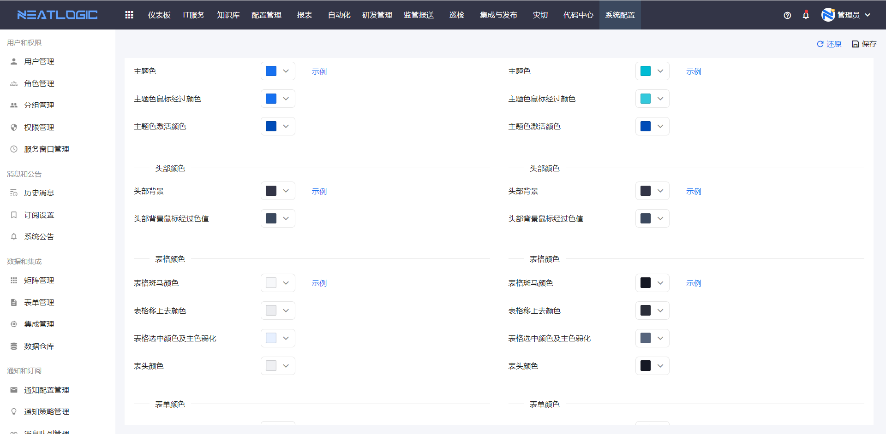
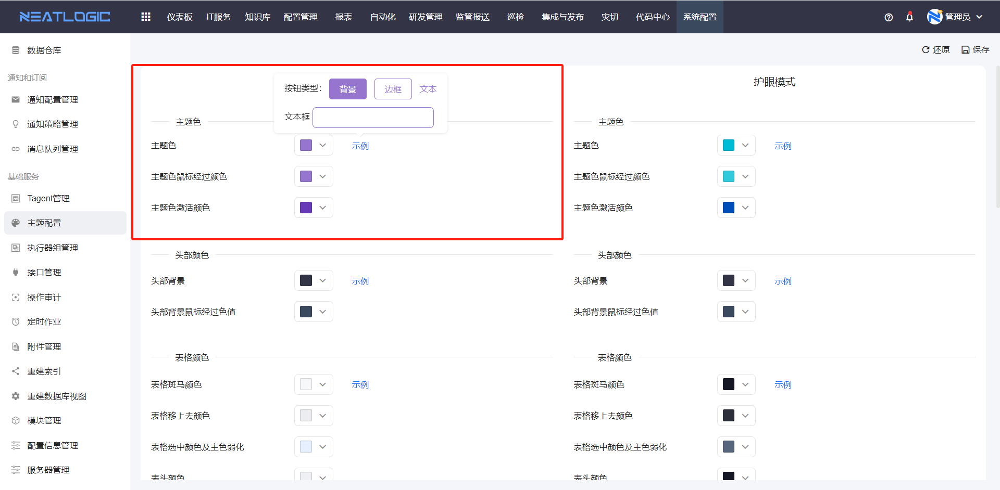
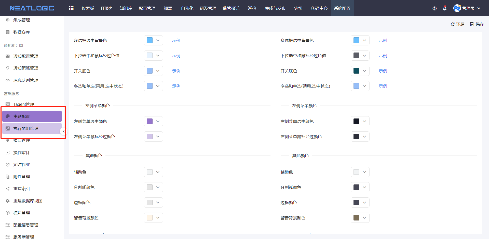

# 主题设置
主题设置是配置系统logo图片，以及配置系统公共的主题颜色、菜单和按钮颜色等。

系统的分为明亮模式（浅色）和护眼模式（深色），所以logo和颜色也分成两个模式分别维护。

## 保存和还原
编辑完颜色配置，点击保存按钮，即可生效。

还原操作是指把所有颜色配置恢复到初始配置，还原操作要谨慎使用。

## 主题配置说明
### Logo
系统默认logo可以替换，上传本地图片并保存即可。

系统有

### 主题色
主题色是指按钮底色、文本颜色以及经过文本框高亮的颜色，如图所示。

### 头部颜色
头部颜色是指页面最上方的头部菜单栏，支持设置菜单底色和选中后显示的颜色，如图所示。

### 表格颜色
表格颜色主要支持设置表头的颜色、光标聚焦时行颜色、选中的行底色，如图所示。

### 表单颜色
表单颜色是指系统常用表单组件的颜色，包括多选框选中颜色、下拉框选项选中状态下的颜色、开口组件启用的背景色和表单组件禁用颜色，如图所示。

### 菜单颜色
菜单颜色包括左侧菜单栏鼠标经过的背景色和选中菜单的背景色，如图所示。
