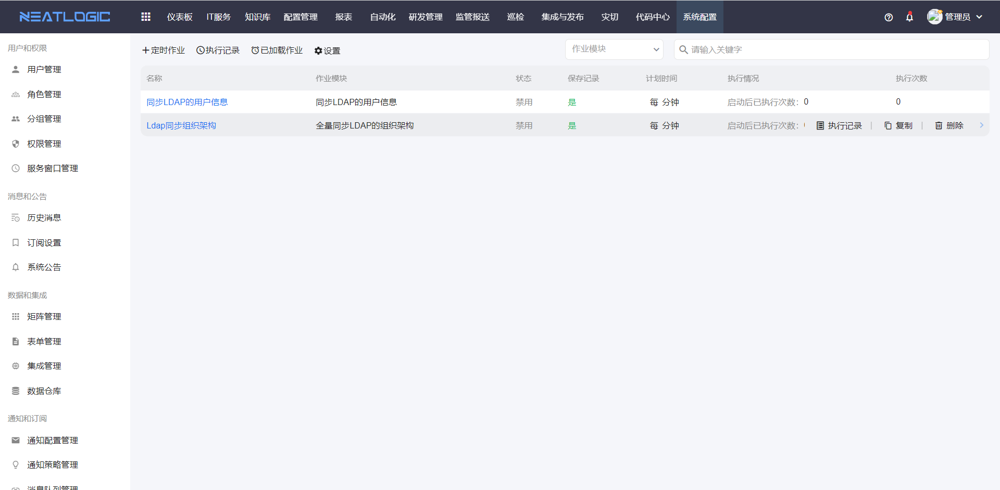
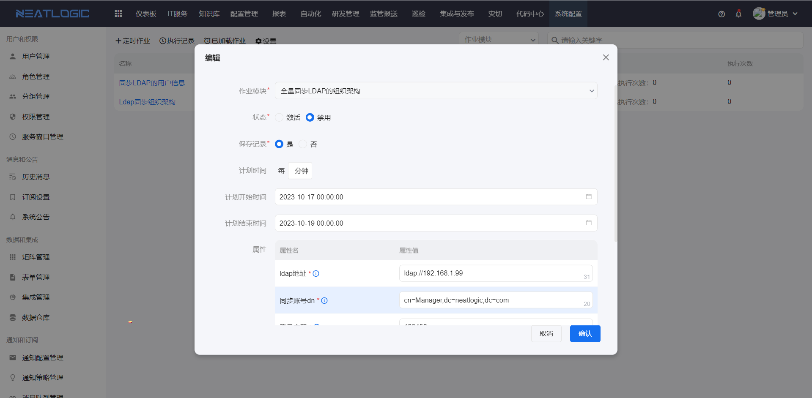

# 定时作业
定时作业，是指周期性、重复性的作业。定时作业是通过系统内置的作业模块插件，实现定时更新指定数据的场景。

支持添加、编辑、复制、删除定时作业和查看作业记录等操作。

相关权限：系统配置-定时作业管理权限

### 定时作业配置
定时作业配置包括名称、作业模块、状态、保存记录、计划时间、属性等。
- 作业模块，定时作业执行的脚本，这个是系统自带的。
- 状态，激活和禁用，激活的定时作业才会执行。
- 保存记录，启用了保存记录，才会保存每次执行的日志。
- 计划时间，配置定时作业执行的频率。
- 属性：属性是作业模块的输入的属性，须在定时作业配置中定义属性的输入值。
  

### 执行记录
定时作业有单个作业的执行记录，和所有作业的执行记录汇总，定时作业执行异常，执行记录中会回显错误日志，方便跟踪问题。
