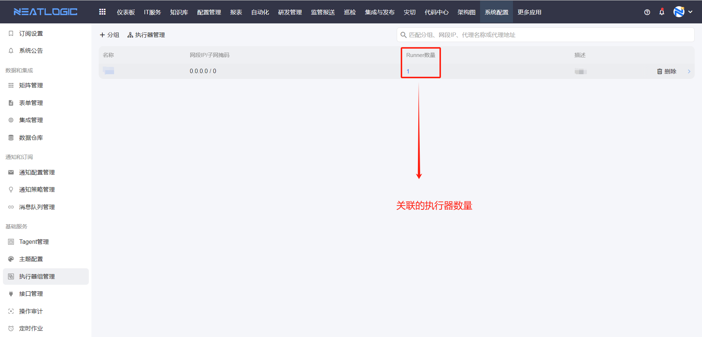
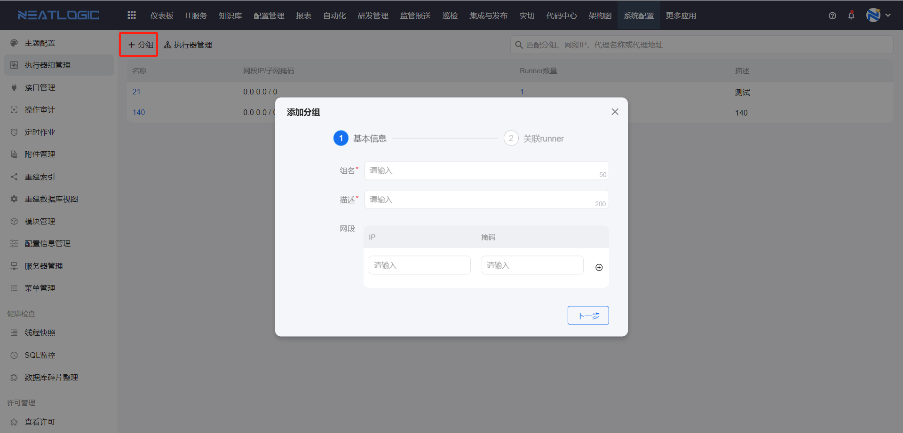
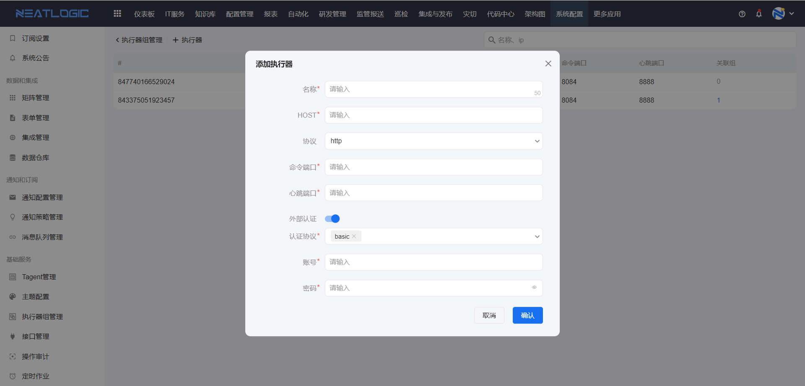
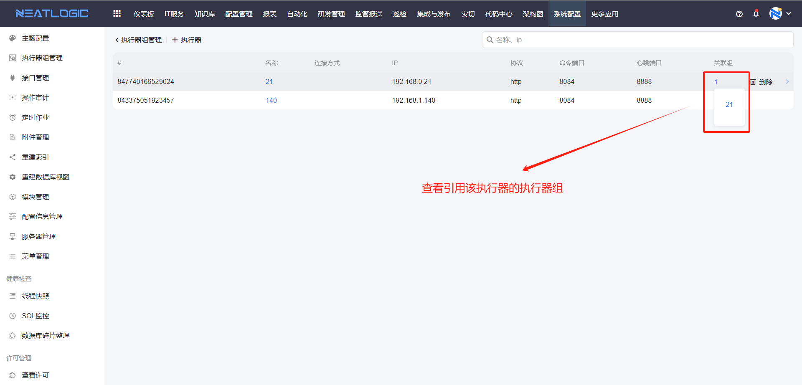
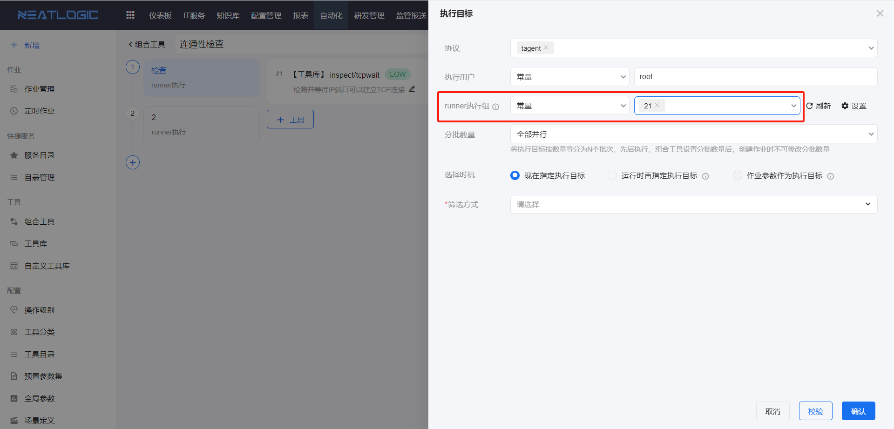

# 执行器组管理
执行器组是由一个或多个执行器组成，执行器组主要是控制其包含的执行器可用网段范围。执行器组的配置有名称、描述、网段和关联执行器。

## 添加执行器组
添加执行器组时，有两个步骤，填写基本信息和关联runner（执行器），网段设置是限制当前执行器组能够应用的网段范围。

## 执行器管理
执行器管理中支持添加、删除、编辑和查询执行器等功能。

添加执行器时，需要填写执行器名称、ip、协议、命令端口和心跳端口配置，另外外部认证支持basic和hmac认证。

执行器数据支持查看引用该执行器的执行器组

## 执行器的应用
组合工具的执行目标中可以预设执行器组，自动化作业执行时根据已选择的执行器组分配的runner。
