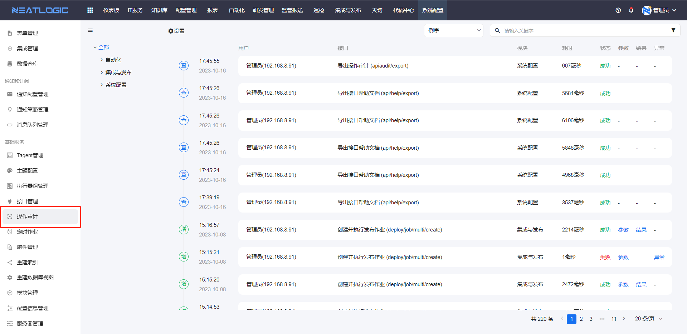
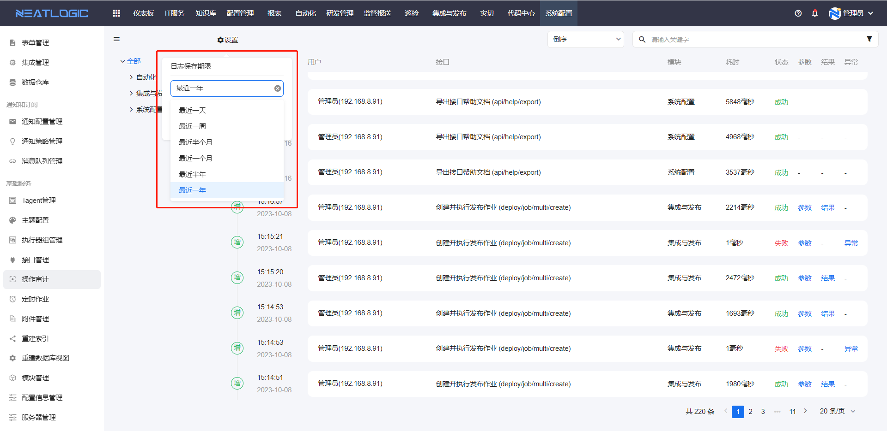

# 操作审计
操作审计汇总所以启用操作审计的[接口](接口管理.md)的调用日志，提供管理员在前端页面查看重点接口的调用情况，可跟踪接口的输入参数、返回结果或异常信息。

## 接口审计范围
操作审计中并不会记录所有接口的操作日志，只有启用审计的接口才会产生操作审计日志。

## 查看日志详情
操作审计日志信息包含用户、接口、模块、耗时、参数、结果和异常等，其中的参数、结果和异常支持查看详情。

## 保留期限
所有的操作审计可以设置保留期限，超过保留期限的日志会被清除。
