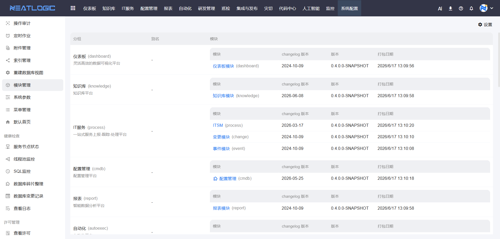
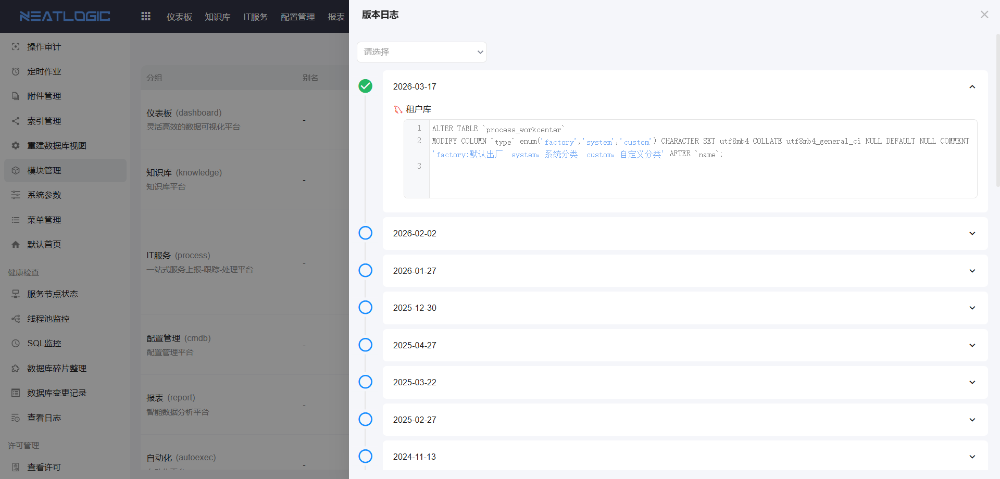
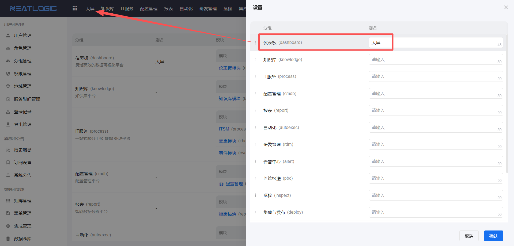

# 模块管理

## 功能概述

模块管理页面展示当前系统启用的分组（导航菜单）及其包含的模块包信息。

**分组结构**：
- 每个分组对应一个导航菜单
- 一个分组可能包含多个模块包
- 每个模块包显示版本号、打包日期和版本日志信息

部分模块带有初始数据，支持导出和导入初始数据。

## 模块信息查看

每个模块包显示版本号、打包日期和版本日志信息。

### 版本日志查看

点击模块包，可以查看详细的版本日志，包括更新时间和更新内容。

## 导出和导入初始数据

部分模块（如自动化和配置管理模块）带有初始数据，支持导出和导入初始数据。

### 导出初始数据

将模块的初始数据导出为文件，用于备份或迁移。

### 导入初始数据

将导出的初始数据文件导入到系统中，用于恢复或部署。

## 分组别名设置

分组菜单的名称支持修改别名，便于用户自定义菜单显示名称。

### 设置别名

- 若设置了别名，菜单显示别名
- 若不设置别名，菜单显示默认名称

## 使用建议

1. **定期查看版本日志**：了解模块的更新内容和功能改进
2. **备份初始数据**：导出重要模块的初始数据，避免数据丢失
3. **合理设置别名**：为分组设置易于理解的别名，提高用户体验
4. **版本管理**：关注模块版本号，确保系统功能的一致性