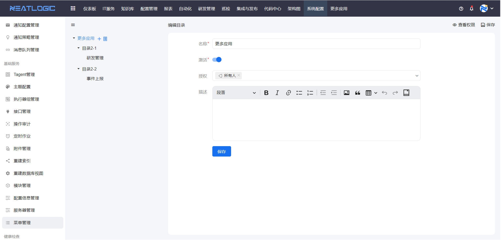
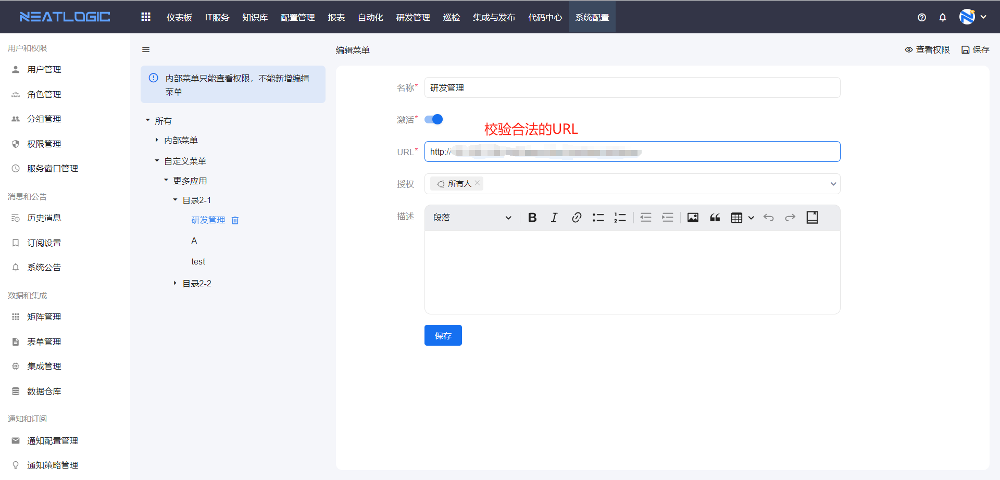
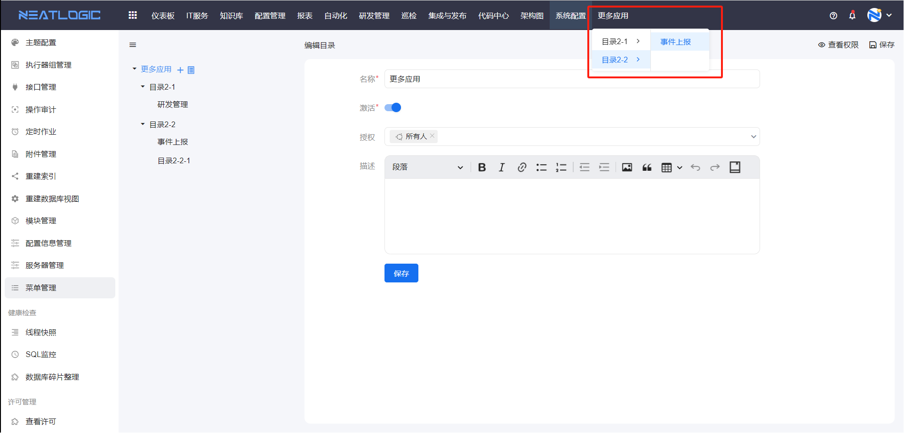
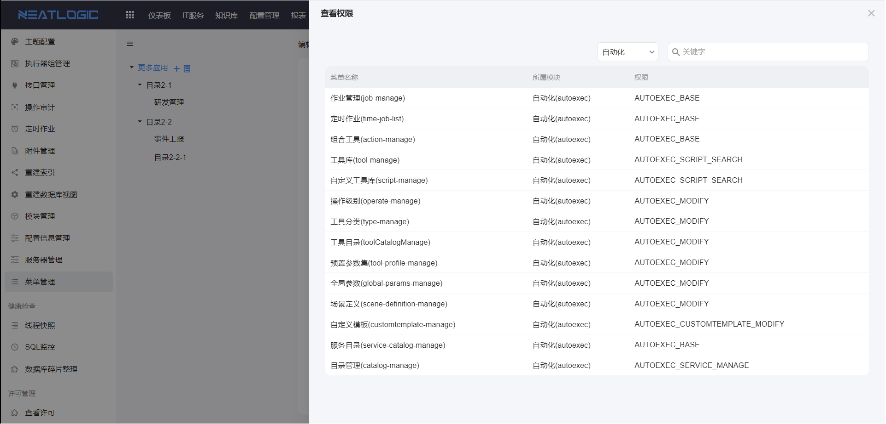

# 菜单管理
菜单管理是用于拓展自定义菜单的管理页面。可以配置目录及菜单，并且目录和菜单都都有授权操作，支持把目录、菜单授权到所有人、用户、分组或角色。目录和菜单都支持拖动修改排序和层级。

## 目录
菜单管理页面有一个默认的根目录-“更多应用”，其下级可以自由配置的目录树，包括添加、编辑和删除操作。

目录配置包括名称、激活状态、授权和描述。激活状态的目录才能展示

## 菜单
菜单必须在目录下，不能和根目录同级。菜单支持添加、编辑和删除操作。

菜单的配置包括名称激活状态、URL、授权和描述。激活状态的菜单才能展示。

自定义菜单应用效果，如图

## 菜单应用说明
目录和菜单显示的条件是，用户有菜单的权限和菜单所在级联目录的权限。

要点说明：
1. 子目录或者菜单的授权范围，是在父级的目录的授权范围的子集，否则授权无法生效。
2. 目录下没有菜单（无菜单权限和菜单不生效也算），目录隐藏。
3. 菜单未激活，菜单不能生效。
4. 目录未激活，目录及其下级目录和菜单不能生效。

## 系统菜单权限
页面右上方有“查看权限”操作，可以查看系统默认菜单的查看权限，用户有菜单对应的权限，即可访问菜单页面。
