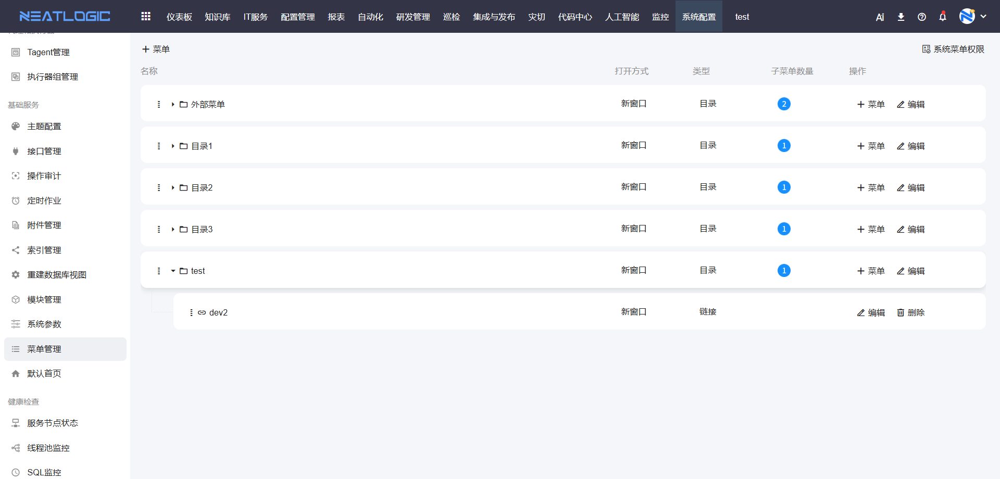
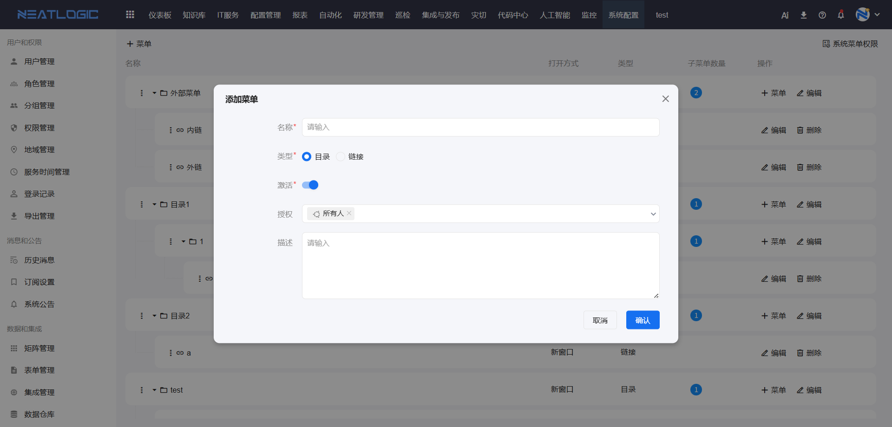
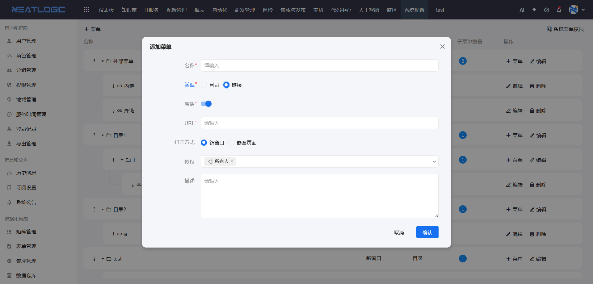
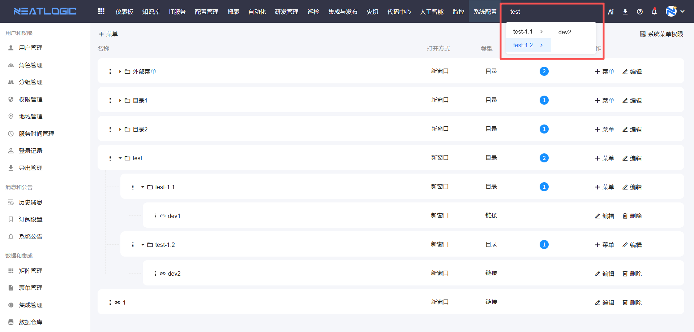
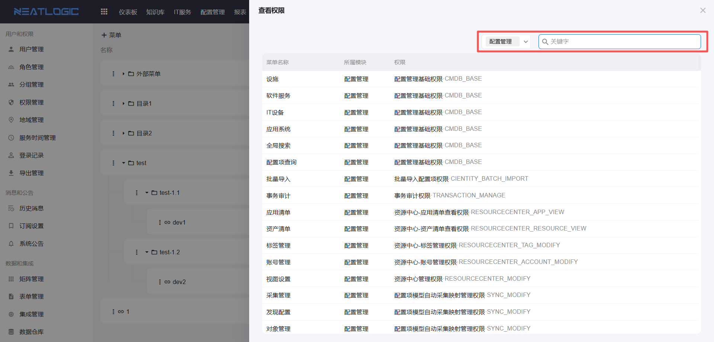

# 菜单管理
菜单管理是用于拓展自定义菜单的管理页面，可以配置目录及菜单，并且目录和菜单都有授权操作，支持把目录、菜单授权到所有人、用户、分组或角色。目录和菜单都支持拖动修改排序和层级。

## 目录
目录用于组织和管理菜单，支持多级嵌套结构。

**目录操作**：
添加、编辑、删除（子级为空时才能删除目录）、拖拽排序（拖动调整目录顺序和层级）

## 菜单（链接）
菜单支持添加、编辑和删除操作。

**菜单操作**：
添加、编辑、删除、拖拽排序（拖动调整菜单顺序，也可拖拽到其他目录下）

自定义菜单应用效果，如图：

## 菜单应用说明
目录和菜单显示的条件是，用户有菜单的权限和菜单所在级联目录的权限。

**要点说明**：
1. 子目录或者菜单的授权范围，是在父级的目录的授权范围的子集，否则授权无法生效。
2. 目录下没有菜单（无菜单权限和菜单不激活也算），目录隐藏。
3. 菜单未激活，菜单不能生效。
4. 目录未激活，目录及其下级目录和菜单不能生效。

## 系统菜单权限
页面右上方有"查看权限"操作，可以查看系统菜单的权限信息。

**功能说明**：
- 查看系统菜单的权限配置
- 了解用户访问菜单所需的权限要求
- 用户有菜单对应的权限，即可访问菜单页面

