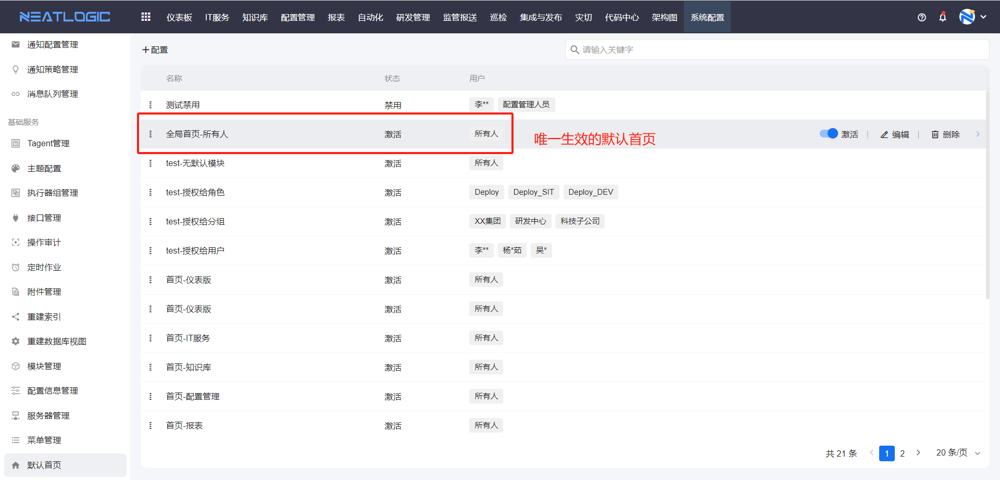
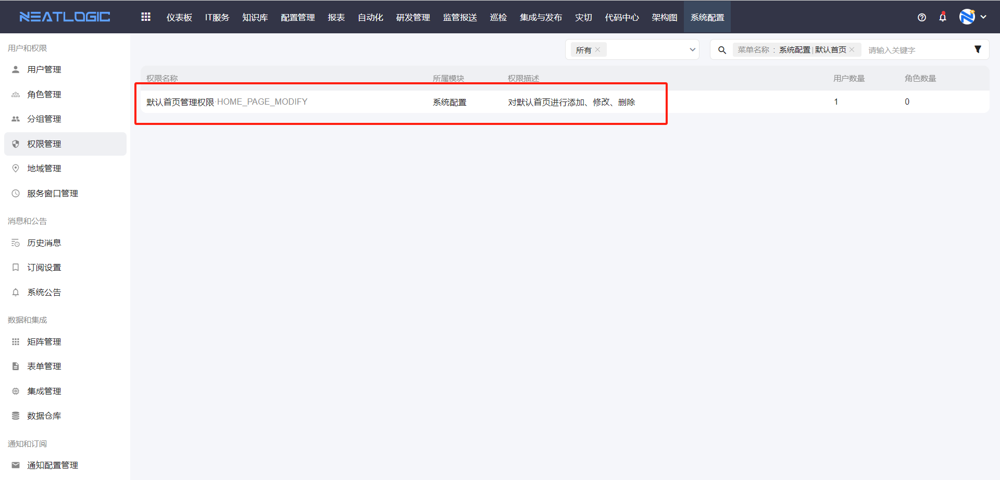
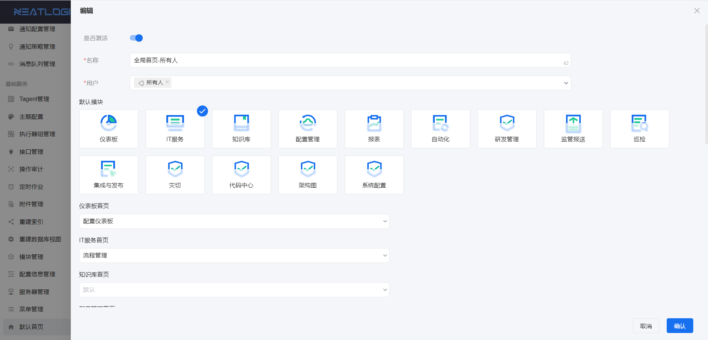
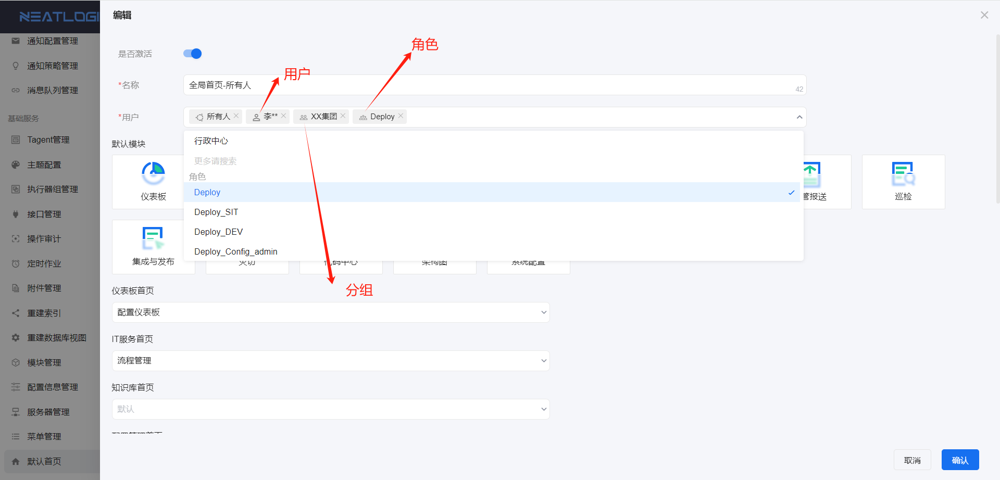

# 默认首页
默认首页页面是管理全局默认首页的页面，可以设置应用于用户的默认模块，生效的全局默认首页只有一个。

唯一生效的配置要满足两个条件：
1. 配置必须是激活状态。
2. 在所有激活的配置中排序第一。

关于默认首页的权限，用户需要有默认首页管理权限，才显示默认首页菜单，并进行添加、编辑和删除等操作。

## 配置
默认首页的配置主要包括授权用户、默认模块和模块默认首页。

1. 授权用户
   
   仅授权的用户能够使用生效的配置，支持授权给所有人、用户、角色和分组。
   
   未授权的用户引用全局配置时，默认模块以及模块默认首页为空。
   

2. 默认模块
   
   默认模块是指，登录系统后，默认打开的模块。

   如果未选择默认模块，则默认打开欢迎页，欢迎页如图。
   

3. 模块默认首页
    
    模块默认首页是指，访问模块时，默认打开的页面。