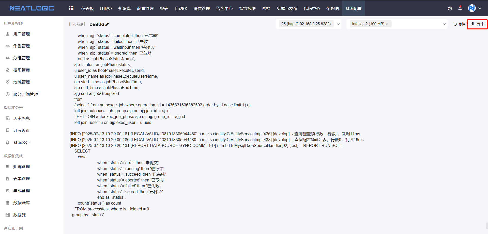

# 查看日志
系统配置-健康检查 有查看日志目录，可以查看系统应用服务器的日志文件。

## 日志级别
日志级别可编辑，会按照选择的日志级别打印日志。

## 日志文件
日志文件的描述说明：

| 文件名 | 描述 |
| - | - |
|debug.log|debug级别日志|
|error.log|error级别日志|
|info.log|info级别日志|
|warn.log|warn级别日志|
|deadlock.log|数据库sql死锁日志|
|gc.log|jdk垃圾回收日志|
|neatlogic.2025-07-17.acc|tomcat接口请求日志|
|neatlogic.out|tomcat控制台日志|
|notifyAudit.log|发送通知日志|
|sqlTimeout.log|mysql慢sql日志|
|tagentRegisterAndNetty.log|tagent注册日志|
|methodTimingAspect.log|方法执行耗时日志（这个没有启用）|

### 导出
日志文件支持导出到本地
