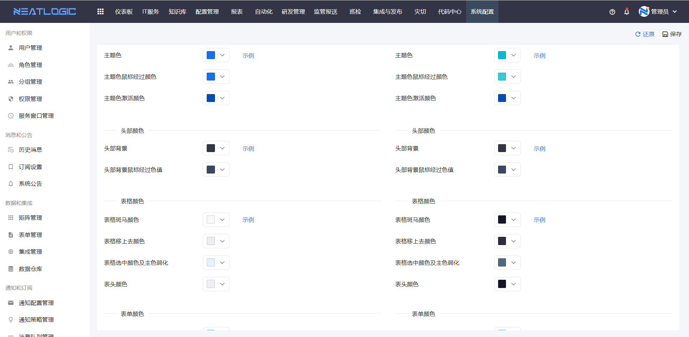
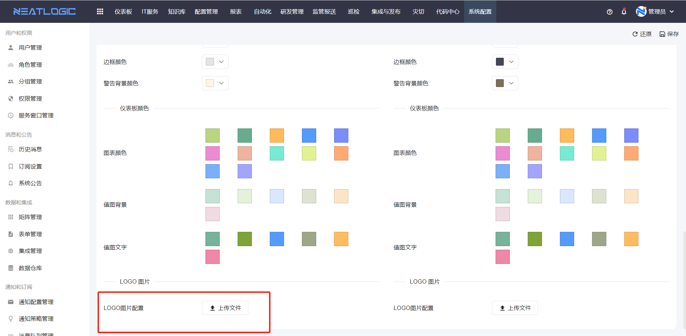
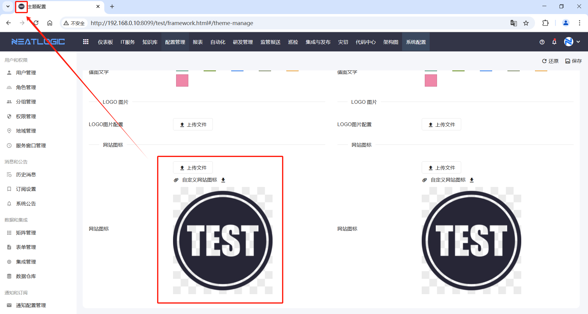
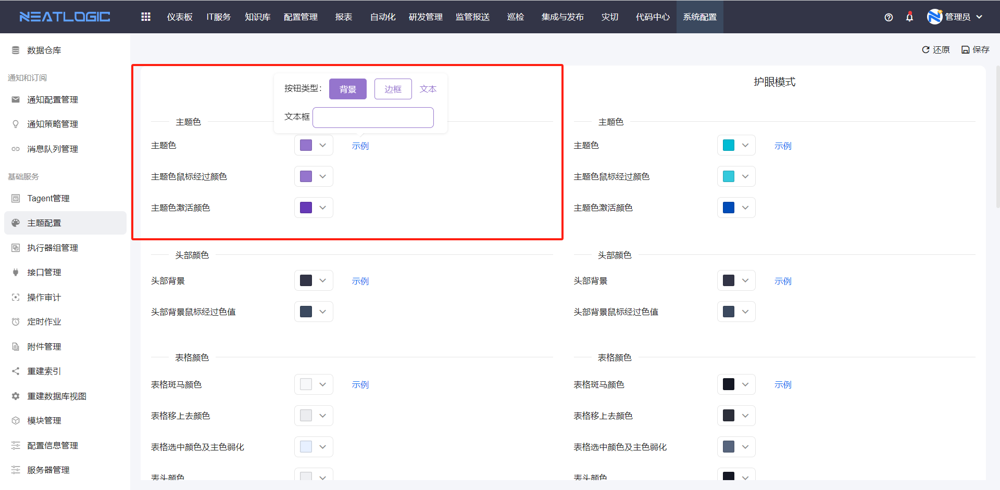
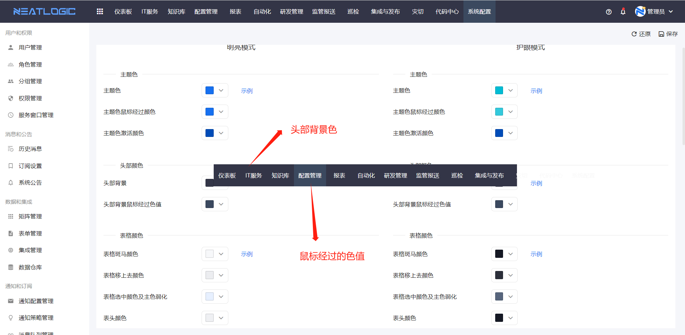
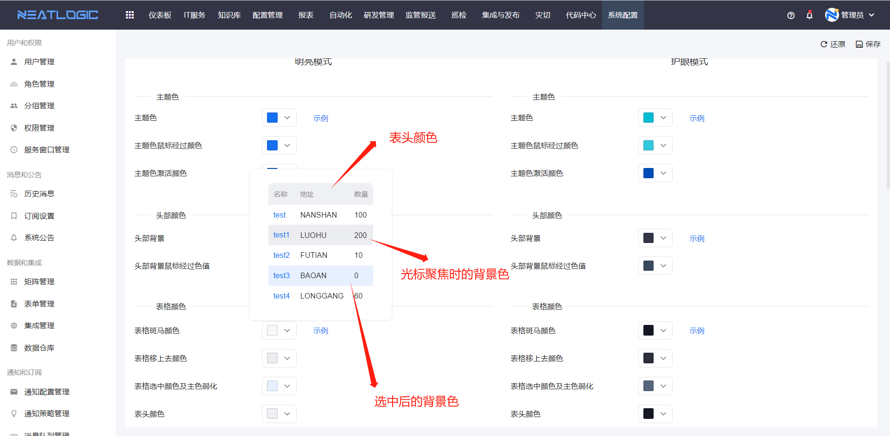
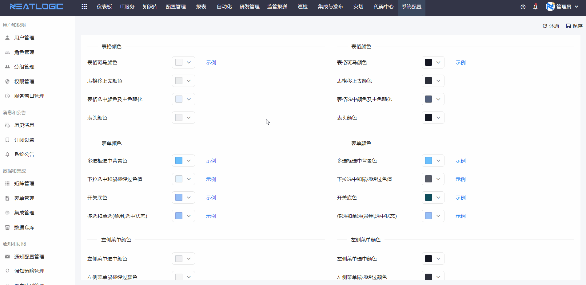
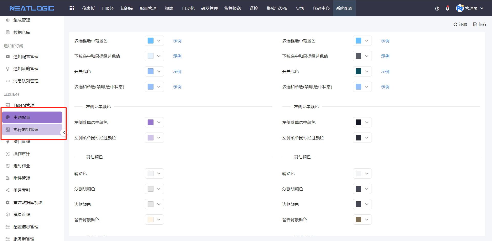
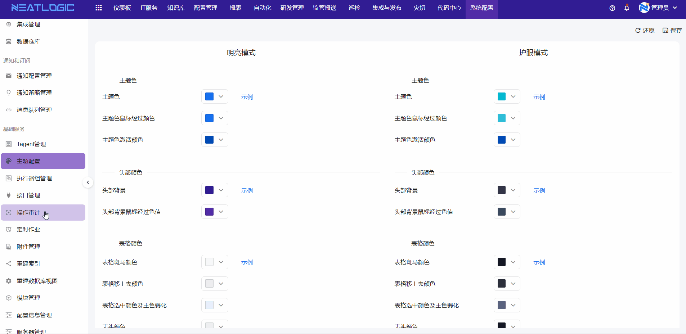

# 主题设置

主题设置用于维护系统 Logo、网站图标和公共配色，包括主题色、头部颜色、表格颜色、表单颜色和菜单颜色。

系统支持明亮模式（浅色）和护眼模式（深色）。Logo 和颜色配置需要按模式分别维护。

## 阅读路径

可根据当前要调整的内容选择阅读入口。

- 如果需要替换系统标识，阅读"Logo"和"网站图标"。
- 如果需要调整系统公共配色，阅读"主题色""头部颜色""表格颜色""表单颜色"和"菜单颜色"。
- 如果需要保存配置或恢复默认主题，阅读"保存和还原"。

## 权限

**操作权限**
- 配置：系统配置-[用户管理](../1.用户和权限/用户管理.md)-授权-主题设置权限
- 包含操作：维护系统 Logo、网站图标和主题颜色
- 配置人员：系统超级管理员

## 主题配置说明

### Logo

Logo 用于显示系统标识。上传本地图片并保存后，系统会使用上传的 Logo；未上传 Logo 时，系统使用默认图片。

### 网站图标

网站图标是浏览器标签页中显示的图标。上传本地图片并保存后，系统会使用上传的网站图标；未上传图片时，系统使用默认图标。

### 主题色

主题色用于控制系统主要操作色，包括按钮底色、文本颜色和文本框聚焦高亮颜色。

### 头部颜色

头部颜色用于控制页面顶部菜单栏的显示效果，支持设置菜单底色和选中状态颜色。

### 表格颜色

表格颜色用于控制表格组件的显示效果，主要包括表头颜色、光标聚焦时的行颜色和选中行底色。

### 表单颜色

表单颜色用于控制常用表单组件的显示效果，包括多选框选中颜色、下拉框选项选中颜色、开关组件启用背景色和表单组件禁用颜色。

### 菜单颜色

菜单颜色用于控制左侧菜单栏的显示效果，包括鼠标经过时的背景色和选中菜单的背景色。

## 保存和还原

保存和还原用于在完成主题配置后应用配置或恢复初始状态。

编辑颜色配置后，点击保存即可生效。

还原操作会将所有颜色配置恢复为初始配置。执行还原前，应确认当前主题配置不再需要保留。

