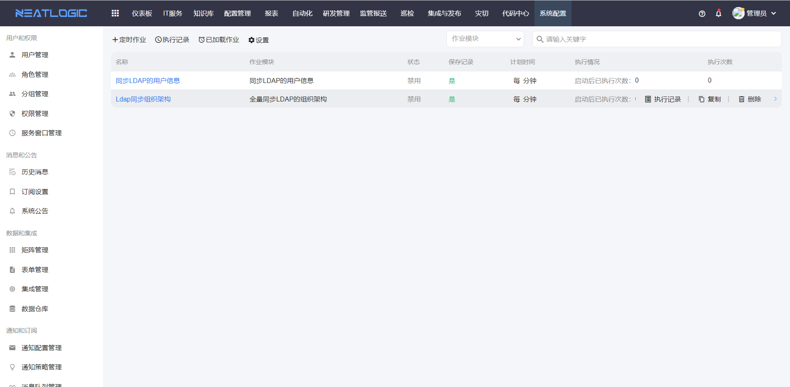
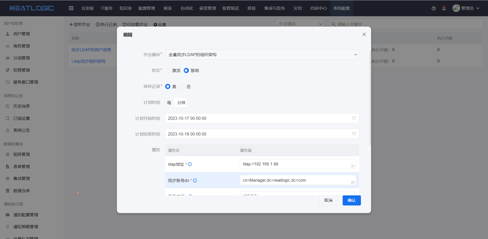
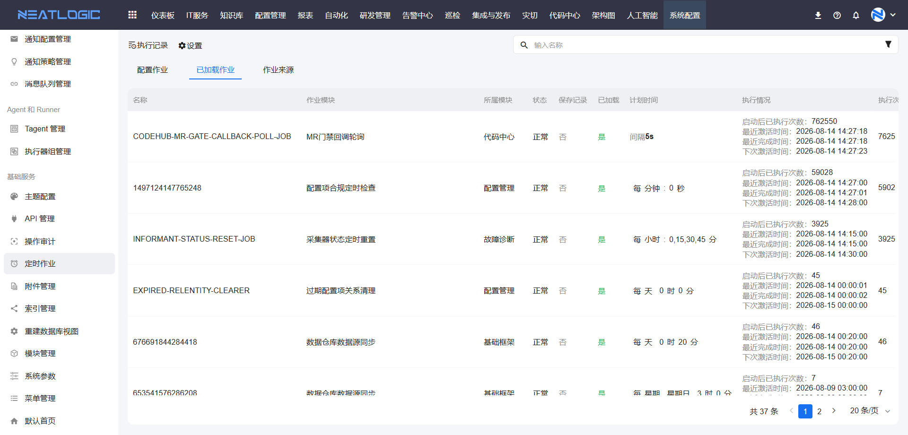
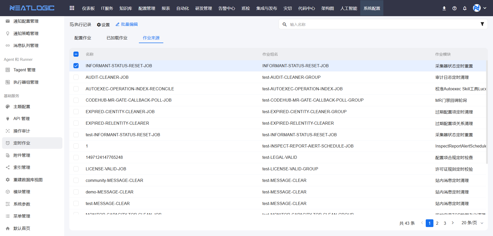
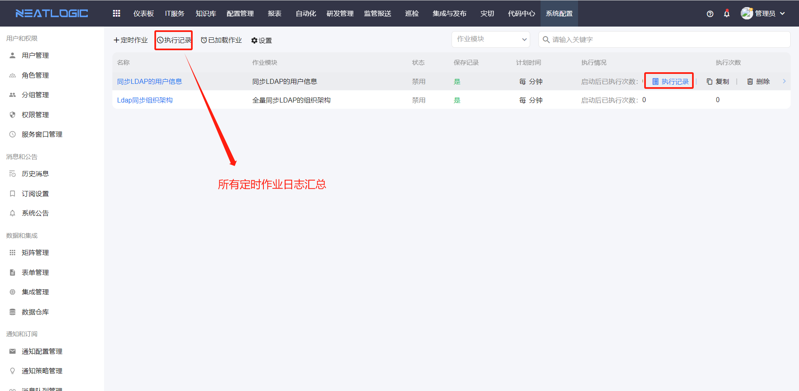

# 定时作业

定时作业用于周期性执行系统内置作业模块插件，适合定时刷新数据或执行重复性维护任务。

定时作业页面包含**配置作业**、**已加载作业**和**作业来源**三个页签。配置作业用于维护作业配置，已加载作业用于查看系统所有模块已加载的定时任务，作业来源用于查看作业所属模块或插件。

## 阅读路径

可根据当前要解决的问题选择阅读入口。

- 如果需要创建、调整或查看定时作业配置，阅读“配置作业”。
- 如果需要查看系统所有模块已加载的定时任务，阅读“已加载作业”。
- 如果需要了解作业由哪个模块、插件或服务器加载，阅读“作业来源”。
- 如果需要确认作业是否执行成功，阅读“执行记录”。
- 如果需要排查作业异常，阅读“执行记录”中的错误日志。

## 权限

**操作权限**
- 配置：系统配置-[用户管理](../1.用户和权限/用户管理.md)-授权-定时作业管理权限
- 包含操作：新增、编辑、复制、删除定时作业和查看执行记录
- 配置人员：系统超级管理员

## 配置作业

配置作业用于维护定时作业实例。系统支持新增、编辑、复制、删除和查看执行记录等操作。

定时作业配置包括名称、作业模块、状态、保存记录、计划时间和属性。

- **作业模块**：定时作业执行的系统内置脚本。
- **状态**：用于控制定时作业是否执行。只有激活状态的定时作业才会按计划执行。
- **保存记录**：启用后，系统会保存每次执行日志。
- **计划时间**：用于配置定时作业的执行频率。
- **属性**：作业模块的输入参数，需要在定时作业配置中填写对应的输入值。

## 已加载作业

已加载作业用于汇总系统所有模块已加载的定时任务。列表包含所属模块、状态、计划时间和执行情况等信息，可用于确认任务是否已被系统识别，以及当前任务的调度和执行状态。

## 作业来源

作业来源用于查看作业定义的来源信息。列表包含所属模块、服务器 ID 和服务器组等信息，可用于确认作业由哪个模块提供，以及当前作业由哪些服务器加载。

## 执行记录

执行记录用于查看定时作业的执行结果，包括单个作业的执行记录和所有作业的执行记录汇总。

当定时作业执行异常时，执行记录中会显示错误日志，便于定位问题。

