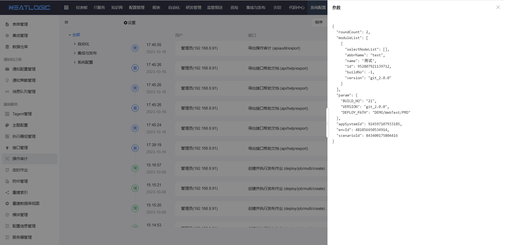

# 操作审计

操作审计用于汇总已启用审计接口的调用日志，便于管理员查看重点接口的调用情况，并跟踪接口的输入参数、返回结果或异常信息。

操作审计日志来自 [API管理](API管理.md) 中已启用审计的接口。未启用审计的接口不会产生操作审计日志。

## 阅读路径

可根据当前要解决的问题选择阅读入口。

- 如果需要了解哪些接口会记录审计日志，阅读“接口审计范围”。
- 如果需要查看某次接口调用的参数、结果或异常，阅读“查看日志详情”。
- 如果需要控制审计日志保留时间，阅读“保留期限”。

## 权限

**操作权限**
- 配置：系统配置-[用户管理](../1.用户和权限/用户管理.md)-授权-查看操作审计权限
- 包含操作：查看接口调用日志、查看参数详情、查看结果详情和查看异常详情
- 配置人员：系统超级管理员

## 接口审计范围

操作审计不会记录所有接口的调用日志。只有在 [API管理](API管理.md) 中启用审计的接口，才会产生操作审计日志。

## 查看日志详情

操作审计日志包含用户、接口、模块、耗时、参数、结果和异常等信息。

其中，参数、结果和异常支持查看详情，可用于排查接口调用失败、返回异常或业务数据不符合预期等问题。

## 保留期限

操作审计支持设置日志保留期限。超过保留期限的日志会被系统自动清理。

