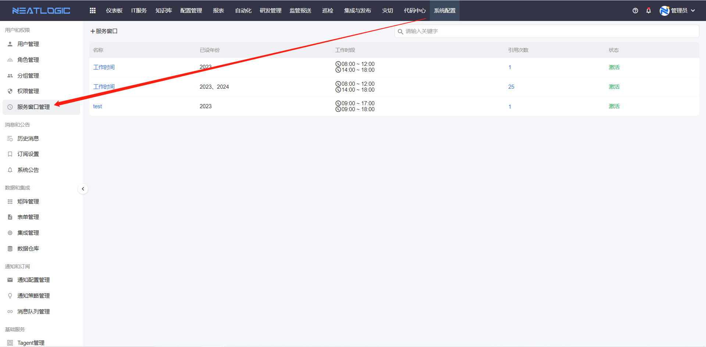
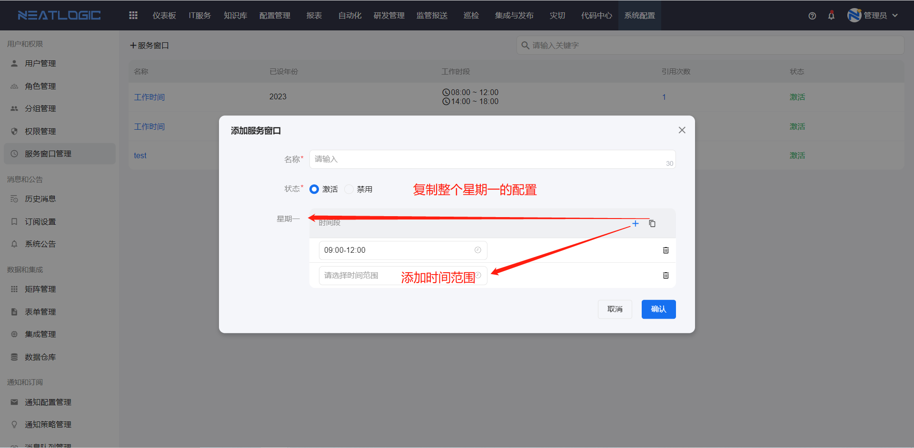
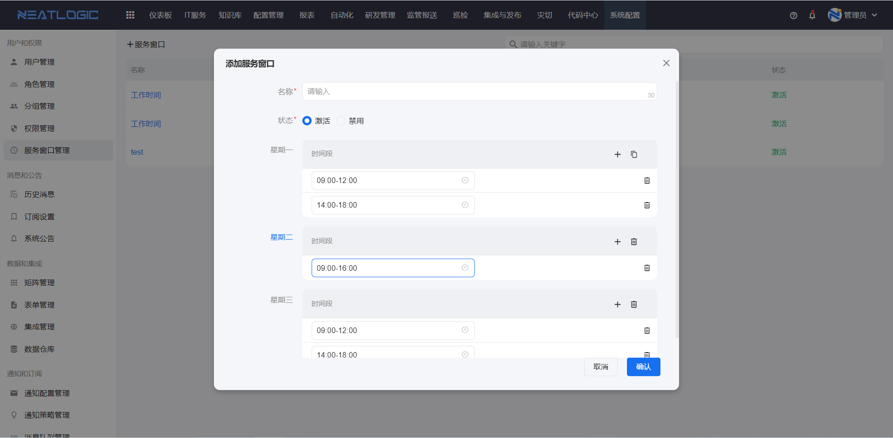
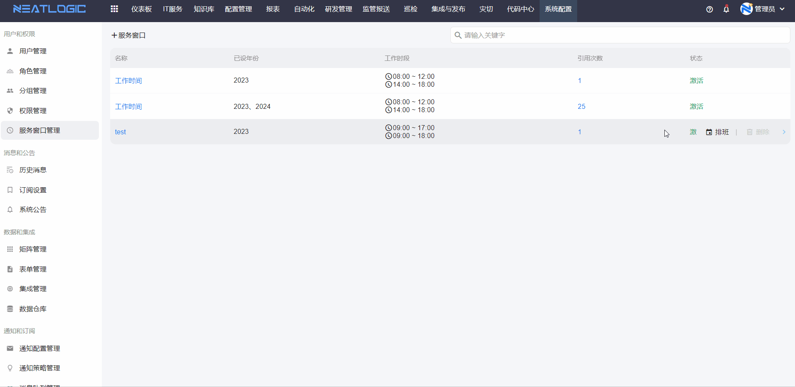
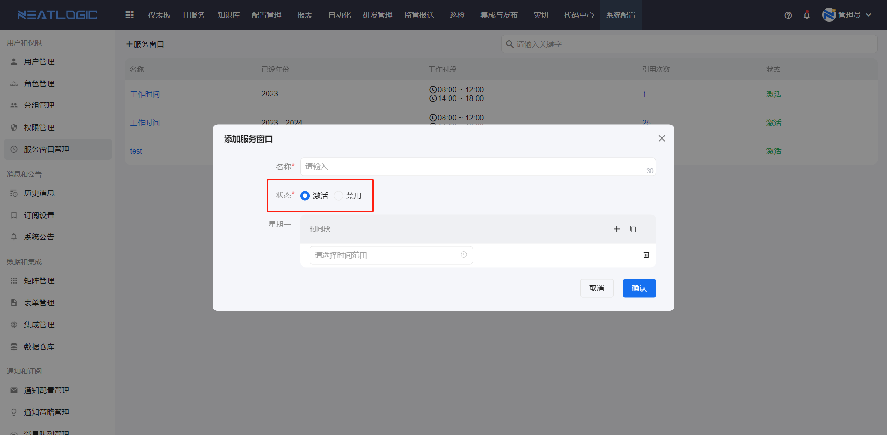
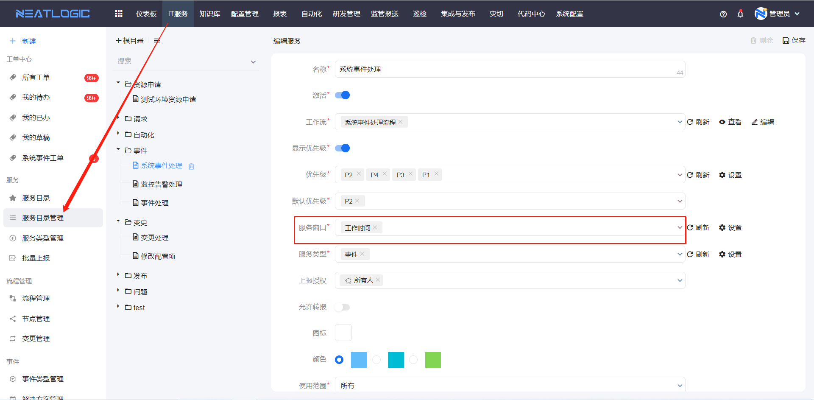
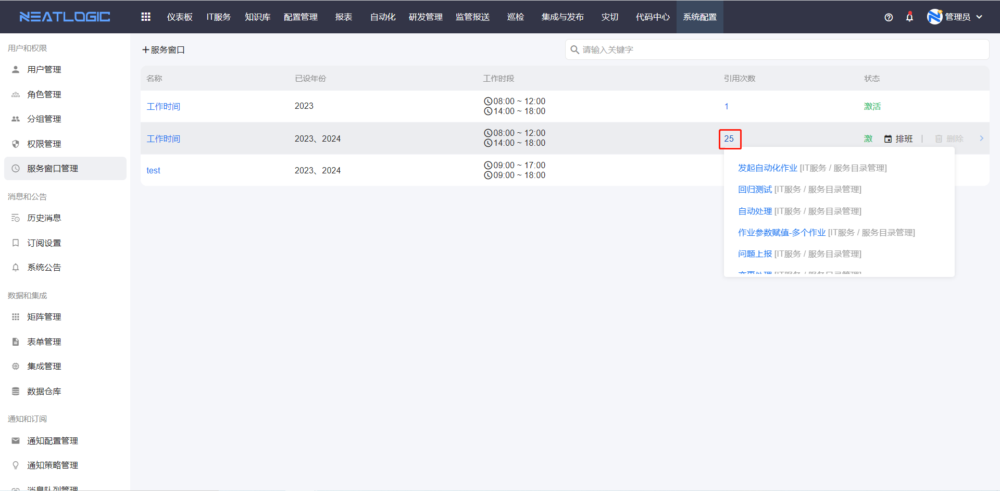

# 服务窗口管理

服务窗口管理用于定义工作人员的服务时间范围，常用于工单剩余处理时长计算。例如服务窗口为 `9:00-17:00` 时，工单待处理剩余时间只计算该时间窗口内的时长。

服务窗口支持新增、编辑、删除、工作日时间段定义和工作日排班。配置完成并激活后，服务窗口才可以被业务对象引用。

## 阅读路径

可根据当前要解决的问题选择阅读入口。

- 如果需要创建或调整服务时间范围，阅读“添加”。
- 如果需要把服务窗口应用到具体日期，阅读“排班”。
- 如果需要控制服务窗口是否可被业务引用，阅读“激活”。
- 如果需要查看服务窗口被哪些对象使用，阅读“查看引用”。

## 权限

**操作权限**
- 配置：系统配置-[用户管理](../1.用户和权限/用户管理.md)-授权-服务窗口管理权限
- 包含操作：新增、编辑、删除、激活、排班和查看引用
- 配置人员：系统超级管理员

## 添加

添加服务窗口时，以一周为配置单位。星期一到星期日都可以单独定义时间段，支持添加多个时间段，也支持将星期一的所有时间段复制到其他工作日。

根据实际服务时间配置星期一到星期日的时间窗口后即可保存。周一到周日的时间窗口不要求全部填写，可根据实际服务日配置。

## 排班

排班用于将服务窗口应用到具体年份日期。每个日期会根据对应星期匹配服务窗口中的时间段。

排班时，如果没有选择某个日期，则该日期默认没有服务时间窗口。新增或修改服务窗口后，需要重新排班才会生效；未重新排班时，系统会沿用旧排班。

**注意：** 某个日期是否最终生效，取决于该日期是否已参与排班，以及对应星期是否配置了工作时间段。

## 激活

服务窗口激活后，才可以被引用对象使用。未激活的服务窗口会在应用场景中被过滤。

服务窗口可应用于服务目录管理页面。

## 查看引用

服务窗口应用于[服务目录管理](../../2.IT服务/服务/服务目录管理.md)。点击服务窗口数据上的引用次数，可以查看引用对象；点击引用对象标题，可跳转到对应编辑页面。

