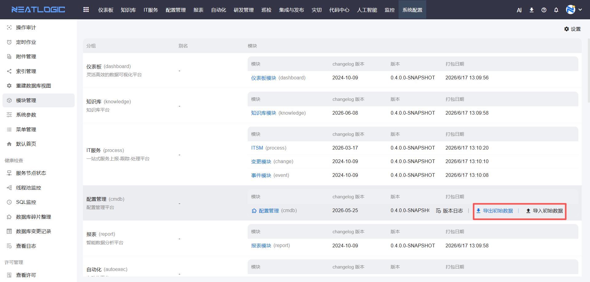

# 模块管理

模块管理用于查看当前系统已加载的分组和模块包信息，以及维护模块初始数据的导入导出和分组菜单的显示别名。

当需要确认模块是否正常加载、查看模块版本和更新日志、备份或迁移模块自带数据，或自定义分组菜单显示名称时，可以从模块管理开始。

本文以"模块包信息查看""初始数据维护"和"分组别名设置"为主线，说明模块管理中的常见操作。

## 阅读路径

- 如果需要确认模块是否加载、查看版本和更新内容，阅读"模块信息查看"。
- 如果需要备份或迁移模块自带数据，阅读"初始数据导入导出"。
- 如果需要自定义分组菜单的显示名称，阅读"分组别名设置"。

## 权限

**操作权限**
- 配置：系统配置-[用户管理](../1.用户和权限/用户管理.md)-授权-系统模块管理权限
- 包含操作：查看模块信息、查看版本日志、导出和导入初始数据、设置分组别名
- 配置人员：系统超级管理员

## 模块信息查看

模块信息查看用于了解当前系统已加载的分组、模块包及其版本信息。

模块管理页面按分组（导航菜单）组织模块包。每个分组对应一个导航菜单，一个分组可能包含多个模块包；每个模块包显示版本号、打包日期和版本日志信息。部分模块还带有初始数据，支持导出和导入。

### 版本日志

版本日志用于查看模块包的更新时间和更新内容。

点击模块包后，可以查看该模块的详细版本日志，包括更新时间和更新内容，便于确认模块当前版本与升级内容。

## 初始数据导入导出

初始数据导入导出用于迁移或备份模块自带的数据。

部分模块（如自动化和配置管理模块）在系统出厂时带有初始数据。可以将这些数据导出为文件用于备份或迁移，也可以将导出的文件导入到目标环境用于恢复或部署。

### 导出初始数据

将模块的初始数据导出为文件，用于备份或迁移到其他环境。

### 导入初始数据

将导出的初始数据文件导入到系统中，用于恢复数据或在其他环境部署。

## 分组别名设置

分组别名设置用于自定义分组菜单的显示名称。

分组菜单默认显示系统出厂名称，管理员可以根据业务习惯为分组设置别名。设置别名后，菜单显示别名；不设置时，菜单显示默认名称。

