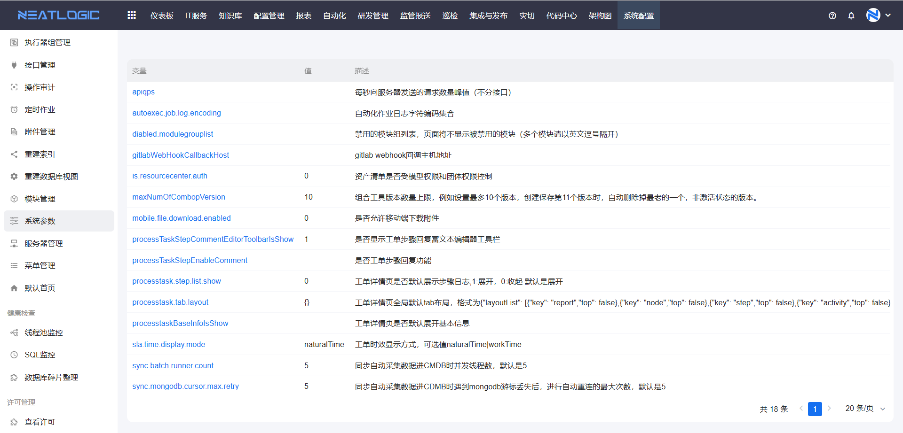

# 系统参数

系统参数用于管理系统代码中定义的变量。

当需要调整代码中变量的值，或在不重启服务的情况下让参数变更生效时，可以从系统参数开始。变更值保存成功后即刻生效，不需要重启服务。

## 权限

**操作权限**
- 配置：系统配置-[用户管理](../1.用户和权限/用户管理.md)-授权-系统核心基础权限
- 包含操作：查看和修改系统参数
- 配置人员：系统超级管理员

## 参数修改

参数修改用于调整系统代码中变量的值。

在系统参数页面，可以查看代码中已定义的变量，并修改变量的值。修改后保存即可。

## 生效说明

生效说明用于确认参数变更是否生效。

变更值保存成功后即刻生效，不需要重启服务。如果参数修改后未生效，可以确认保存是否成功，或检查变量是否被其他配置覆盖。
