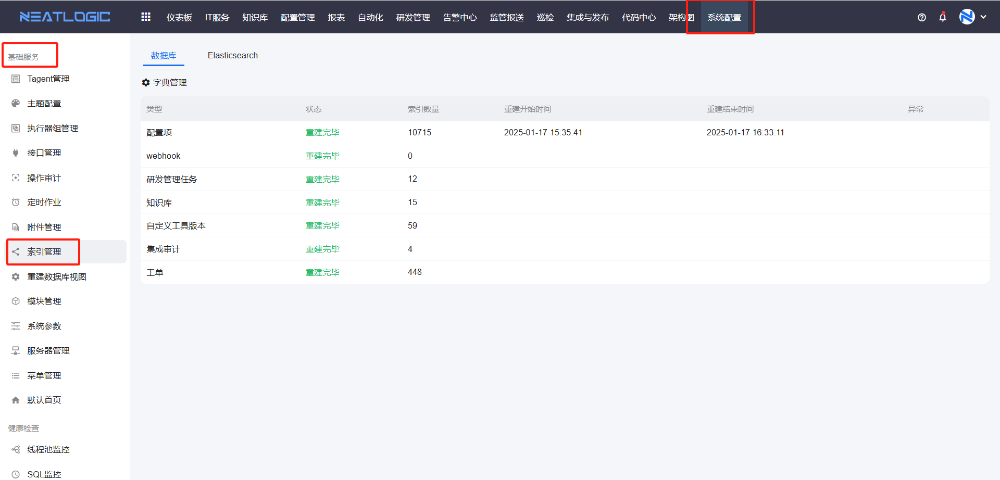
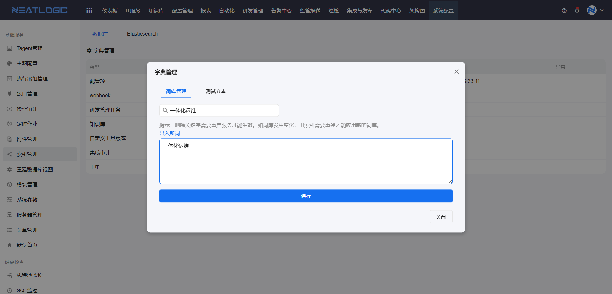

# 索引管理

索引管理用于维护数据库中各模块的索引关系，支持重建索引和管理分词字典。

当搜索结果异常、关键字匹配不到预期数据，或需要为业务模块新增自定义分词时，可以从索引管理开始。

本文以"重建索引"和"字典管理"为主线，说明索引管理中的常见操作。

## 阅读路径

- 如果需要刷新模块索引数据，阅读"重建索引"。
- 如果需要调整关键字搜索的分词规则，阅读"字典管理"。
- 如果需要新增自定义分词，阅读"导入新词"。

## 权限

**操作权限**
- 配置：系统配置-[用户管理](../1.用户和权限/用户管理.md)-授权-重建搜索中心索引权限
- 包含操作：重建索引、管理分词字典、导入新词
- 配置人员：系统超级管理员

## 重建索引

重建索引用于刷新数据库对应模块类型的索引关系。

当模块数据发生变更但搜索结果未及时更新，或重建过索引后仍未生效时，可以执行重建索引。重建会按模块类型重新建立索引关系，确保关键字搜索能匹配到最新数据。

## 字典管理

字典管理用于维护关键字搜索的分词词库。

索引管理中的模块进行关键字搜索时，系统会根据字典词库将关键字拆分成分词进行匹配。管理员可以通过导入新词扩展词库，让自定义词汇也能被正确分词。

### 导入新词

导入新词用于向分词字典中添加自定义词汇。

支持导入新词到字典词库，导入的新词保存后即刻生效，无需重建索引。

**注意：** 若删除已导入的新词，需要重建索引才能生效。
