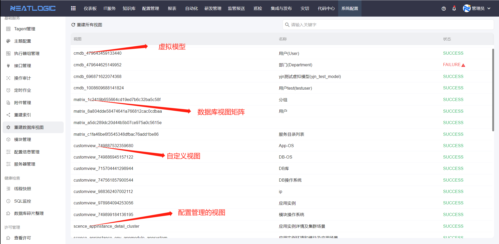
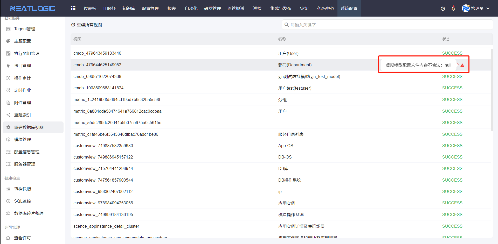

# 重建数据库视图

重建数据库视图用于重新生成系统中依赖视图渲染的数据列表。

租户中有些模块的数据，是先通过配置生成视图，再查询视图数据并渲染到相应的数据列表，包括[数据库视图矩阵](../3.数据和集成/矩阵管理.md)、[虚拟模型](../../3.配置管理/系统管理/模型管理.md)、配置管理-[自定义视图](../../3.配置管理/自定义视图/自定义视图.md)和配置管理模块-[视图设置](../../4.巡检/资源中心/视图设置.md)的视图。

当视图对应的数据结构发生变更、视图渲染异常，或数据列表显示不正确时，可以执行重建数据库视图。

## 阅读路径

- 如果需要重建视图，阅读"重建操作"。
- 如果需要排查重建失败，阅读"失败原因"。

## 权限

**操作权限**
- 配置：系统配置-[用户管理](../1.用户和权限/用户管理.md)-授权-系统核心基础权限
- 包含操作：重建数据库视图
- 配置人员：系统超级管理员

## 重建操作

重建操作用于重新生成系统中各模块依赖的视图。

在重建数据库视图页面，可以针对各模块的视图执行重建，重建完成后系统会按最新配置生成视图数据并渲染到对应数据列表。

## 失败原因

失败原因用于排查视图重建失败问题。

重建视图失败后，鼠标聚焦到失败状态的提示图标，会显示失败原因，便于定位是脚本错误、字段缺失还是数据库权限等导致的问题。

