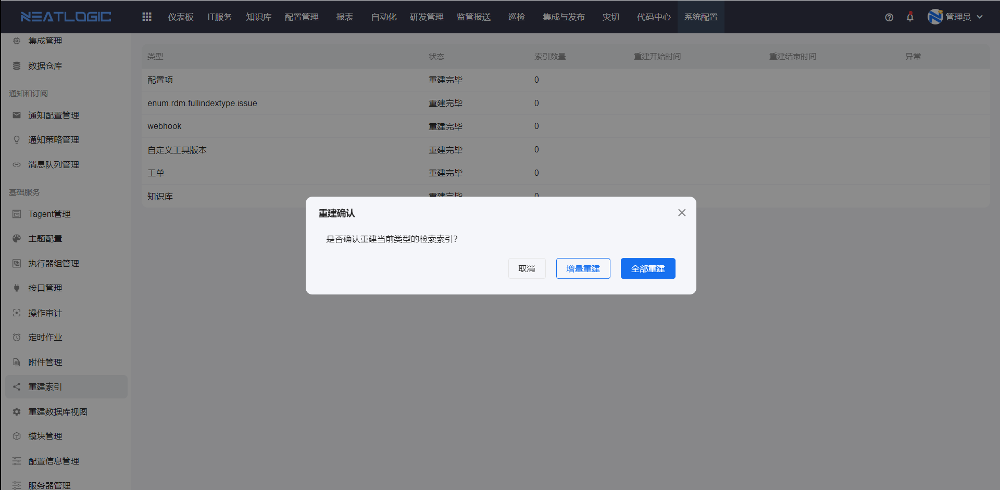

# 重建索引

重建索引用于更新系统中各分类的索引数据。

当搜索结果异常、关键字匹配不到数据，或新增分类后索引未及时生成时，可以执行重建索引。重建索引页面回显系统中所有存在索引的分类，支持按分类重建索引。

## 阅读路径

- 如果需要更新部分缺失索引，阅读"增量重建"。
- 如果需要刷新所有索引数据，阅读"全部重建"。

## 权限

**操作权限**
- 配置：系统配置-[用户管理](../1.用户和权限/用户管理.md)-授权-系统核心基础权限
- 包含操作：增量重建索引、全部重建索引
- 配置人员：系统超级管理员

## 增量重建

增量重建用于只重建找不到的索引。

增量重建会扫描当前分类的索引数据，仅对缺失或找不到的索引执行重建，执行效率较高，适合索引数据少量缺失的场景。

## 全部重建

全部重建用于刷新所有分类的索引数据。

全部重建会忽略当前索引状态，把所有分类的索引全部重建一遍。重建过程可能耗时较长，建议在系统空闲时段执行。

